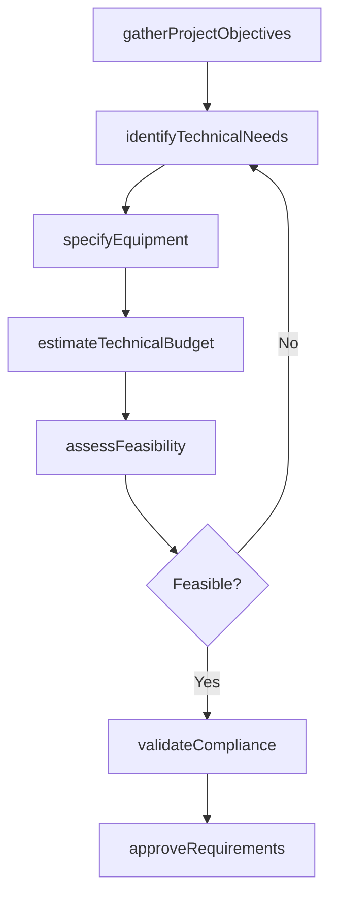
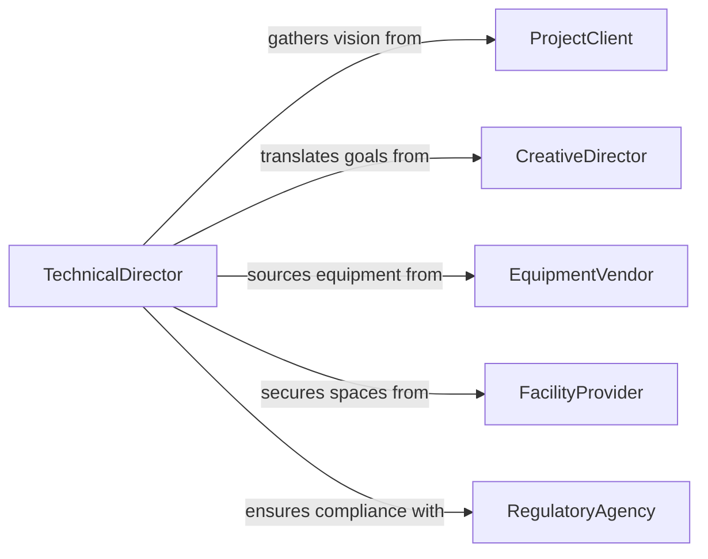

# Determine Technical Requirements Productions Projects

> Business-as-Code definition for determining the technical requirements of productions or projects. Models the process of identifying, documenting, and validating the technical specifications, equipment needs, and infrastructure required to execute productions or projects successfully.

## Overview

Determining technical requirements for productions or projects involves translating creative or business objectives into specific technical specifications including equipment, staffing, facilities, and technology needs. This applies across industries from film and media production to construction and engineering projects. The process ensures that all technical dependencies are identified early, resource gaps are addressed, and feasibility is confirmed before execution begins.

## Actors

| Actor | Description |
|-------|-------------|
| ProjectClient | Defines the project vision, scope, and deliverables |
| CreativeDirector | Specifies artistic or design goals that drive technical needs |
| EquipmentVendor | Provides technical equipment, pricing, and availability |
| FacilityProvider | Offers venues, stages, or workspaces for the production or project |
| RegulatoryAgency | Enforces permits, safety codes, and technical compliance standards |

## Roles

| Role | Description |
|------|-------------|
| TechnicalDirector | Identifies and documents all technical requirements for the project |
| ProductionManager | Coordinates resources and schedules based on technical specifications |
| SystemsEngineer | Evaluates infrastructure and technology integration requirements |
| BudgetAnalyst | Estimates costs associated with technical requirements |

## Entities

| Entity | Description |
|--------|-------------|
| TechnicalSpec | A detailed specification defining equipment, infrastructure, or technology needs |
| EquipmentList | An itemized inventory of technical equipment required for the project |
| FacilityRequirement | Physical space, power, connectivity, and environmental conditions needed |
| TechnicalBudget | A cost estimate covering all technical requirements |
| FeasibilityAssessment | An evaluation of whether technical requirements can be met within constraints |
| ComplianceChecklist | A list of regulatory and safety requirements the technical setup must satisfy |

## Actions

| Action | Description |
|--------|-------------|
| gatherProjectObjectives | Collect creative and business goals that drive technical requirements |
| identifyTechnicalNeeds | Determine equipment, infrastructure, and technology requirements |
| assessFeasibility | Evaluate whether technical requirements can be met within budget and timeline |
| specifyEquipment | Document detailed equipment specifications and quantities |
| estimateTechnicalBudget | Calculate costs for all technical requirements |
| validateCompliance | Verify that technical plans meet regulatory and safety standards |
| approveRequirements | Finalize and approve the complete set of technical requirements |

## Events

| Event | Description |
|-------|-------------|
| objectivesGathered | Project objectives have been collected and documented |
| technicalNeedsIdentified | Equipment and infrastructure requirements have been determined |
| feasibilityAssessed | Technical feasibility evaluation is complete |
| equipmentSpecified | Detailed equipment specifications have been documented |
| technicalBudgetEstimated | Cost estimates for technical requirements are complete |
| complianceValidated | Technical plans have been confirmed compliant with regulations |
| requirementsApproved | The full set of technical requirements has been finalized |

## Searches

| Search | Description |
|--------|-------------|
| findRequirementsByProject | List technical requirements for a specific project or production |
| getEquipmentAvailability | Query available equipment by type, specification, and date range |
| getFeasibilityReports | Retrieve feasibility assessments by project or status |
| getBudgetEstimates | Find technical budget estimates by project or cost category |

## Workflow



## Actor Relationships



## Usage

### Calling Actions

```typescript
import { determineTechnicalRequirementsProductionsProjects } from '@headlessly/determine-technical-requirements-productions-projects'

const requirements = determineTechnicalRequirementsProductionsProjects()

// Gather project objectives
const objectives = await requirements.gatherProjectObjectives({
  projectId: 'prod-2026-feature-film',
  description: 'Feature film production requiring on-location and studio shoots',
  deliverables: ['4K digital cinema master', 'Dolby Atmos audio mix']
})

// Identify technical needs
await requirements.identifyTechnicalNeeds({
  projectId: objectives.projectId,
  categories: ['camera', 'lighting', 'audio', 'post-production'],
  locations: ['studio-a', 'on-location-desert']
})

// Estimate budget and approve
const budget = await requirements.estimateTechnicalBudget({
  projectId: objectives.projectId
})

await requirements.approveRequirements({
  projectId: objectives.projectId,
  budgetId: budget.id
})
```

### Event-Driven Automation

```typescript
// Alert when feasibility assessment reveals issues
requirements.feasibilityAssessed(async ({ projectId, feasible, blockers }) => {
  if (!feasible) {
    await notify({
      to: 'production-management',
      message: `Technical feasibility issues on ${projectId}: ${blockers.join(', ')}`
    })
  }
})

// Trigger procurement when requirements are approved
requirements.requirementsApproved(async ({ projectId, equipmentList }) => {
  await startProcurement({
    projectId,
    items: equipmentList
  })
})
```
