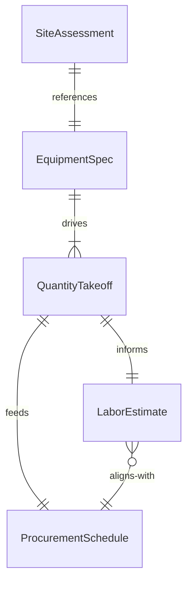
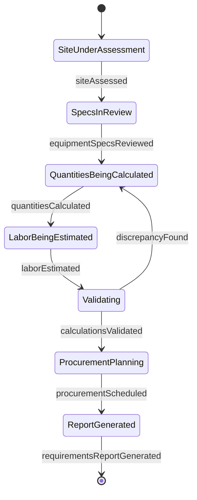
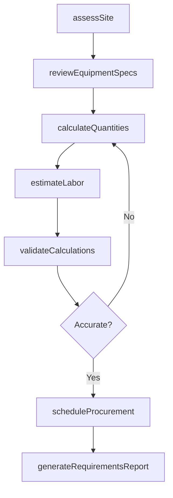
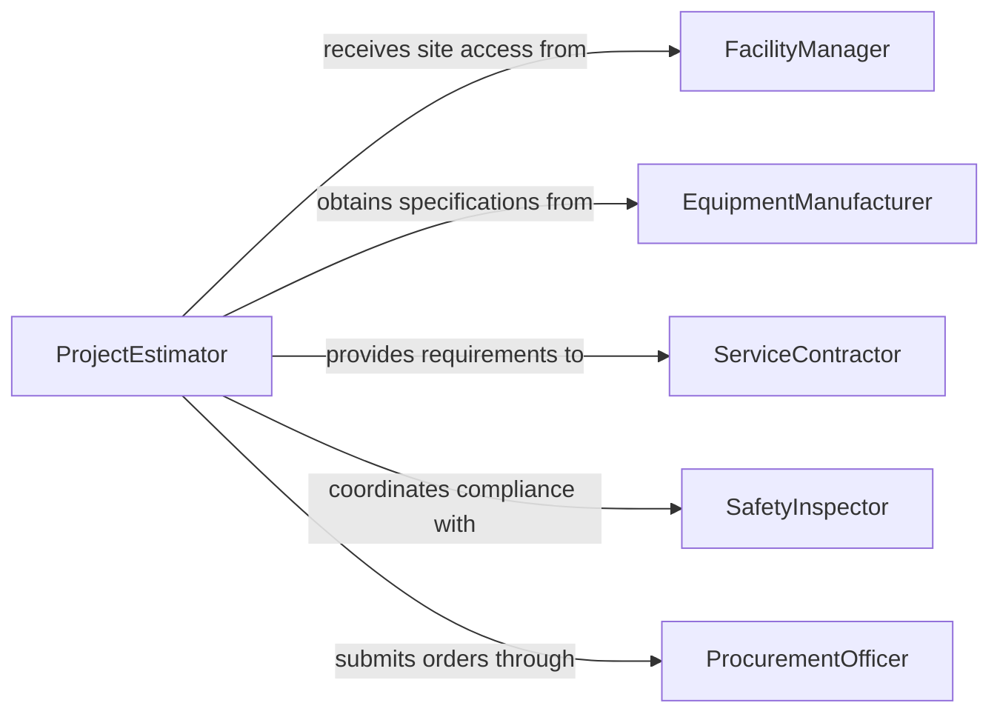

# Calculate Requirements Equipment Installation Repair

> Business-as-Code definition for calculating requirements for equipment installation or repair projects. Models the resource calculation process from site assessment through specification, quantity takeoff, and procurement scheduling.

## Overview

Calculating requirements for equipment installation or repair projects involves assessing site conditions, reviewing equipment specifications, determining component quantities, estimating labor and tooling needs, and scheduling procurement to meet project timelines. This activity applies to HVAC installations, industrial machinery repairs, electrical system upgrades, and similar technical projects. The definition provides actions for each calculation phase, events for tracking estimation milestones, and searches for referencing equipment data and project histories.

## Actors

| Actor | Description |
|-------|-------------|
| FacilityManager | Identifies equipment needing installation or repair and provides site access |
| EquipmentManufacturer | Supplies technical specifications, installation guides, and parts catalogs |
| ServiceContractor | Performs the installation or repair work based on calculated requirements |
| SafetyInspector | Verifies that planned work meets building codes and safety regulations |
| ProcurementOfficer | Sources parts and materials according to the requirements calculation |

## Roles

| Role | Description |
|------|-------------|
| ProjectEstimator | Calculates quantities, labor hours, and material needs for the project |
| InstallationEngineer | Designs the installation plan and specifies technical requirements |
| MaintenancePlanner | Schedules repair activities and coordinates resource availability |
| QualityAssuranceAnalyst | Reviews calculations for accuracy and completeness |

## Entities

| Entity | Description |
|--------|-------------|
| SiteAssessment | A documented evaluation of the installation or repair location |
| EquipmentSpec | Technical specifications and installation requirements for a piece of equipment |
| QuantityTakeoff | A detailed count of all parts, materials, and components required |
| LaborEstimate | The projected hours and skill categories needed for the project |
| ProcurementSchedule | A timeline for ordering and receiving parts and materials |

## Actions

| Action | Description |
|--------|-------------|
| assessSite | Evaluate the installation or repair site for conditions and constraints |
| reviewEquipmentSpecs | Analyze manufacturer specifications and installation requirements |
| calculateQuantities | Determine exact counts of parts, materials, and components needed |
| estimateLabor | Project the labor hours and trade categories required |
| scheduleProcurement | Plan ordering timelines to align parts delivery with project milestones |
| validateCalculations | Cross-check all requirements against specifications and site conditions |
| generateRequirementsReport | Produce the complete requirements document for the project |

## Events

| Event | Description |
|-------|-------------|
| siteAssessed | The installation or repair site has been evaluated |
| equipmentSpecsReviewed | Manufacturer specifications have been analyzed |
| quantitiesCalculated | Parts and materials counts have been determined |
| laborEstimated | Required labor hours and trade categories have been projected |
| procurementScheduled | Ordering timelines have been established |
| calculationsValidated | Requirements have been cross-checked and confirmed accurate |
| requirementsReportGenerated | The complete requirements document has been produced |

## Searches

| Search | Description |
|--------|-------------|
| findProjectsByEquipment | Locate past projects involving the same or similar equipment |
| getPartsAvailability | Check supplier stock and lead times for required components |
| getCalculationHistory | Retrieve previous requirement calculations for a given site or equipment type |

## Entity Relationships



## State Diagram



## Workflow



## Actor Relationships



## Usage

### Calling Actions

```typescript
import { calculateRequirementsEquipmentInstallationRepair } from '@headlessly/calculate-requirements-equipment-installation-repair'

const calculator = calculateRequirementsEquipmentInstallationRepair()

// Assess the installation site
const site = await calculator.assessSite({
  location: 'Building B - Rooftop Mechanical Room',
  equipmentType: 'commercial-chiller',
  projectType: 'replacement-installation'
})

// Calculate quantities for the project
const quantities = await calculator.calculateQuantities({
  siteAssessmentId: site.id,
  equipmentModel: 'Trane-CGAM-50T',
  includeAccessories: true,
  includeRefrigerantPiping: true
})

// Generate the full requirements report
await calculator.generateRequirementsReport({
  projectId: site.projectId,
  quantities,
  laborEstimate: { journeymen: 3, apprentices: 2, hours: 120 }
})
```

### Event-Driven Automation

```typescript
// Notify procurement when quantities are finalized
calculator.calculationsValidated(async ({ projectId, quantityTakeoff }) => {
  await notify({
    to: 'procurement',
    message: `Requirements validated for project ${projectId}: ${quantityTakeoff.totalItems} items ready for ordering`
  })
})

// Alert project manager if lead times exceed schedule
calculator.procurementScheduled(async ({ projectId, longestLeadTime, targetDate }) => {
  if (new Date(longestLeadTime) > new Date(targetDate)) {
    await escalate({
      to: 'project-manager',
      message: `Lead time conflict on project ${projectId}: parts arrive after target date`
    })
  }
})
```
