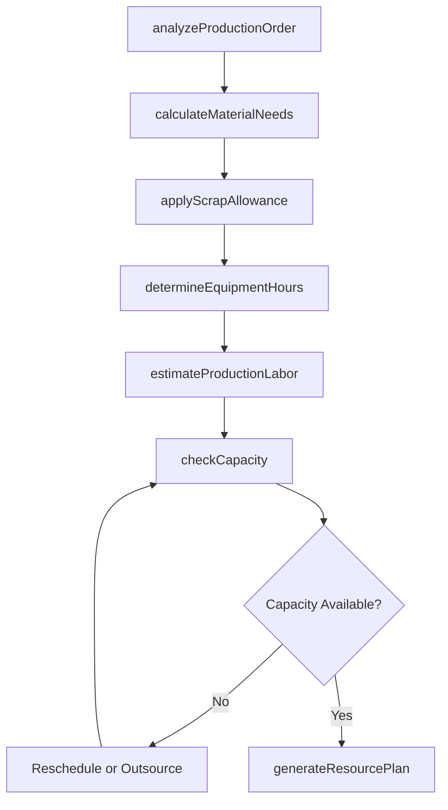
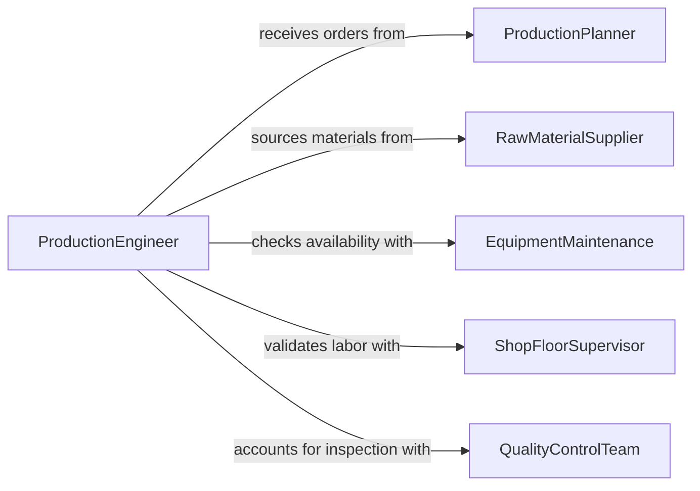

# Calculate Specific Material Equipment Labor

> Business-as-Code definition for calculating specific material, equipment, or labor requirements for production. Models the production resource calculation process from order analysis through material takeoff, machine capacity planning, and staffing determination.

## Overview

Calculating specific material, equipment, and labor requirements for production involves translating production orders into precise resource needs, including raw material quantities, machine hours, tooling requirements, and workforce hours by skill category. This activity is central to manufacturing planning, job shop scheduling, and production line management where accurate resource calculations drive on-time delivery and cost control. The definition provides actions for each calculation phase, events for tracking resource readiness, and searches for referencing production standards and inventory data.

## Actors

| Actor | Description |
|-------|-------------|
| ProductionPlanner | Issues production orders and sets output targets and deadlines |
| RawMaterialSupplier | Provides materials, pricing, and delivery schedules |
| EquipmentMaintenance | Reports machine availability and maintenance schedules |
| ShopFloorSupervisor | Validates labor estimates against actual production line capabilities |
| QualityControlTeam | Specifies inspection points that affect labor and time calculations |

## Roles

| Role | Description |
|------|-------------|
| ProductionEngineer | Calculates material, equipment, and labor requirements from production orders |
| CapacityPlanner | Matches production requirements against available machine and labor capacity |
| MaterialsPlanner | Determines raw material quantities and coordinates procurement |
| CostAccountant | Assigns standard costs to calculated resource requirements |

## Entities

| Entity | Description |
|--------|-------------|
| ProductionOrder | A directive specifying the product, quantity, and delivery date |
| BillOfMaterials | A structured list of raw materials and components for a product |
| RoutingSheet | A sequence of operations specifying machines, tools, and setup times |
| CapacityPlan | A schedule mapping production requirements to available resources |
| LaborAllocation | The assignment of workers by skill type and hours to production tasks |
| ScrapAllowance | An additional material quantity to account for production defects |

## Actions

| Action | Description |
|--------|-------------|
| analyzeProductionOrder | Review the order to determine product specifications and quantities |
| calculateMaterialNeeds | Compute raw material quantities from the bill of materials and order size |
| determineEquipmentHours | Calculate machine time and tooling requirements from routing sheets |
| estimateProductionLabor | Project labor hours by skill category for each operation |
| applyScrapAllowance | Adjust material quantities for expected production defects |
| checkCapacity | Validate that required resources fit within available capacity |
| generateResourcePlan | Produce the consolidated resource requirements document |

## Events

| Event | Description |
|-------|-------------|
| productionOrderAnalyzed | The order specifications and quantities have been reviewed |
| materialNeedsCalculated | Raw material quantities have been computed |
| equipmentHoursDetermined | Machine time and tooling requirements have been calculated |
| productionLaborEstimated | Labor hours by skill category have been projected |
| scrapAllowanceApplied | Material quantities have been adjusted for production defects |
| capacityChecked | Resource requirements have been validated against available capacity |
| resourcePlanGenerated | The consolidated resource requirements document has been produced |

## Searches

| Search | Description |
|--------|-------------|
| findProductionOrders | List production orders by product, status, or delivery date |
| getMachineAvailability | Check available machine hours by equipment type and time period |
| getMaterialInventory | Query current raw material stock levels and incoming shipments |

## Workflow



## Actor Relationships



## Usage

### Calling Actions

```typescript
import { calculateSpecificMaterialEquipmentLabor } from '@headlessly/calculate-specific-material-equipment-labor'

const production = calculateSpecificMaterialEquipmentLabor()

// Analyze a production order
const order = await production.analyzeProductionOrder({
  orderId: 'PO-2026-1847',
  product: 'Precision Gear Assembly - Model PGA-400',
  quantity: 2500,
  deliveryDate: '2026-05-15'
})

// Calculate material needs
const materials = await production.calculateMaterialNeeds({
  orderId: order.id,
  bomRevision: 'R4',
  scrapRate: 0.03
})

// Determine equipment hours
const equipment = await production.determineEquipmentHours({
  orderId: order.id,
  operations: ['cnc-milling', 'heat-treatment', 'grinding', 'assembly', 'inspection']
})

// Generate the complete resource plan
await production.generateResourcePlan({
  orderId: order.id,
  materials,
  equipment,
  laborBySkill: { machinist: 160, assembler: 80, inspector: 40 }
})
```

### Event-Driven Automation

```typescript
// Trigger material procurement when needs are calculated
production.materialNeedsCalculated(async ({ orderId, materials }) => {
  const shortages = materials.filter(m => m.required > m.onHand)
  if (shortages.length > 0) {
    await procurementPipeline.order({
      orderId,
      items: shortages.map(s => ({ sku: s.sku, quantity: s.required - s.onHand }))
    })
  }
})

// Alert when capacity constraints are detected
production.capacityChecked(async ({ orderId, bottlenecks }) => {
  if (bottlenecks.length > 0) {
    await escalate({
      to: 'capacity-planner',
      message: `Bottlenecks on order ${orderId}: ${bottlenecks.map(b => b.resource).join(', ')}`
    })
  }
})
```
