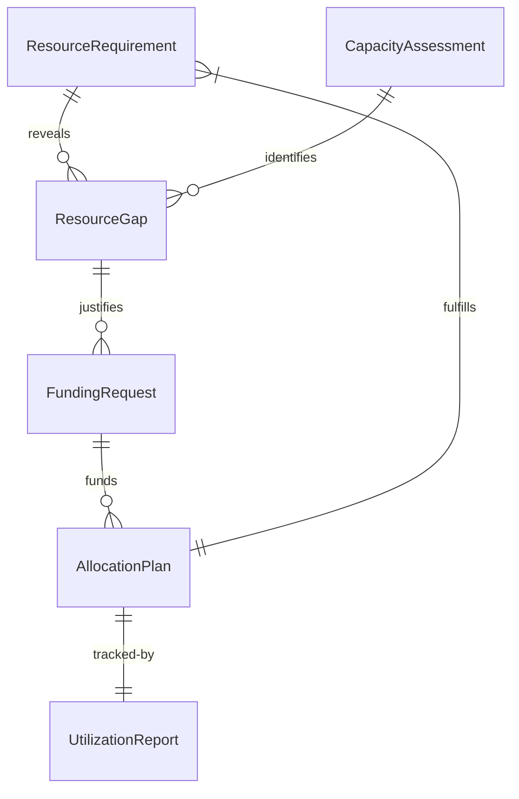
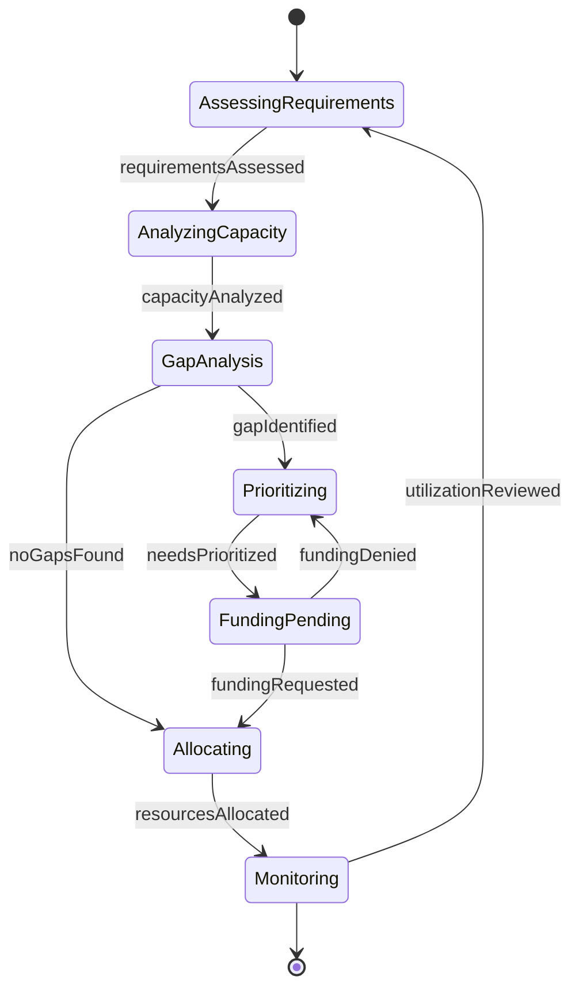
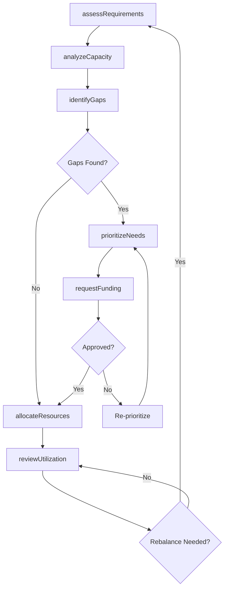
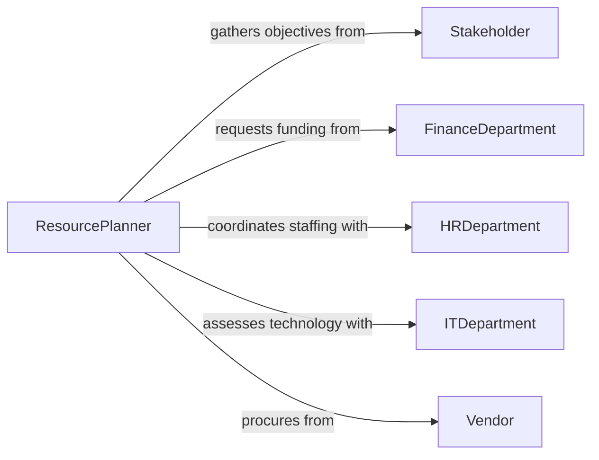

# Determine Resource Needs

> Business-as-Code definition for determining resource needs across projects and operations. Models the general assessment of human, financial, material, and technological resources required to achieve organizational objectives.

## Overview

Determining resource needs involves evaluating organizational goals, project requirements, current capacity, and constraints to identify what people, funding, materials, and technology must be secured. This definition exposes actions for resource assessment and gap analysis, events for planning automation, and searches for capacity and utilization data.

## Actors

| Actor | Description |
|-------|-------------|
| Stakeholder | Defines business objectives and priority requirements |
| Vendor | Provides external goods, services, or contract labor |
| FinanceDepartment | Controls budget allocation and funding availability |
| HRDepartment | Manages workforce planning and talent acquisition |
| ITDepartment | Assesses technology infrastructure and tooling needs |

## Roles

| Role | Description |
|------|-------------|
| ResourcePlanner | Evaluates and forecasts resource requirements |
| OperationsManager | Aligns resource allocation with operational priorities |
| BudgetAnalyst | Validates resource requests against financial constraints |
| ProjectSponsor | Approves resource commitments for strategic initiatives |

## Entities

| Entity | Description |
|--------|-------------|
| ResourceRequirement | A defined need for a specific type and quantity of resource |
| CapacityAssessment | Current available resources versus projected demand |
| ResourceGap | Identified shortfall between required and available resources |
| AllocationPlan | Approved distribution of resources across initiatives |
| UtilizationReport | Metrics on how effectively current resources are deployed |
| FundingRequest | A formal request for budget to acquire needed resources |

## Actions

| Action | Description |
|--------|-------------|
| assessRequirements | Evaluate project or operational scope to identify resource needs |
| analyzeCapacity | Measure current resource availability and utilization |
| identifyGaps | Compare requirements against capacity to find shortfalls |
| prioritizeNeeds | Rank resource requirements by urgency and strategic value |
| requestFunding | Submit budget requests for resource acquisition |
| allocateResources | Assign available resources to approved initiatives |
| reviewUtilization | Analyze how effectively allocated resources are being used |

## Events

| Event | Description |
|-------|-------------|
| requirementsAssessed | Resource needs have been identified for a project or operation |
| capacityAnalyzed | Current resource availability has been evaluated |
| gapIdentified | A resource shortfall has been detected |
| needsPrioritized | Resource requirements have been ranked by importance |
| fundingRequested | A budget request has been submitted for resources |
| resourcesAllocated | Resources have been assigned to an initiative |
| utilizationReviewed | Resource effectiveness metrics have been analyzed |

## Searches

| Search | Description |
|--------|-------------|
| findRequirements | List resource needs by project, department, or type |
| getCapacity | Retrieve current resource availability by category |
| getGaps | Find resource shortfalls across active initiatives |
| getUtilization | Look up resource utilization rates by team or project |

## Entity Relationships



## State Diagram



## Workflow



## Actor Relationships



## Usage

### Calling Actions

```typescript
import { determineResourceNeeds } from '@headlessly/determine-resource-needs'

const resources = determineResourceNeeds()

// Assess resource requirements for a new initiative
const requirements = await resources.assessRequirements({
  initiativeId: 'INIT-2026-Q2-Expansion',
  scope: 'Regional warehouse build-out',
  categories: ['personnel', 'equipment', 'facilities', 'technology']
})

// Analyze current capacity
const capacity = await resources.analyzeCapacity({
  departments: ['operations', 'logistics', 'IT'],
  period: { start: '2026-04-01', end: '2026-12-31' }
})

// Identify and prioritize gaps
const gaps = await resources.identifyGaps({
  requirements: requirements.id,
  capacity: capacity.id
})

await resources.prioritizeNeeds({
  gaps: gaps.map(g => g.id),
  criteria: ['strategic-alignment', 'time-sensitivity', 'cost-impact']
})
```

### Event-Driven Automation

```typescript
// Notify stakeholders when resource gaps are found
resources.gapIdentified(async ({ initiativeId, resourceType, shortfall }) => {
  await notify({
    to: 'operations-leadership',
    message: `Resource gap: ${shortfall} ${resourceType} units needed for ${initiativeId}`
  })
})

// Auto-trigger funding request for high-priority gaps
resources.needsPrioritized(async ({ gaps }) => {
  const critical = gaps.filter(g => g.priority === 'critical')
  for (const gap of critical) {
    await resources.requestFunding({
      gapId: gap.id,
      amount: gap.estimatedCost,
      justification: gap.businessCase
    })
  }
})
```
