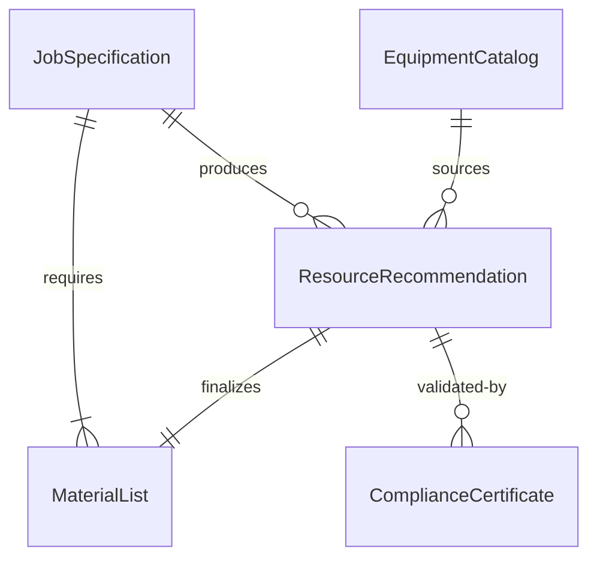
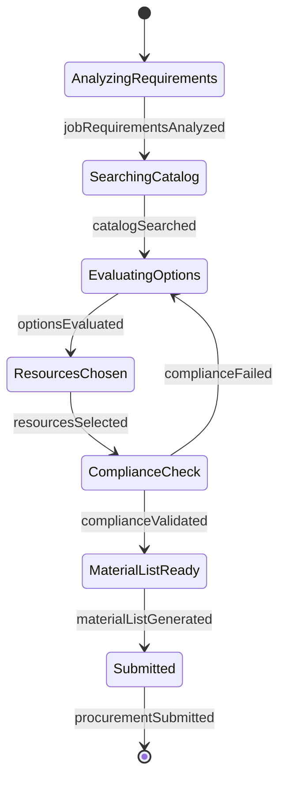
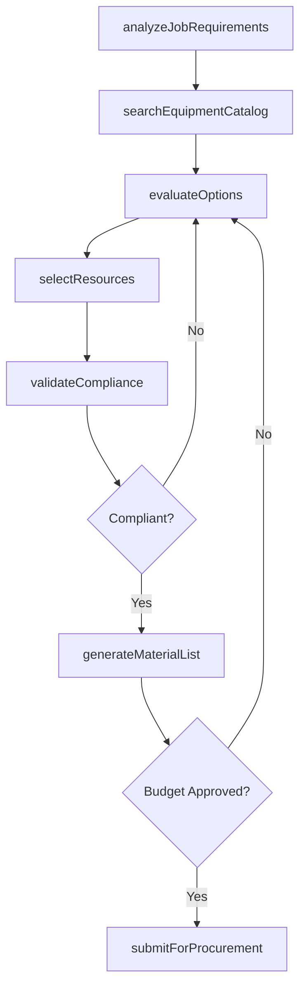
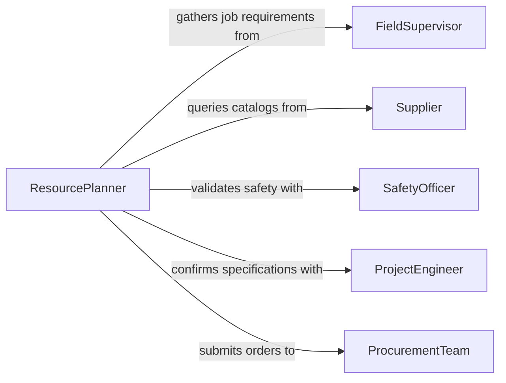

# Determine Types Equipment Tools Materials

> Business-as-Code definition for determining the types of equipment, tools, or materials needed for jobs. Models the resource identification process from job analysis through specification, sourcing evaluation, and procurement recommendation.

## Overview

Determining the types of equipment, tools, and materials needed for jobs involves analyzing work requirements, consulting technical specifications, evaluating available options, and selecting the right resources to complete tasks safely and efficiently. This process applies across construction, manufacturing, maintenance, and field service operations where matching the right tools and materials to the job is critical for quality and productivity. The definition provides actions for each phase of the resource determination workflow, events for decision tracking, and searches for catalog and inventory lookup.

## Actors

| Actor | Description |
|-------|-------------|
| FieldSupervisor | Defines job requirements and validates resource selections on-site |
| Supplier | Provides equipment catalogs, pricing, and availability information |
| SafetyOfficer | Ensures selected equipment meets regulatory and safety standards |
| ProjectEngineer | Specifies technical requirements and tolerances for materials and tools |
| ProcurementTeam | Processes purchase orders and manages vendor relationships |

## Roles

| Role | Description |
|------|-------------|
| ResourcePlanner | Analyzes job scopes and determines equipment and material needs |
| ToolSpecialist | Evaluates tool options and recommends the best fit for each task |
| MaterialsCoordinator | Sources materials and confirms specifications against project requirements |
| InventoryManager | Tracks available stock and identifies items requiring procurement |

## Entities

| Entity | Description |
|--------|-------------|
| JobSpecification | The documented requirements and scope for a particular work assignment |
| EquipmentCatalog | A reference listing of available tools and equipment with specifications |
| MaterialList | A bill of materials identifying all items needed for a job |
| ResourceRecommendation | A formal selection of equipment, tools, and materials for a job |
| ComplianceCertificate | Documentation confirming equipment meets safety and regulatory standards |

## Actions

| Action | Description |
|--------|-------------|
| analyzeJobRequirements | Review the work scope to identify resource categories needed |
| searchEquipmentCatalog | Query available equipment and tools by specification criteria |
| evaluateOptions | Compare candidate equipment or materials on cost, capability, and availability |
| selectResources | Finalize the equipment, tools, and materials for the job |
| validateCompliance | Confirm selections meet safety, regulatory, and quality standards |
| generateMaterialList | Produce the complete bill of materials and equipment list |
| submitForProcurement | Forward the finalized resource list to procurement for ordering |

## Events

| Event | Description |
|-------|-------------|
| jobRequirementsAnalyzed | The work scope has been reviewed and resource categories identified |
| catalogSearched | Equipment catalog queries have returned candidate options |
| optionsEvaluated | Candidate resources have been compared and ranked |
| resourcesSelected | Final equipment, tools, and materials have been chosen |
| complianceValidated | Selected resources have passed safety and regulatory checks |
| materialListGenerated | The complete bill of materials has been produced |
| procurementSubmitted | The resource list has been forwarded for purchase ordering |

## Searches

| Search | Description |
|--------|-------------|
| findEquipmentBySpec | Locate equipment matching technical specification criteria |
| getMaterialsByJob | Retrieve the material list for a specific job or project |
| getAvailableInventory | Check current stock levels for specified tools or materials |

## Entity Relationships



## State Diagram



## Workflow



## Actor Relationships



## Usage

### Calling Actions

```typescript
import { determineTypesEquipmentToolsMaterials } from '@headlessly/determine-types-equipment-tools-materials'

const resources = determineTypesEquipmentToolsMaterials()

// Analyze a job's resource requirements
const analysis = await resources.analyzeJobRequirements({
  jobId: 'MAINT-2026-0451',
  scope: 'HVAC system replacement - Building C, floors 3-5',
  tradeCategory: 'mechanical'
})

// Search equipment catalog for matching items
const options = await resources.searchEquipmentCatalog({
  category: 'pipe-fitting-tools',
  minRating: 'commercial-grade',
  availableBy: '2026-03-15'
})

// Generate the final material list
await resources.generateMaterialList({
  jobId: 'MAINT-2026-0451',
  selectedResources: analysis.recommendations
})
```

### Event-Driven Automation

```typescript
// Alert procurement when material list is ready
resources.materialListGenerated(async ({ jobId, materialList }) => {
  await notify({
    to: 'procurement',
    message: `Material list ready for job ${jobId}: ${materialList.items.length} items`
  })
})

// Flag non-compliant selections for review
resources.complianceValidated(async ({ jobId, passed, issues }) => {
  if (!passed) {
    await escalate({
      to: 'safety-officer',
      message: `Compliance issues on job ${jobId}: ${issues.join(', ')}`
    })
  }
})
```
