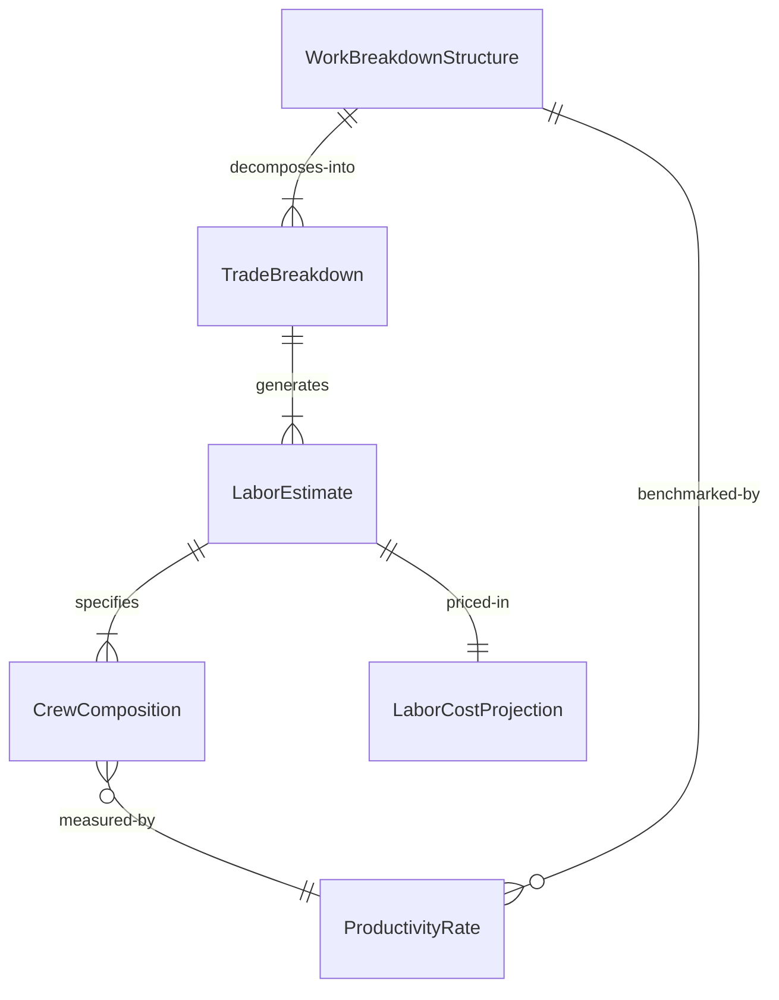
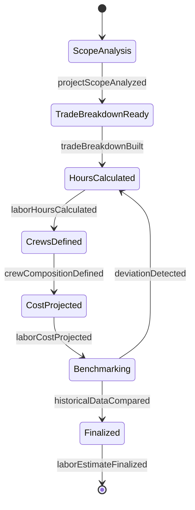
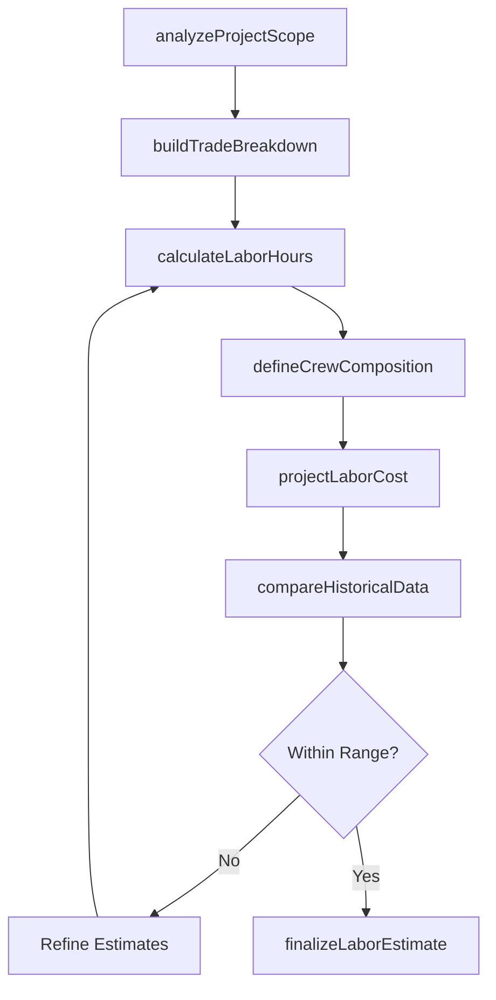
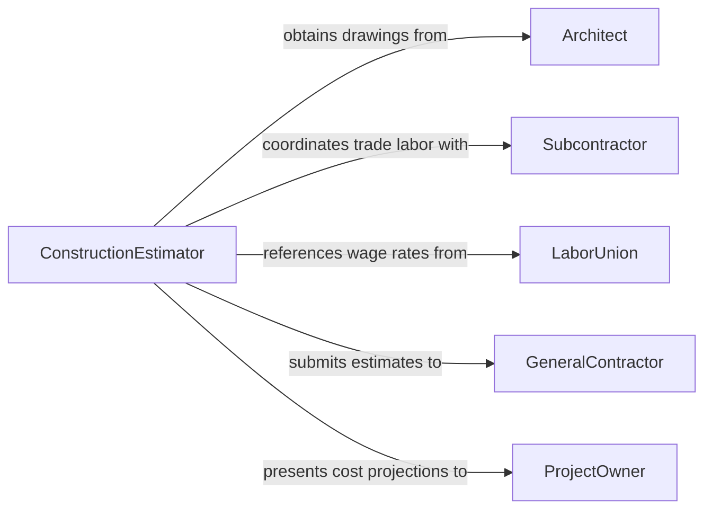

# Estimate Construction Project Labor Requirements

> Business-as-Code definition for estimating construction project labor requirements. Models the workforce planning process from scope analysis through trade breakdowns, crew scheduling, and labor cost projection.

## Overview

Estimating construction project labor requirements involves analyzing project drawings and specifications, breaking work into trade-specific tasks, calculating crew sizes and durations, and projecting total labor hours and costs. This process is essential for bidding, scheduling, and managing construction projects of all scales, from residential renovations to commercial developments. The definition provides actions for each estimation phase, events for tracking bid and planning milestones, and searches for referencing labor productivity benchmarks and historical project data.

## Actors

| Actor | Description |
|-------|-------------|
| GeneralContractor | Manages the overall project and coordinates subcontractor labor |
| Architect | Provides construction drawings, specifications, and design clarifications |
| Subcontractor | Supplies trade-specific labor for portions of the project |
| LaborUnion | Sets wage rates, work rules, and apprenticeship requirements |
| ProjectOwner | Funds the project and reviews labor cost projections |

## Roles

| Role | Description |
|------|-------------|
| ConstructionEstimator | Calculates labor quantities, durations, and costs for each trade |
| ProjectScheduler | Sequences labor activities and builds the construction timeline |
| FieldSuperintendent | Validates labor estimates against actual site conditions and productivity |
| CostEngineer | Integrates labor estimates into the overall project budget |

## Entities

| Entity | Description |
|--------|-------------|
| LaborEstimate | A detailed breakdown of worker hours by trade and project phase |
| TradeBreakdown | The division of project work into trade-specific categories |
| ProductivityRate | A benchmark measuring output per labor hour for a specific task |
| CrewComposition | The mix of journeymen, apprentices, and foremen assigned to a task |
| LaborCostProjection | The total estimated cost of labor including wages, benefits, and burden |
| WorkBreakdownStructure | A hierarchical decomposition of the project into estimable work packages |

## Actions

| Action | Description |
|--------|-------------|
| analyzeProjectScope | Review drawings and specifications to identify labor-intensive activities |
| buildTradeBreakdown | Categorize work into trade-specific packages for estimation |
| calculateLaborHours | Compute the total hours required for each trade and phase |
| defineCrewComposition | Specify the worker mix and skill levels for each activity |
| projectLaborCost | Calculate total labor costs including wages, benefits, and overhead |
| compareHistoricalData | Benchmark estimates against similar completed projects |
| finalizeLaborEstimate | Produce the approved labor estimate for bidding or scheduling |

## Events

| Event | Description |
|-------|-------------|
| projectScopeAnalyzed | Construction drawings and specifications have been reviewed |
| tradeBreakdownBuilt | Work has been categorized into trade-specific packages |
| laborHoursCalculated | Total hours by trade and phase have been computed |
| crewCompositionDefined | Worker mix and skill levels have been specified |
| laborCostProjected | Total labor costs have been calculated |
| historicalDataCompared | Estimates have been benchmarked against past projects |
| laborEstimateFinalized | The approved labor estimate has been produced |

## Searches

| Search | Description |
|--------|-------------|
| findProductivityRates | Retrieve labor productivity benchmarks by trade and task type |
| getHistoricalEstimates | Locate labor estimates from similar past construction projects |
| getLaborRates | Query current wage rates and burden factors by trade and region |

## Entity Relationships



## State Diagram



## Workflow



## Actor Relationships



## Usage

### Calling Actions

```typescript
import { estimateConstructionProjectLaborRequirements } from '@headlessly/estimate-construction-project-labor-requirements'

const estimator = estimateConstructionProjectLaborRequirements()

// Analyze the project scope
const scope = await estimator.analyzeProjectScope({
  projectName: 'Riverside Office Complex - Phase 2',
  drawingSet: 'RVR-2026-CD-SET-R3',
  totalSquareFootage: 85000,
  stories: 4
})

// Build trade breakdown and calculate labor
const trades = await estimator.buildTradeBreakdown({
  scopeId: scope.id,
  trades: ['concrete', 'structural-steel', 'electrical', 'mechanical', 'finish-carpentry']
})

// Project total labor cost
const cost = await estimator.projectLaborCost({
  scopeId: scope.id,
  tradeBreakdownId: trades.id,
  region: 'pacific-northwest',
  wageYear: 2026
})
```

### Event-Driven Automation

```typescript
// Notify general contractor when estimate is finalized
estimator.laborEstimateFinalized(async ({ projectId, totalHours, totalCost }) => {
  await notify({
    to: 'general-contractor',
    message: `Labor estimate finalized: ${totalHours} hours, $${totalCost.toLocaleString()}`
  })
})

// Flag estimates that deviate significantly from historical benchmarks
estimator.historicalDataCompared(async ({ projectId, deviationPercent }) => {
  if (Math.abs(deviationPercent) > 20) {
    await escalate({
      to: 'chief-estimator',
      message: `Labor estimate for ${projectId} deviates ${deviationPercent}% from historical average`
    })
  }
})
```
