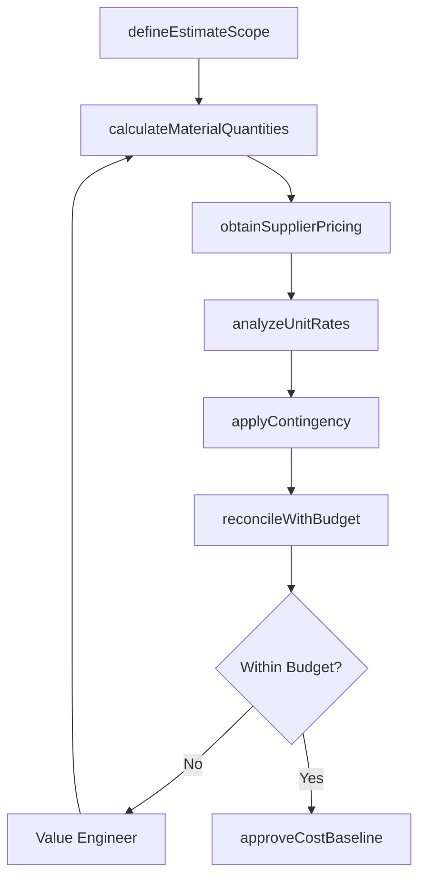
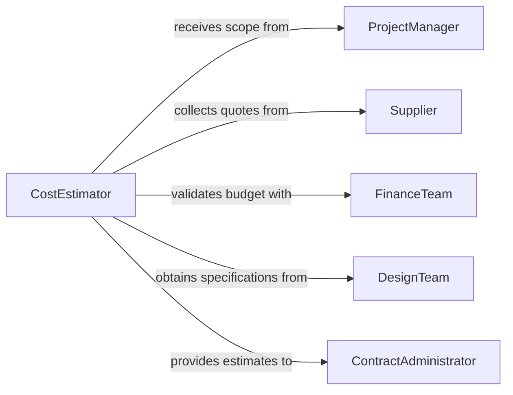

# Estimate Cost Material Requirements

> Business-as-Code definition for estimating cost or material requirements. Models the combined cost-and-material estimation process from scope definition through quantity calculation, pricing analysis, and budget reconciliation.

## Overview

Estimating cost and material requirements involves determining the quantities of materials needed for a project or operation, obtaining pricing from suppliers, calculating total costs including delivery and contingency, and reconciling estimates against budget constraints. This activity is fundamental to project bidding, capital planning, and operational budgeting across construction, manufacturing, maintenance, and facility management. The definition provides actions for each estimation phase, events for tracking cost milestones, and searches for referencing pricing databases and historical cost data.

## Actors

| Actor | Description |
|-------|-------------|
| ProjectManager | Defines project scope and validates cost estimates against objectives |
| Supplier | Provides material pricing, availability, and delivery terms |
| FinanceTeam | Sets budget limits and reviews cost estimate accuracy |
| DesignTeam | Produces specifications that drive material selection and quantities |
| ContractAdministrator | Incorporates cost estimates into bid proposals and contract documents |

## Roles

| Role | Description |
|------|-------------|
| CostEstimator | Calculates material quantities and total project costs |
| PricingAnalyst | Evaluates supplier quotes and identifies cost optimization opportunities |
| BudgetCoordinator | Reconciles estimates with available funding and financial constraints |
| QuantitySurveyor | Measures material quantities from drawings and specifications |

## Entities

| Entity | Description |
|--------|-------------|
| CostEstimate | A comprehensive projection of material and associated costs for a project |
| MaterialSchedule | A categorized list of materials with quantities and specifications |
| PriceComparison | A side-by-side evaluation of supplier quotes for the same materials |
| ContingencyAllowance | A budgeted reserve for unforeseen cost increases or scope changes |
| CostBaseline | The approved cost estimate serving as the benchmark for project spending |
| UnitRate | The cost per unit of material including handling and delivery |

## Actions

| Action | Description |
|--------|-------------|
| defineEstimateScope | Establish the boundaries and categories of the cost estimate |
| calculateMaterialQuantities | Determine the amounts of each material needed from specifications |
| obtainSupplierPricing | Request and collect quotes from material suppliers |
| analyzeUnitRates | Compare unit costs across suppliers and historical data |
| applyContingency | Add a contingency allowance for risk and unforeseen costs |
| reconcileWithBudget | Compare the total estimate against available funding |
| approveCostBaseline | Formally approve the cost estimate as the project baseline |

## Events

| Event | Description |
|-------|-------------|
| estimateScopeDefined | The boundaries and categories of the estimate have been established |
| materialQuantitiesCalculated | Required material amounts have been determined |
| supplierPricingObtained | Quotes from material suppliers have been collected |
| unitRatesAnalyzed | Unit costs have been compared across suppliers and benchmarks |
| contingencyApplied | A risk reserve has been added to the estimate |
| budgetReconciled | The estimate has been compared against available funding |
| costBaselineApproved | The cost estimate has been formally approved |

## Searches

| Search | Description |
|--------|-------------|
| findCostEstimates | List cost estimates by project, status, or approval date |
| getHistoricalCosts | Retrieve actual cost data from similar completed projects |
| getSupplierQuotes | Query current pricing from suppliers by material category |

## Workflow



## Actor Relationships



## Usage

### Calling Actions

```typescript
import { estimateCostMaterialRequirements } from '@headlessly/estimate-cost-material-requirements'

const estimator = estimateCostMaterialRequirements()

// Define the scope of the estimate
const scope = await estimator.defineEstimateScope({
  projectName: 'Warehouse Expansion - Building D',
  categories: ['structural-steel', 'concrete', 'roofing', 'electrical', 'plumbing'],
  estimateType: 'definitive'
})

// Calculate material quantities
const quantities = await estimator.calculateMaterialQuantities({
  scopeId: scope.id,
  drawingSet: 'WHD-2026-CD-R4',
  wasteFactors: { steel: 1.03, concrete: 1.05, roofing: 1.08 }
})

// Obtain and analyze supplier pricing
await estimator.obtainSupplierPricing({
  scopeId: scope.id,
  suppliers: ['national-steel-co', 'metro-concrete', 'pacific-roofing'],
  validUntil: '2026-06-30'
})

// Approve the cost baseline
await estimator.approveCostBaseline({
  scopeId: scope.id,
  contingencyRate: 0.10,
  approvedBy: 'chief-estimator'
})
```

### Event-Driven Automation

```typescript
// Notify contract administrator when baseline is approved
estimator.costBaselineApproved(async ({ projectId, totalCost, contingency }) => {
  await notify({
    to: 'contract-admin',
    message: `Cost baseline approved for ${projectId}: $${totalCost.toLocaleString()} (includes ${(contingency * 100).toFixed(0)}% contingency)`
  })
})

// Alert when supplier pricing deviates from historical benchmarks
estimator.unitRatesAnalyzed(async ({ projectId, outliers }) => {
  if (outliers.length > 0) {
    await escalate({
      to: 'pricing-analyst',
      message: `${outliers.length} materials on ${projectId} priced significantly above historical average`
    })
  }
})
```
