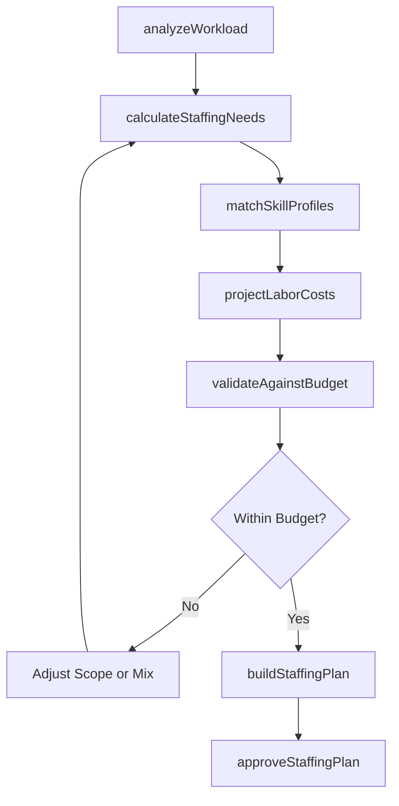
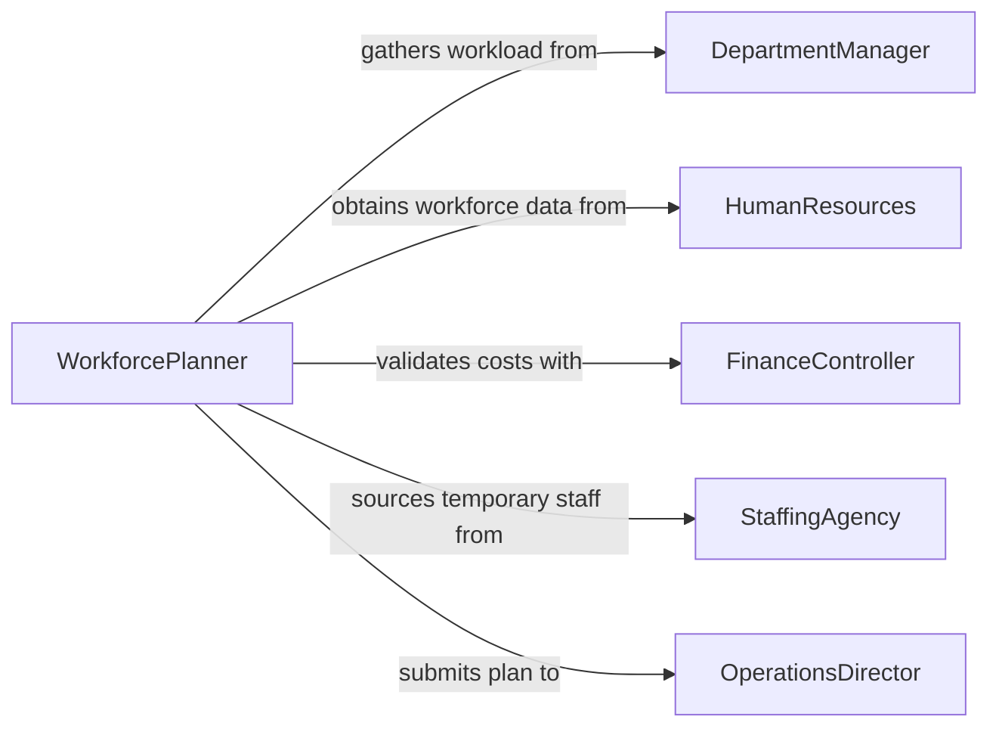

# Estimate Labor Requirements

> Business-as-Code definition for estimating labor requirements. Models the workforce planning process from workload analysis through staffing calculations, skill matching, and labor plan approval.

## Overview

Estimating labor requirements involves analyzing the scope and complexity of planned work, determining the number and types of workers needed, projecting labor hours and costs, and producing staffing plans that align with project timelines and budgets. This activity spans all industries where workforce planning is essential, including manufacturing, services, logistics, and professional operations. The definition provides actions for each estimation phase, events for tracking planning decisions, and searches for labor market and historical staffing data.

## Actors

| Actor | Description |
|-------|-------------|
| DepartmentManager | Defines workload expectations and validates labor projections |
| HumanResources | Provides workforce data, wage rates, and staffing policies |
| FinanceController | Reviews labor cost projections against budget constraints |
| StaffingAgency | Supplies temporary or contract workers to meet demand peaks |
| OperationsDirector | Approves final staffing plans and authorizes headcount changes |

## Roles

| Role | Description |
|------|-------------|
| WorkforcePlanner | Analyzes workloads and calculates staffing needs |
| LaborAnalyst | Models labor demand using historical data and productivity metrics |
| SchedulingCoordinator | Maps labor requirements to shift patterns and availability |
| BudgetAnalyst | Integrates labor estimates into financial projections |

## Entities

| Entity | Description |
|--------|-------------|
| LaborRequirement | A specification of the number, type, and duration of workers needed |
| WorkloadForecast | A projection of upcoming work volume driving labor demand |
| StaffingPlan | The approved plan for deploying workers across activities and time periods |
| SkillProfile | A description of competencies and qualifications needed for a role |
| LaborCostModel | A calculation framework for projecting total labor expenses |
| ProductivityBenchmark | A standard measure of output per labor hour for a given activity |

## Actions

| Action | Description |
|--------|-------------|
| analyzeWorkload | Assess the volume, complexity, and timing of planned work |
| calculateStaffingNeeds | Determine the headcount and skill mix required |
| matchSkillProfiles | Align available or recruitable talent to required competencies |
| projectLaborCosts | Estimate total wages, benefits, and overhead for the staffing plan |
| buildStaffingPlan | Assemble the complete labor deployment schedule |
| validateAgainstBudget | Confirm the staffing plan fits within financial constraints |
| approveStaffingPlan | Formally sign off on the labor requirements |

## Events

| Event | Description |
|-------|-------------|
| workloadAnalyzed | The volume and timing of planned work have been assessed |
| staffingNeedsCalculated | Required headcount and skill mix have been determined |
| skillProfilesMatched | Available talent has been aligned to required competencies |
| laborCostsProjected | Total labor expenses have been estimated |
| staffingPlanBuilt | The labor deployment schedule has been assembled |
| budgetValidated | The staffing plan has been confirmed within budget |
| staffingPlanApproved | The labor requirements have been formally approved |

## Searches

| Search | Description |
|--------|-------------|
| findStaffingPlans | List staffing plans by department, period, or approval status |
| getProductivityBenchmarks | Retrieve output-per-hour benchmarks by activity type |
| getLaborMarketData | Query wage rates and worker availability by region and skill |

## Workflow



## Actor Relationships



## Usage

### Calling Actions

```typescript
import { estimateLaborRequirements } from '@headlessly/estimate-labor-requirements'

const workforce = estimateLaborRequirements()

// Analyze workload for upcoming quarter
const workload = await workforce.analyzeWorkload({
  department: 'Fulfillment Center - East',
  period: '2026-Q2',
  expectedOrderVolume: 450000,
  averageProcessingTime: 12 // minutes per order
})

// Calculate staffing needs
const staffing = await workforce.calculateStaffingNeeds({
  workloadId: workload.id,
  shiftsPerDay: 2,
  hoursPerShift: 8,
  targetUtilization: 0.85
})

// Build and approve the staffing plan
await workforce.buildStaffingPlan({
  workloadId: workload.id,
  staffingNeeds: staffing,
  startDate: '2026-04-01',
  endDate: '2026-06-30'
})
```

### Event-Driven Automation

```typescript
// Trigger recruitment when staffing plan is approved
workforce.staffingPlanApproved(async ({ planId, newHires, contractPositions }) => {
  if (newHires > 0) {
    await recruitmentPipeline.initiate({
      planId,
      positions: newHires
    })
  }
  if (contractPositions > 0) {
    await notify({
      to: 'staffing-agency',
      message: `${contractPositions} contract positions needed for plan ${planId}`
    })
  }
})

// Alert when labor costs exceed budget threshold
workforce.laborCostsProjected(async ({ planId, totalCost, budgetLimit }) => {
  if (totalCost > budgetLimit * 0.95) {
    await escalate({
      to: 'finance-controller',
      message: `Labor cost projection at ${((totalCost / budgetLimit) * 100).toFixed(1)}% of budget for plan ${planId}`
    })
  }
})
```
