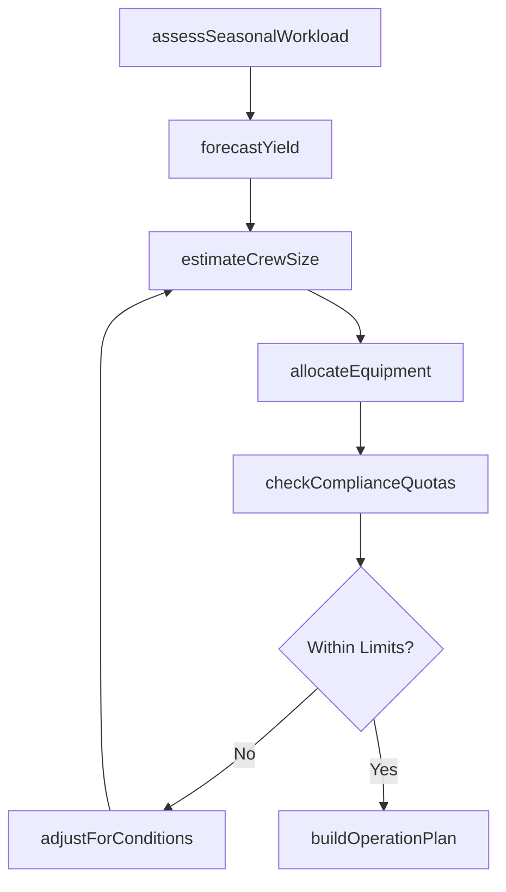
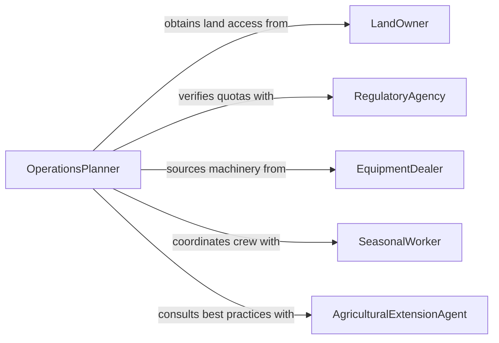

# Estimate Labor Resource Requirements Forestry

> Business-as-Code definition for estimating labor or resource requirements for forestry, fishing, or agricultural operations. Models the planning process from seasonal assessment through crew sizing, equipment allocation, and operational scheduling.

## Overview

Estimating labor and resource requirements for forestry, fishing, and agricultural operations involves analyzing seasonal workloads, terrain and environmental conditions, crop or harvest cycles, and regulatory constraints to project the workforce, equipment, and supplies needed. This activity supports timber harvest planning, commercial fishing fleet management, and farm operations scheduling. The definition provides actions for each estimation phase, events for tracking planning milestones, and searches for historical yield and labor data.

## Actors

| Actor | Description |
|-------|-------------|
| LandOwner | Provides access to forestry, farmland, or waterway resources |
| RegulatoryAgency | Sets harvest quotas, fishing limits, and environmental compliance requirements |
| EquipmentDealer | Supplies machinery, vessels, and agricultural implements |
| SeasonalWorker | Provides labor during peak harvest, planting, or fishing periods |
| AgriculturalExtensionAgent | Advises on best practices, yield projections, and resource optimization |

## Roles

| Role | Description |
|------|-------------|
| OperationsPlanner | Analyzes workloads and develops resource requirement estimates |
| CrewSupervisor | Manages field teams and validates labor estimates against actual conditions |
| HarvestManager | Coordinates timing, equipment, and personnel for harvest operations |
| ResourceAnalyst | Reviews historical data and forecasts to refine estimation accuracy |

## Entities

| Entity | Description |
|--------|-------------|
| OperationPlan | A documented plan covering scope, timeline, and resource needs for a season |
| LaborEstimate | The projected number of workers, skill types, and hours for an operation |
| EquipmentAllocation | The assignment of machinery and tools to specific operation phases |
| YieldForecast | A projection of expected harvest volume based on conditions and history |
| SeasonalCalendar | A timeline mapping planting, growing, and harvesting windows |
| ComplianceQuota | A regulatory limit on harvest volume, catch quantity, or land use |

## Actions

| Action | Description |
|--------|-------------|
| assessSeasonalWorkload | Evaluate the scope and timing of upcoming operations |
| forecastYield | Project expected production volume from historical and current data |
| estimateCrewSize | Calculate the number and type of workers needed per operation phase |
| allocateEquipment | Assign machinery and vessels to operation phases based on requirements |
| checkComplianceQuotas | Verify that planned operations fall within regulatory limits |
| buildOperationPlan | Assemble the complete resource plan for the season |
| adjustForConditions | Modify estimates based on weather, terrain, or market changes |

## Events

| Event | Description |
|-------|-------------|
| workloadAssessed | The seasonal scope and timing have been evaluated |
| yieldForecasted | Expected production volume has been projected |
| crewSizeEstimated | Required workforce numbers have been calculated |
| equipmentAllocated | Machinery and vessels have been assigned to operation phases |
| complianceVerified | Planned operations have been confirmed within regulatory limits |
| operationPlanBuilt | The complete seasonal resource plan has been assembled |
| estimatesAdjusted | Resource estimates have been modified due to changing conditions |

## Searches

| Search | Description |
|--------|-------------|
| findOperationPlans | List operation plans by season, region, or crop type |
| getHistoricalYields | Retrieve past yield data for a given parcel, species, or waterway |
| getLaborAvailability | Check availability of seasonal workers by region and time period |

## Workflow



## Actor Relationships



## Usage

### Calling Actions

```typescript
import { estimateLaborResourceRequirementsForestry } from '@headlessly/estimate-labor-resource-requirements-forestry'

const planner = estimateLaborResourceRequirementsForestry()

// Assess workload for the upcoming timber harvest season
const workload = await planner.assessSeasonalWorkload({
  operationType: 'timber-harvest',
  region: 'Pacific Northwest - Unit 14',
  season: '2026-Q3',
  acreage: 320
})

// Estimate crew requirements
const crew = await planner.estimateCrewSize({
  workloadId: workload.id,
  phases: ['felling', 'skidding', 'loading', 'transport'],
  productivityRate: 25 // cubic meters per crew-day
})

// Build the complete operation plan
await planner.buildOperationPlan({
  workloadId: workload.id,
  crewEstimate: crew,
  equipment: ['feller-buncher', 'skidder', 'log-loader'],
  startDate: '2026-07-15'
})
```

### Event-Driven Automation

```typescript
// Alert when compliance quotas are at risk
planner.complianceVerified(async ({ operationPlanId, passed, violations }) => {
  if (!passed) {
    await escalate({
      to: 'regulatory-liaison',
      message: `Quota violations in plan ${operationPlanId}: ${violations.join(', ')}`
    })
  }
})

// Trigger crew recruitment when estimates are finalized
planner.crewSizeEstimated(async ({ operationPlanId, totalWorkers, skills }) => {
  await recruitmentPipeline.initiate({
    planId: operationPlanId,
    positions: totalWorkers,
    requiredSkills: skills
  })
})
```
