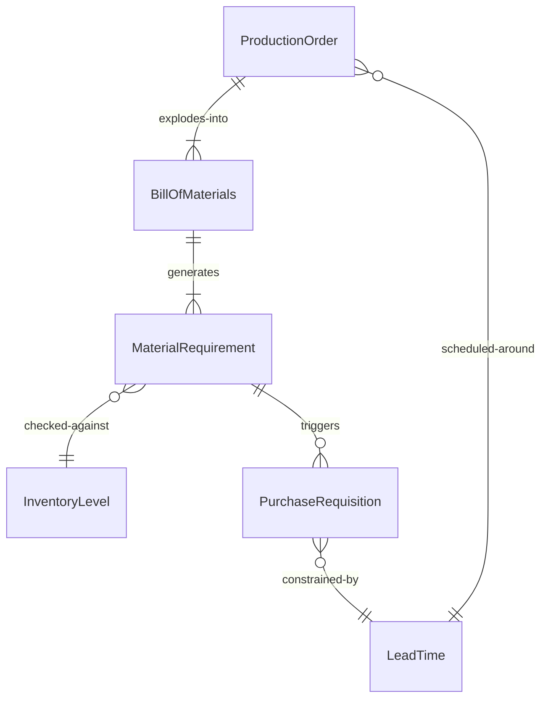
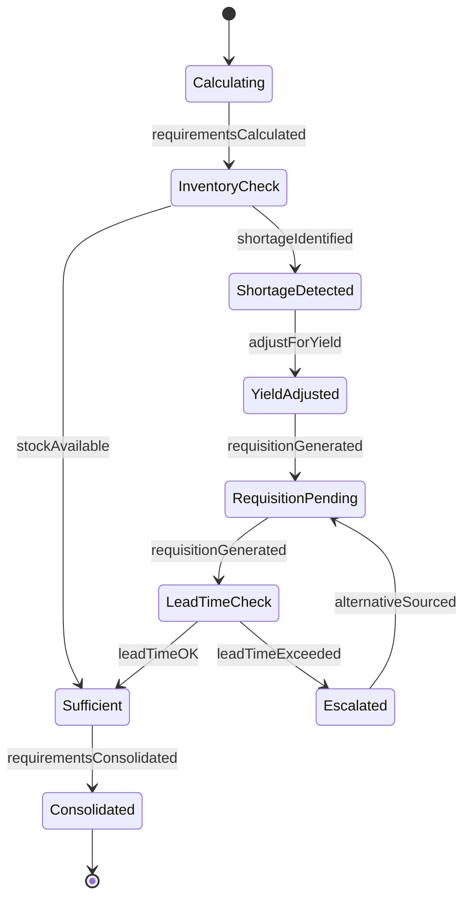
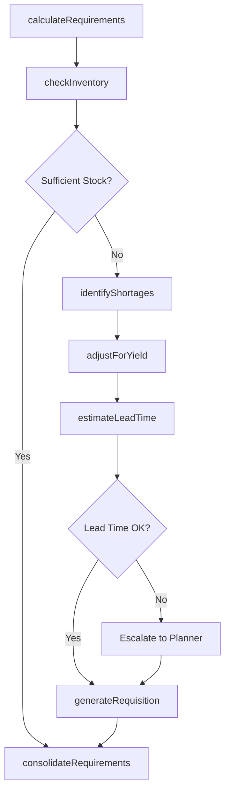
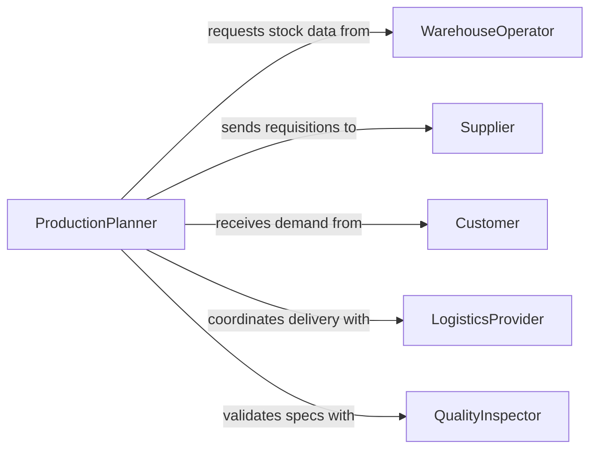

# Estimate Material Requirements Production

> Business-as-Code definition for estimating material requirements in production environments. Models the process of calculating raw material quantities, lead times, and procurement needs based on production schedules and demand forecasts.

## Overview

Estimating material requirements for production involves analyzing production orders, bills of materials, current inventory levels, and supplier lead times to determine the types and quantities of raw materials needed. This definition exposes actions for demand-driven material planning, events for supply chain automation, and searches for inventory and requirement data retrieval.

## Actors

| Actor | Description |
|-------|-------------|
| Supplier | Provides raw materials and components with quoted lead times |
| Customer | Generates demand through purchase orders and forecasts |
| WarehouseOperator | Manages physical inventory and reports stock levels |
| QualityInspector | Validates incoming material specifications and quality |
| LogisticsProvider | Handles material transportation and delivery scheduling |

## Roles

| Role | Description |
|------|-------------|
| ProductionPlanner | Develops production schedules and calculates material needs |
| MaterialsManager | Oversees material procurement and inventory optimization |
| ProcurementSpecialist | Sources materials and negotiates supplier contracts |
| InventoryAnalyst | Tracks stock levels and consumption patterns |

## Entities

| Entity | Description |
|--------|-------------|
| BillOfMaterials | Hierarchical list of components and raw materials for a product |
| MaterialRequirement | Calculated quantity and timing for a specific material |
| ProductionOrder | A scheduled manufacturing run with defined output quantities |
| InventoryLevel | Current on-hand and committed stock for a material |
| LeadTime | Expected duration from order placement to material delivery |
| PurchaseRequisition | A formal request to procure materials for production |

## Actions

| Action | Description |
|--------|-------------|
| calculateRequirements | Compute material quantities from production orders and BOMs |
| checkInventory | Compare requirements against current stock levels |
| identifyShortages | Flag materials where demand exceeds available supply |
| generateRequisition | Create purchase requisitions for deficit materials |
| estimateLeadTime | Calculate expected delivery dates from supplier data |
| adjustForYield | Factor in scrap rates and yield loss when estimating quantities |
| consolidateRequirements | Merge requirements across multiple production orders |

## Events

| Event | Description |
|-------|-------------|
| requirementsCalculated | Material requirements have been computed for a production order |
| shortageIdentified | A material deficit has been detected against inventory |
| requisitionGenerated | A purchase requisition has been created for procurement |
| leadTimeExceeded | Supplier lead time exceeds production schedule deadline |
| inventoryThresholdBreached | Stock level has fallen below the reorder point |
| requirementsConsolidated | Requirements across orders have been merged |

## Searches

| Search | Description |
|--------|-------------|
| findRequirements | List material requirements by production order, date range, or material type |
| getInventoryLevels | Retrieve current stock levels for specified materials |
| getShortages | Find materials with insufficient inventory for planned production |
| getLeadTimes | Look up supplier lead times for specific materials |

## Entity Relationships



## State Diagram



## Workflow



## Actor Relationships



## Usage

### Calling Actions

```typescript
import { estimateMaterialRequirementsProduction } from '@headlessly/estimate-material-requirements-production'

const materials = estimateMaterialRequirementsProduction()

// Calculate material requirements for a production order
const requirements = await materials.calculateRequirements({
  productionOrderId: 'PO-2026-0042',
  productId: 'WIDGET-A',
  quantity: 5000,
  startDate: '2026-03-01'
})

// Check inventory against calculated requirements
const inventory = await materials.checkInventory({
  materialIds: requirements.map(r => r.materialId)
})

// Generate purchase requisitions for shortages
const shortages = await materials.identifyShortages({
  productionOrderId: 'PO-2026-0042'
})

for (const shortage of shortages) {
  await materials.generateRequisition({
    materialId: shortage.materialId,
    quantity: shortage.deficit,
    requiredBy: shortage.needDate
  })
}
```

### Event-Driven Automation

```typescript
// Alert procurement when lead time exceeds schedule
materials.leadTimeExceeded(async ({ materialId, supplierId, leadTimeDays, requiredBy }) => {
  await notify({
    to: 'procurement-team',
    message: `Material ${materialId} lead time of ${leadTimeDays} days exceeds required date ${requiredBy}`
  })
})

// Auto-generate requisitions on shortage detection
materials.shortageIdentified(async ({ materialId, deficit, productionOrderId }) => {
  await materials.generateRequisition({
    materialId,
    quantity: deficit,
    linkedOrder: productionOrderId
  })
})
```
