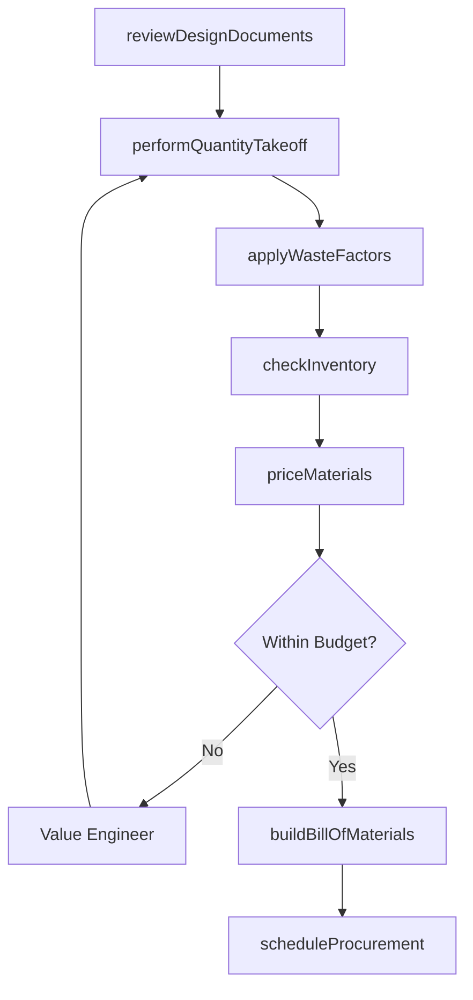
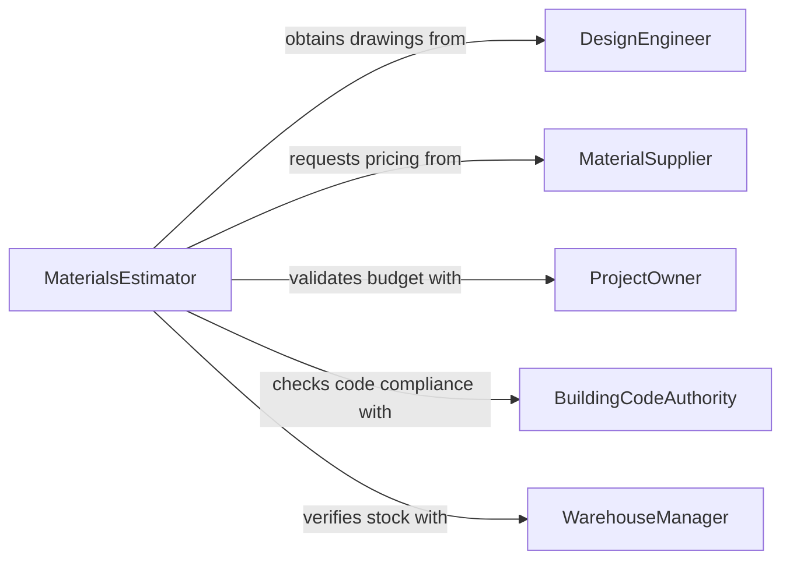

# Estimate Materials Requirements Projects

> Business-as-Code definition for estimating materials requirements for projects. Models the materials planning process from design review through quantity takeoff, waste factor calculation, and procurement scheduling.

## Overview

Estimating materials requirements for projects involves reviewing project designs and specifications, performing quantity takeoffs for each material category, applying waste and contingency factors, and producing a procurement-ready bill of materials. This activity is essential in construction, manufacturing, renovation, and infrastructure projects where accurate material estimation prevents shortages, reduces waste, and controls costs. The definition provides actions for each estimation phase, events for tracking planning milestones, and searches for referencing supplier catalogs and material pricing.

## Actors

| Actor | Description |
|-------|-------------|
| DesignEngineer | Provides project drawings, specifications, and material callouts |
| MaterialSupplier | Offers pricing, availability, and lead time information for materials |
| ProjectOwner | Sets budget constraints and approves material cost projections |
| BuildingCodeAuthority | Specifies material standards and compliance requirements |
| WarehouseManager | Tracks existing inventory that may offset new procurement needs |

## Roles

| Role | Description |
|------|-------------|
| MaterialsEstimator | Performs quantity takeoffs and calculates total material requirements |
| CostAnalyst | Prices the bill of materials and evaluates cost optimization options |
| ProcurementCoordinator | Schedules material orders to align with project timelines |
| QualitySpecialist | Verifies that specified materials meet performance and code standards |

## Entities

| Entity | Description |
|--------|-------------|
| BillOfMaterials | A comprehensive list of all materials, quantities, and specifications |
| QuantityTakeoff | A detailed measurement of material quantities from project drawings |
| WasteFactor | A multiplier accounting for cutting waste, breakage, and installation loss |
| MaterialPriceQuote | A supplier quote for specified materials including delivery terms |
| ProcurementSchedule | A timeline for ordering materials to meet project phase deadlines |

## Actions

| Action | Description |
|--------|-------------|
| reviewDesignDocuments | Analyze project drawings and specifications for material requirements |
| performQuantityTakeoff | Measure and calculate material quantities from design documents |
| applyWasteFactors | Adjust quantities to account for cutting waste and installation loss |
| priceMaterials | Obtain supplier quotes and calculate total material costs |
| checkInventory | Compare requirements against existing warehouse stock |
| buildBillOfMaterials | Assemble the complete materials list with quantities and specifications |
| scheduleProcurement | Plan ordering timelines to align material delivery with project phases |

## Events

| Event | Description |
|-------|-------------|
| designDocumentsReviewed | Project drawings and specifications have been analyzed |
| quantityTakeoffCompleted | Material quantities have been measured and calculated |
| wasteFactorsApplied | Quantities have been adjusted for waste and contingency |
| materialsPriced | Supplier quotes have been obtained and total costs calculated |
| inventoryChecked | Existing stock levels have been compared against requirements |
| billOfMaterialsBuilt | The complete materials list has been assembled |
| procurementScheduled | Material ordering timelines have been established |

## Searches

| Search | Description |
|--------|-------------|
| findMaterialsBySpec | Locate materials matching specific grade, size, or performance criteria |
| getSupplierPricing | Retrieve current pricing and availability from material suppliers |
| getBillOfMaterials | Access the bill of materials for a specific project or phase |

## Workflow



## Actor Relationships



## Usage

### Calling Actions

```typescript
import { estimateMaterialsRequirementsProjects } from '@headlessly/estimate-materials-requirements-projects'

const materials = estimateMaterialsRequirementsProjects()

// Review design documents for material requirements
const review = await materials.reviewDesignDocuments({
  projectName: 'Downtown Library Renovation',
  drawingSet: 'DLR-2026-ARCH-SET-R2',
  phases: ['demolition', 'structural', 'finishes']
})

// Perform quantity takeoff
const takeoff = await materials.performQuantityTakeoff({
  reviewId: review.id,
  categories: ['concrete', 'structural-steel', 'drywall', 'flooring', 'paint']
})

// Build the complete bill of materials
await materials.buildBillOfMaterials({
  reviewId: review.id,
  takeoffId: takeoff.id,
  wasteFactors: { concrete: 1.05, drywall: 1.10, paint: 1.15 }
})
```

### Event-Driven Automation

```typescript
// Notify procurement when bill of materials is ready
materials.billOfMaterialsBuilt(async ({ projectId, totalItems, totalCost }) => {
  await notify({
    to: 'procurement',
    message: `BOM ready for ${projectId}: ${totalItems} line items, estimated $${totalCost.toLocaleString()}`
  })
})

// Alert when material pricing exceeds budget threshold
materials.materialsPriced(async ({ projectId, totalCost, budgetAllocation }) => {
  if (totalCost > budgetAllocation * 1.1) {
    await escalate({
      to: 'project-owner',
      message: `Material costs for ${projectId} exceed budget by ${(((totalCost - budgetAllocation) / budgetAllocation) * 100).toFixed(1)}%`
    })
  }
})
```
