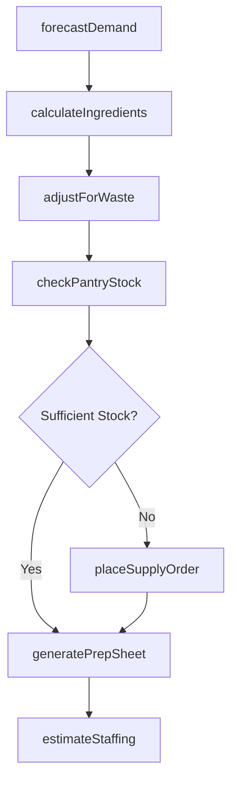
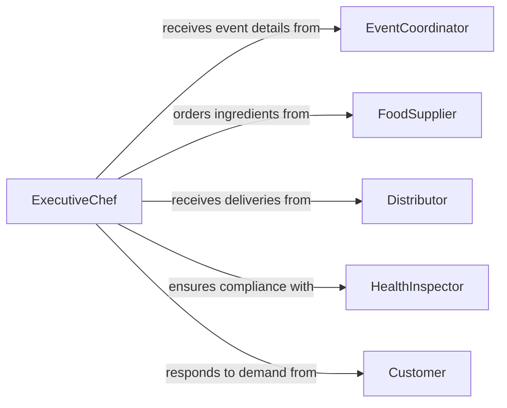

# Estimate Supplies Ingredients Staff Requirements

> Business-as-Code definition for estimating supplies, ingredients, and staffing needs for food preparation activities. Models the planning process from menu forecasting through ingredient ordering and kitchen labor scheduling.

## Overview

Estimating supplies, ingredients, and staff requirements for food preparation involves analyzing menus, anticipated covers, seasonal availability, and kitchen capacity to determine what must be procured and how many staff are needed. This definition exposes actions for recipe-based ingredient calculation, events for procurement automation, and searches for inventory and scheduling data.

## Actors

| Actor | Description |
|-------|-------------|
| FoodSupplier | Provides ingredients, produce, and specialty items |
| EventCoordinator | Communicates banquet and catering requirements |
| HealthInspector | Enforces food safety and storage compliance |
| Distributor | Delivers bulk supplies and disposable goods |
| Customer | Generates demand through reservations and orders |

## Roles

| Role | Description |
|------|-------------|
| ExecutiveChef | Plans menus and determines ingredient specifications |
| KitchenManager | Schedules kitchen staff and coordinates prep workflows |
| PurchasingAgent | Procures ingredients and supplies from vendors |
| PrepCook | Executes food preparation tasks based on production sheets |

## Entities

| Entity | Description |
|--------|-------------|
| Recipe | A standardized formula listing ingredients and quantities per serving |
| MenuForecast | Projected number of covers and menu item demand for a period |
| IngredientRequirement | Calculated quantity of a specific ingredient needed |
| StaffSchedule | Planned labor allocation by shift, role, and station |
| SupplyOrder | A purchase order for ingredients or kitchen supplies |
| PrepSheet | Daily production plan listing items to prepare and quantities |

## Actions

| Action | Description |
|--------|-------------|
| forecastDemand | Project covers and menu item popularity for a period |
| calculateIngredients | Compute ingredient quantities from recipes and forecasted demand |
| estimateStaffing | Determine kitchen labor hours needed based on prep volume |
| checkPantryStock | Compare ingredient requirements against current inventory |
| placeSupplyOrder | Submit purchase orders for deficit ingredients and supplies |
| adjustForWaste | Factor in spoilage and waste percentages when estimating |
| generatePrepSheet | Create daily production plans from calculated requirements |

## Events

| Event | Description |
|-------|-------------|
| demandForecasted | Cover counts and menu projections have been calculated |
| ingredientsCalculated | Ingredient quantities have been determined for the period |
| staffingEstimated | Kitchen labor requirements have been projected |
| stockShortageDetected | Pantry inventory is insufficient for planned production |
| supplyOrderPlaced | A purchase order has been submitted to a supplier |
| prepSheetGenerated | Daily production plan has been created |

## Searches

| Search | Description |
|--------|-------------|
| findIngredientNeeds | List ingredient requirements by date, recipe, or menu item |
| getStaffingSchedule | Retrieve staff schedules by shift, station, or date range |
| getStockLevels | Check current pantry and dry storage inventory levels |
| getSupplyOrders | Find pending or completed supply orders by vendor or date |

## Workflow



## Actor Relationships



## Usage

### Calling Actions

```typescript
import { estimateSuppliesIngredientsStaffRequirements } from '@headlessly/estimate-supplies-ingredients-staff-requirements'

const kitchen = estimateSuppliesIngredientsStaffRequirements()

// Forecast demand for Saturday dinner service
const forecast = await kitchen.forecastDemand({
  date: '2026-03-14',
  mealPeriod: 'dinner',
  expectedCovers: 220
})

// Calculate ingredient needs from menu and forecast
const ingredients = await kitchen.calculateIngredients({
  forecastId: forecast.id,
  menuId: 'spring-dinner-2026'
})

// Estimate staffing for the shift
const staffing = await kitchen.estimateStaffing({
  date: '2026-03-14',
  mealPeriod: 'dinner',
  prepVolume: ingredients.totalPrepItems
})
```

### Event-Driven Automation

```typescript
// Auto-order when pantry stock falls short
kitchen.stockShortageDetected(async ({ ingredientId, deficit, neededBy }) => {
  await kitchen.placeSupplyOrder({
    ingredientId,
    quantity: deficit,
    deliveryDate: neededBy,
    preferredVendor: 'primary'
  })
})

// Notify kitchen manager when prep sheet is ready
kitchen.prepSheetGenerated(async ({ date, mealPeriod, totalItems }) => {
  await notify({
    to: 'kitchen-manager',
    message: `Prep sheet for ${date} ${mealPeriod} is ready: ${totalItems} items`
  })
})
```
