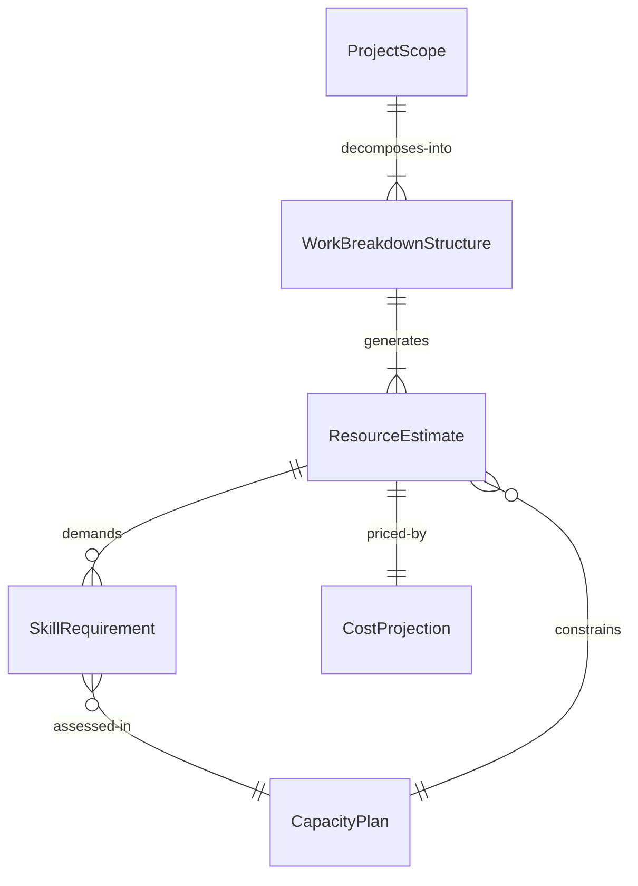
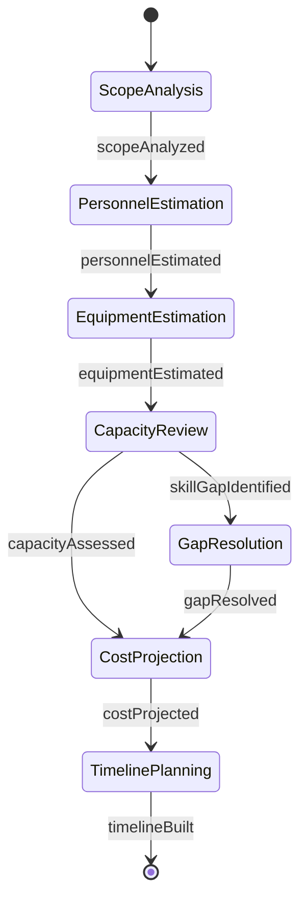
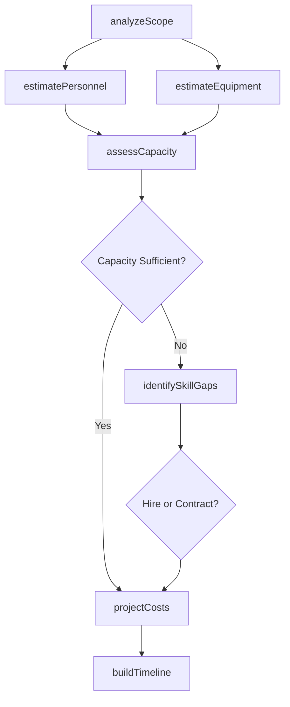
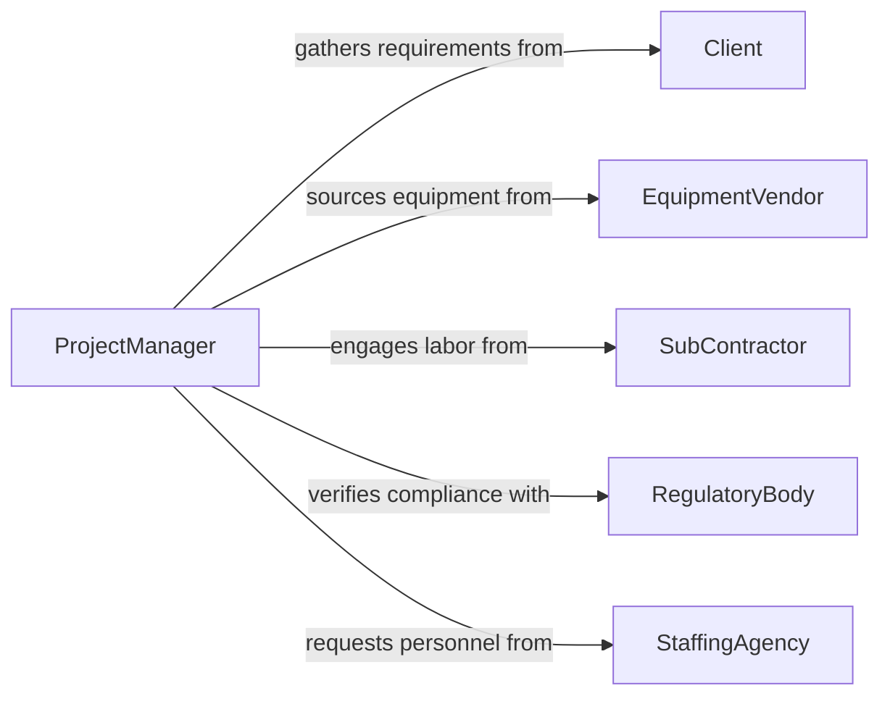

# Estimate Technical Resource Requirements Development

> Business-as-Code definition for estimating technical and resource requirements for development or production projects. Models the assessment of personnel, equipment, infrastructure, and timeline needs to deliver engineering and manufacturing initiatives.

## Overview

Estimating technical resource requirements for development or production projects involves analyzing project scope, engineering complexity, skill demands, equipment availability, and timeline constraints to determine the resources needed for successful delivery. This definition exposes actions for capacity planning and resource estimation, events for project planning automation, and searches for resource availability data.

## Actors

| Actor | Description |
|-------|-------------|
| Client | Defines project requirements and acceptance criteria |
| EquipmentVendor | Supplies specialized tools, machinery, or infrastructure |
| SubContractor | Provides supplemental technical labor or specialized services |
| RegulatoryBody | Sets compliance requirements that influence resource needs |
| StaffingAgency | Sources contract technical personnel when capacity is short |

## Roles

| Role | Description |
|------|-------------|
| ProjectManager | Coordinates resource planning across project phases |
| TechnicalLead | Assesses engineering complexity and skill requirements |
| ResourcePlanner | Allocates personnel and equipment across projects |
| CostEstimator | Develops budget estimates based on resource projections |

## Entities

| Entity | Description |
|--------|-------------|
| ProjectScope | Defined deliverables, milestones, and technical requirements |
| ResourceEstimate | Projected personnel, equipment, and material needs for a project |
| SkillRequirement | A specific technical competency needed for project execution |
| CapacityPlan | Available versus required resources over a time horizon |
| CostProjection | Estimated financial expenditure based on resource estimates |
| WorkBreakdownStructure | Hierarchical decomposition of project deliverables into tasks |

## Actions

| Action | Description |
|--------|-------------|
| analyzeScope | Break down project deliverables into estimable work packages |
| estimatePersonnel | Calculate staffing needs by skill type and duration |
| estimateEquipment | Determine machinery, tooling, and infrastructure requirements |
| assessCapacity | Compare required resources against current organizational capacity |
| projectCosts | Calculate budget estimates from resource and rate data |
| identifySkillGaps | Flag technical competencies not available in-house |
| buildTimeline | Sequence resource assignments against project milestones |

## Events

| Event | Description |
|-------|-------------|
| scopeAnalyzed | Project work breakdown structure has been completed |
| personnelEstimated | Staffing requirements have been calculated |
| equipmentEstimated | Equipment and infrastructure needs have been determined |
| capacityAssessed | Resource availability has been evaluated against demand |
| skillGapIdentified | A required competency is unavailable within the organization |
| costProjected | Budget estimate has been generated from resource plan |
| timelineBuilt | Resource assignments have been sequenced against milestones |

## Searches

| Search | Description |
|--------|-------------|
| findEstimates | List resource estimates by project, phase, or resource type |
| getCapacity | Retrieve available capacity by skill, department, or time period |
| getSkillGaps | Find unfilled technical competency requirements |
| getCostProjections | Look up budget estimates by project or cost category |

## Entity Relationships



## State Diagram



## Workflow



## Actor Relationships



## Usage

### Calling Actions

```typescript
import { estimateTechnicalResourceRequirementsDevelopment } from '@headlessly/estimate-technical-resource-requirements-development'

const resources = estimateTechnicalResourceRequirementsDevelopment()

// Analyze project scope and break into work packages
const scope = await resources.analyzeScope({
  projectId: 'PRJ-2026-018',
  deliverables: ['PCB Design', 'Firmware Development', 'Enclosure Tooling'],
  targetDate: '2026-09-30'
})

// Estimate personnel needs
const staffing = await resources.estimatePersonnel({
  projectId: 'PRJ-2026-018',
  workPackages: scope.workPackages
})

// Assess organizational capacity
const capacity = await resources.assessCapacity({
  projectId: 'PRJ-2026-018',
  requiredSkills: staffing.skillRequirements,
  period: { start: '2026-04-01', end: '2026-09-30' }
})
```

### Event-Driven Automation

```typescript
// Alert resource planning when skill gaps are found
resources.skillGapIdentified(async ({ projectId, skill, requiredHeadcount }) => {
  await notify({
    to: 'resource-planning',
    message: `Project ${projectId} needs ${requiredHeadcount} ${skill} specialists not available in-house`
  })
})

// Auto-generate cost projection when capacity is assessed
resources.capacityAssessed(async ({ projectId, resourcePlan }) => {
  await resources.projectCosts({
    projectId,
    resourcePlan,
    rateCard: 'standard-2026'
  })
})
```
