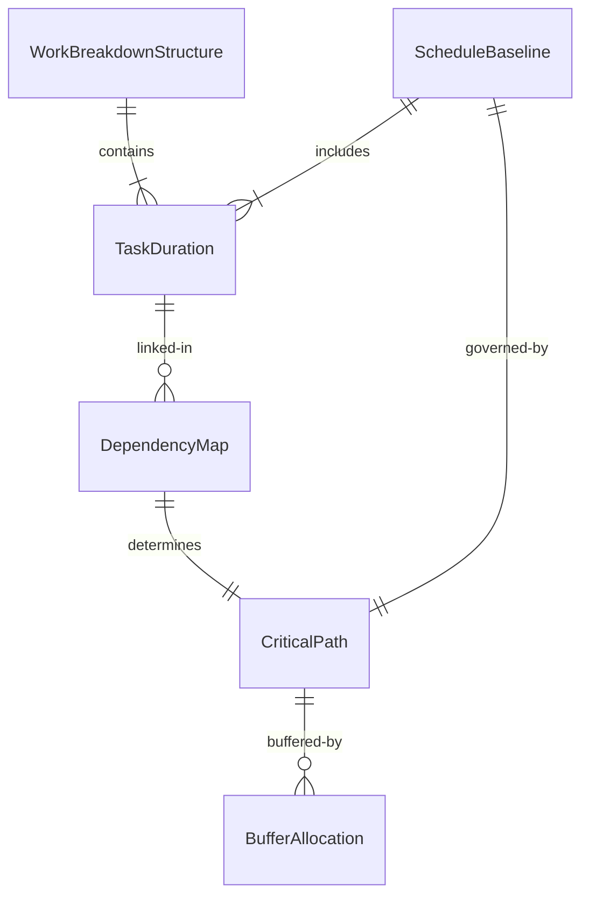
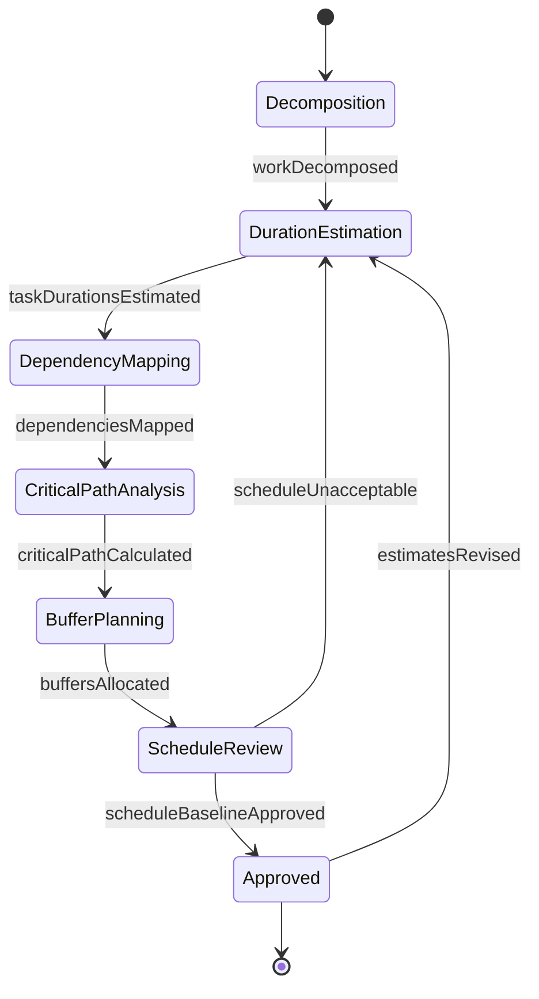
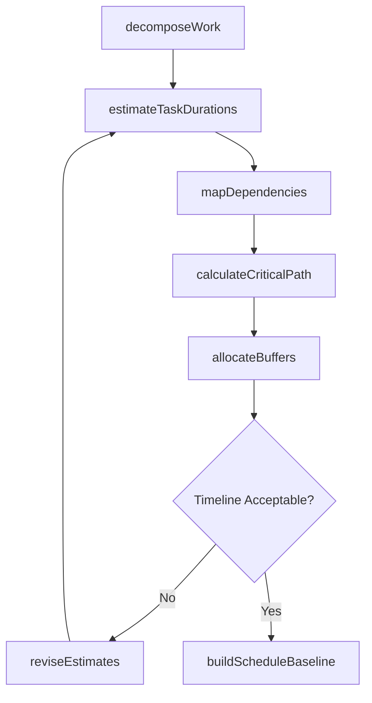
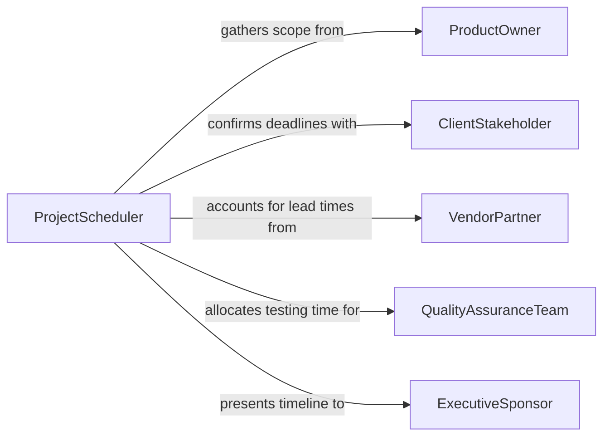

# Estimate Time Requirements Development Production

> Business-as-Code definition for estimating time requirements for development or production projects. Models the scheduling process from work breakdown through duration estimation, dependency mapping, and timeline finalization.

## Overview

Estimating time requirements for development or production projects involves decomposing project work into discrete tasks, assessing the effort and duration for each, identifying dependencies and sequencing constraints, and assembling a realistic project timeline. This activity applies across software development, product manufacturing, media production, and engineering projects where accurate scheduling drives resource allocation and delivery commitments. The definition provides actions for each estimation phase, events for milestone tracking, and searches for referencing historical durations and productivity benchmarks.

## Actors

| Actor | Description |
|-------|-------------|
| ProductOwner | Defines scope, priorities, and delivery expectations for the project |
| ClientStakeholder | Sets contractual deadlines and reviews schedule commitments |
| VendorPartner | Provides components or services with their own lead times |
| QualityAssuranceTeam | Requires allocated time for testing and validation activities |
| ExecutiveSponsor | Approves the project timeline and authorizes resource commitments |

## Roles

| Role | Description |
|------|-------------|
| ProjectScheduler | Decomposes work and builds the project timeline |
| TechnicalLead | Provides effort estimates for development or engineering tasks |
| ProductionManager | Estimates durations for manufacturing and assembly activities |
| ScheduleAnalyst | Validates estimates using historical data and risk analysis |

## Entities

| Entity | Description |
|--------|-------------|
| WorkBreakdownStructure | A hierarchical decomposition of project deliverables into estimable tasks |
| TaskDuration | The estimated time to complete an individual task or activity |
| DependencyMap | A representation of sequencing relationships between tasks |
| CriticalPath | The longest sequence of dependent tasks determining minimum project duration |
| ScheduleBaseline | The approved project timeline against which progress is measured |
| BufferAllocation | Contingency time added to account for uncertainty and risk |

## Actions

| Action | Description |
|--------|-------------|
| decomposeWork | Break the project into a work breakdown structure of estimable tasks |
| estimateTaskDurations | Assess the time required for each individual task |
| mapDependencies | Identify predecessor and successor relationships between tasks |
| calculateCriticalPath | Determine the longest chain of dependent tasks |
| allocateBuffers | Add contingency time for risk and uncertainty |
| buildScheduleBaseline | Assemble the approved project timeline |
| reviseEstimates | Update duration estimates based on new information or scope changes |

## Events

| Event | Description |
|-------|-------------|
| workDecomposed | The project has been broken into estimable tasks |
| taskDurationsEstimated | Time estimates have been assigned to all tasks |
| dependenciesMapped | Sequencing relationships between tasks have been identified |
| criticalPathCalculated | The longest dependent task chain has been determined |
| buffersAllocated | Contingency time has been added to the schedule |
| scheduleBaselineApproved | The project timeline has been formally approved |
| estimatesRevised | Duration estimates have been updated |

## Searches

| Search | Description |
|--------|-------------|
| findHistoricalDurations | Retrieve actual durations from similar past projects |
| getTasksByPhase | List tasks within a specific project phase |
| getCriticalPathTasks | Identify tasks on the critical path for a given project |

## Entity Relationships



## State Diagram



## Workflow



## Actor Relationships



## Usage

### Calling Actions

```typescript
import { estimateTimeRequirementsDevelopmentProduction } from '@headlessly/estimate-time-requirements-development-production'

const scheduler = estimateTimeRequirementsDevelopmentProduction()

// Decompose project into estimable tasks
const wbs = await scheduler.decomposeWork({
  projectName: 'Mobile App v3.0 Release',
  deliverables: ['user-authentication', 'payment-integration', 'push-notifications', 'ui-redesign'],
  methodology: 'agile'
})

// Estimate durations for all tasks
await scheduler.estimateTaskDurations({
  wbsId: wbs.id,
  estimationMethod: 'three-point',
  unit: 'days'
})

// Calculate the critical path
const criticalPath = await scheduler.calculateCriticalPath({
  wbsId: wbs.id
})

// Build the approved schedule baseline
await scheduler.buildScheduleBaseline({
  wbsId: wbs.id,
  startDate: '2026-04-01',
  bufferStrategy: 'critical-chain'
})
```

### Event-Driven Automation

```typescript
// Notify stakeholders when schedule baseline is approved
scheduler.scheduleBaselineApproved(async ({ projectId, endDate, totalDays }) => {
  await notify({
    to: 'project-team',
    message: `Schedule approved: ${totalDays} days, target completion ${endDate}`
  })
})

// Alert when critical path changes after revision
scheduler.criticalPathCalculated(async ({ projectId, pathLength, previousLength }) => {
  if (previousLength && pathLength > previousLength) {
    await escalate({
      to: 'project-manager',
      message: `Critical path extended from ${previousLength} to ${pathLength} days`
    })
  }
})
```
