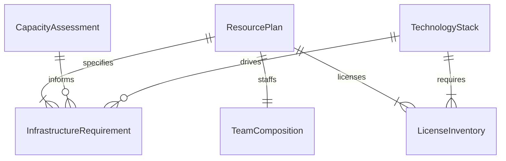
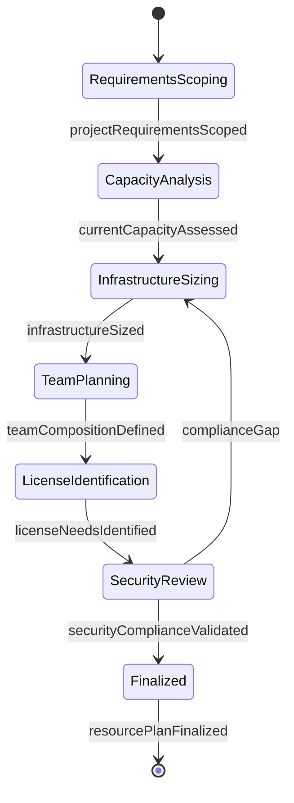
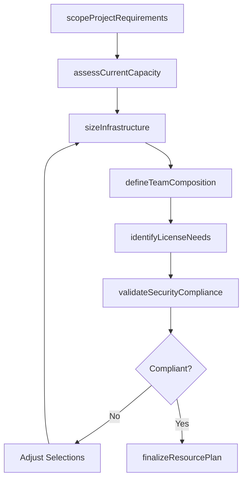
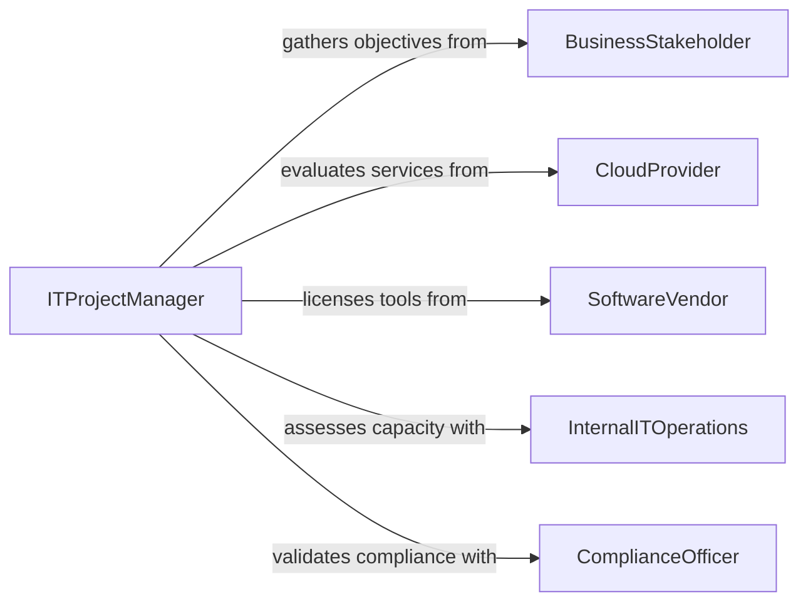

# Identify Information Technology Project Resource

> Business-as-Code definition for identifying information technology project resource requirements. Models the IT resource planning process from project scoping through infrastructure sizing, team composition, and budget alignment.

## Overview

Identifying IT project resource requirements involves analyzing project scope and technical architecture, determining the hardware, software, cloud services, and human talent needed, and aligning those requirements with budget and timeline constraints. This activity supports software development, infrastructure deployments, system integrations, and digital transformation initiatives. The definition provides actions for each resource identification phase, events for tracking planning decisions, and searches for referencing technology catalogs and capacity data.

## Actors

| Actor | Description |
|-------|-------------|
| BusinessStakeholder | Defines the project objectives and expected business outcomes |
| CloudProvider | Supplies infrastructure, platform, and software services |
| SoftwareVendor | Licenses tools, frameworks, and third-party components |
| InternalITOperations | Manages existing infrastructure and provides capacity data |
| ComplianceOfficer | Ensures resource selections meet security and regulatory requirements |
| ProcurementTeam | Processes technology purchases and vendor contracts |

## Roles

| Role | Description |
|------|-------------|
| ITProjectManager | Coordinates resource identification and aligns with project milestones |
| SolutionsArchitect | Designs the technical architecture and specifies infrastructure needs |
| ResourcePlanner | Calculates staffing, licensing, and infrastructure quantities |
| SecurityAnalyst | Evaluates resource selections for security posture and compliance |

## Entities

| Entity | Description |
|--------|-------------|
| ResourcePlan | A comprehensive document listing all IT resources needed for the project |
| InfrastructureRequirement | A specification for compute, storage, network, or cloud resources |
| TeamComposition | The required roles, skill sets, and headcount for the project team |
| LicenseInventory | A catalog of software licenses and subscriptions needed |
| CapacityAssessment | An evaluation of existing infrastructure against projected demand |
| TechnologyStack | The set of platforms, frameworks, and tools selected for the project |

## Actions

| Action | Description |
|--------|-------------|
| scopeProjectRequirements | Analyze project objectives and define technical needs at a high level |
| assessCurrentCapacity | Evaluate existing infrastructure and team capabilities |
| sizeInfrastructure | Determine compute, storage, and network resource requirements |
| defineTeamComposition | Specify the roles, skills, and headcount needed |
| identifyLicenseNeeds | Catalog required software licenses and service subscriptions |
| validateSecurityCompliance | Confirm resource selections meet security and regulatory standards |
| finalizeResourcePlan | Produce the approved IT resource plan for procurement and staffing |

## Events

| Event | Description |
|-------|-------------|
| projectRequirementsScoped | Project objectives and technical needs have been defined |
| currentCapacityAssessed | Existing infrastructure and team capabilities have been evaluated |
| infrastructureSized | Compute, storage, and network requirements have been determined |
| teamCompositionDefined | Required roles, skills, and headcount have been specified |
| licenseNeedsIdentified | Software licenses and subscriptions have been cataloged |
| securityComplianceValidated | Resource selections have passed security and regulatory review |
| resourcePlanFinalized | The approved IT resource plan has been produced |

## Searches

| Search | Description |
|--------|-------------|
| findResourcePlans | List IT resource plans by project, status, or technology stack |
| getCapacityMetrics | Retrieve current utilization and available capacity for infrastructure |
| getLicenseCatalog | Query available software licenses and subscription options |
| getTeamAvailability | Check availability of internal IT staff by skill set and time period |

## Entity Relationships



## State Diagram



## Workflow



## Actor Relationships



## Usage

### Calling Actions

```typescript
import { identifyInformationTechnologyProjectResource } from '@headlessly/identify-information-technology-project-resource'

const itPlanner = identifyInformationTechnologyProjectResource()

// Scope the project requirements
const scope = await itPlanner.scopeProjectRequirements({
  projectName: 'Customer Portal Modernization',
  objectives: ['migrate-to-cloud', 'implement-sso', 'real-time-analytics'],
  targetLaunch: '2026-09-01'
})

// Size infrastructure needs
const infrastructure = await itPlanner.sizeInfrastructure({
  scopeId: scope.id,
  expectedUsers: 50000,
  peakConcurrency: 5000,
  dataRetentionMonths: 36
})

// Define team composition
const team = await itPlanner.defineTeamComposition({
  scopeId: scope.id,
  roles: [
    { title: 'Full-Stack Developer', count: 4, level: 'senior' },
    { title: 'DevOps Engineer', count: 2, level: 'mid' },
    { title: 'QA Engineer', count: 2, level: 'mid' }
  ]
})

// Finalize the resource plan
await itPlanner.finalizeResourcePlan({
  scopeId: scope.id,
  infrastructure,
  team,
  estimatedBudget: 1200000
})
```

### Event-Driven Automation

```typescript
// Trigger procurement when resource plan is finalized
itPlanner.resourcePlanFinalized(async ({ projectId, licenses, infrastructure }) => {
  await procurementPipeline.initiate({
    projectId,
    items: [...licenses, ...infrastructure.services]
  })
})

// Alert when security compliance fails
itPlanner.securityComplianceValidated(async ({ projectId, passed, findings }) => {
  if (!passed) {
    await escalate({
      to: 'security-team',
      message: `Compliance findings on project ${projectId}: ${findings.length} issues require resolution`
    })
  }
})
```
