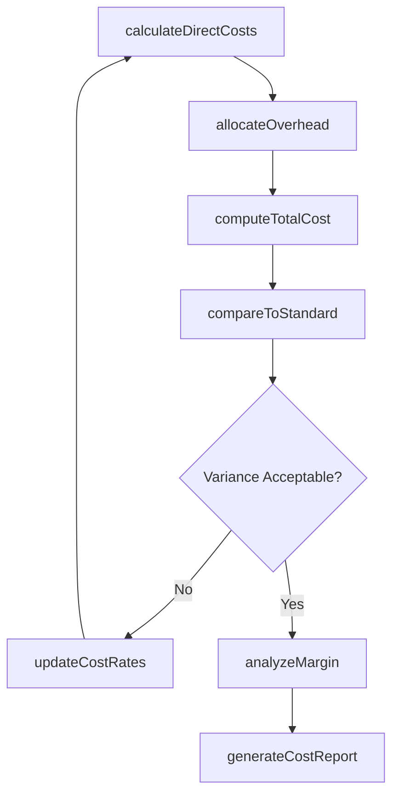
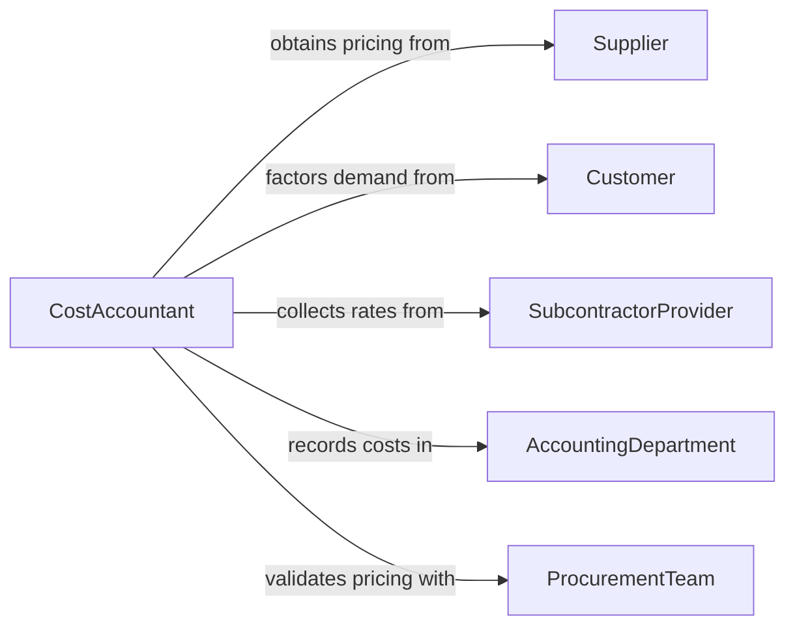

# Calculate Costs Goods Services

> Business-as-Code definition for calculating costs of goods or services. Models the cost computation process including material, labor, overhead, and margin analysis.

## Overview

Calculating costs of goods or services involves aggregating direct materials, labor, overhead, and other cost components to determine the total cost of producing or delivering a product or service. This definition exposes actions for cost breakdown analysis, rate application, overhead allocation, and margin computation, along with events for tracking cost changes and triggering pricing updates.

## Actors

| Actor | Description |
|-------|-------------|
| Supplier | Provides raw materials and components with associated pricing |
| Customer | Receives goods or services and drives demand-based costing |
| SubcontractorProvider | Delivers outsourced labor or services at contracted rates |
| AccountingDepartment | Maintains cost accounting records and allocation methods |
| ProcurementTeam | Negotiates supplier pricing and manages purchase costs |

## Roles

| Role | Description |
|------|-------------|
| CostAccountant | Performs detailed cost calculations and maintains cost standards |
| PricingAnalyst | Uses cost data to inform pricing decisions |
| ProductionManager | Provides labor and overhead inputs for manufacturing costs |
| FinancialController | Reviews cost calculations for accuracy and completeness |

## Entities

| Entity | Description |
|--------|-------------|
| CostSheet | A detailed breakdown of all cost components for a product or service |
| MaterialCost | Direct material expenses including raw materials and components |
| LaborCost | Direct labor expenses based on time and wage rates |
| OverheadAllocation | Indirect costs allocated to products using established methods |
| CostStandard | Predetermined cost benchmarks for comparison and control |
| MarginAnalysis | Calculation of profit margins based on cost and selling price |

## Actions

| Action | Description |
|--------|-------------|
| calculateDirectCosts | Compute material and labor costs for a specific product or service |
| allocateOverhead | Apply indirect cost allocations using appropriate methods |
| computeTotalCost | Aggregate all cost components into a complete cost sheet |
| compareToStandard | Evaluate actual costs against predetermined cost standards |
| analyzeMargin | Calculate profit margins based on total cost and target price |
| updateCostRates | Refresh material prices, labor rates, or overhead factors |
| generateCostReport | Produce a comprehensive cost analysis document |

## Events

| Event | Description |
|-------|-------------|
| directCostsCalculated | Material and labor costs have been computed |
| overheadAllocated | Indirect costs have been distributed to products or services |
| totalCostComputed | All cost components have been aggregated |
| standardVarianceDetected | Actual costs deviate significantly from standard costs |
| marginAnalyzed | Profit margin analysis is complete |
| costRatesUpdated | Material prices, labor rates, or overhead factors have changed |
| costReportGenerated | A cost analysis report has been produced |

## Searches

| Search | Description |
|--------|-------------|
| findCostSheets | List cost sheets by product, service, date, or status |
| getCostBreakdown | Retrieve detailed cost components for a specific item |
| getStandardVariances | Find items where actual costs deviate from standards |
| getCostTrends | Analyze cost changes over time by component or category |

## Workflow



## Actor Relationships



## Usage

### Calling Actions

```typescript
import { calculateCostsGoodsServices } from '@headlessly/calculate-costs-goods-services'

const costs = calculateCostsGoodsServices()

// Calculate direct costs for a product
const directCosts = await costs.calculateDirectCosts({
  productId: 'PROD-2026-0451',
  materials: [
    { item: 'steel-alloy-304', quantity: 50, unit: 'kg', unitPrice: 4.25 },
    { item: 'polymer-seal', quantity: 200, unit: 'units', unitPrice: 0.85 }
  ],
  labor: { hours: 12, rate: 45.00 }
})

// Compute total cost with overhead
const total = await costs.computeTotalCost({
  productId: 'PROD-2026-0451',
  directCosts: directCosts.id,
  overheadMethod: 'activity-based',
  overheadRate: 0.35
})

// Analyze profit margin
const margin = await costs.analyzeMargin({
  productId: 'PROD-2026-0451',
  totalCost: total.amount,
  targetPrice: 1250.00
})
```

### Event-Driven Automation

```typescript
// Alert pricing team when costs change significantly
costs.standardVarianceDetected(async ({ productId, component, variancePercent }) => {
  if (Math.abs(variancePercent) > 10) {
    await notify({
      to: 'pricing-analyst',
      message: `Cost variance of ${variancePercent}% on ${component} for ${productId}`
    })
  }
})

// Recalculate costs when rates are updated
costs.costRatesUpdated(async ({ rateType, affectedProducts }) => {
  for (const productId of affectedProducts) {
    await costs.calculateDirectCosts({ productId, recalculate: true })
  }
})
```
