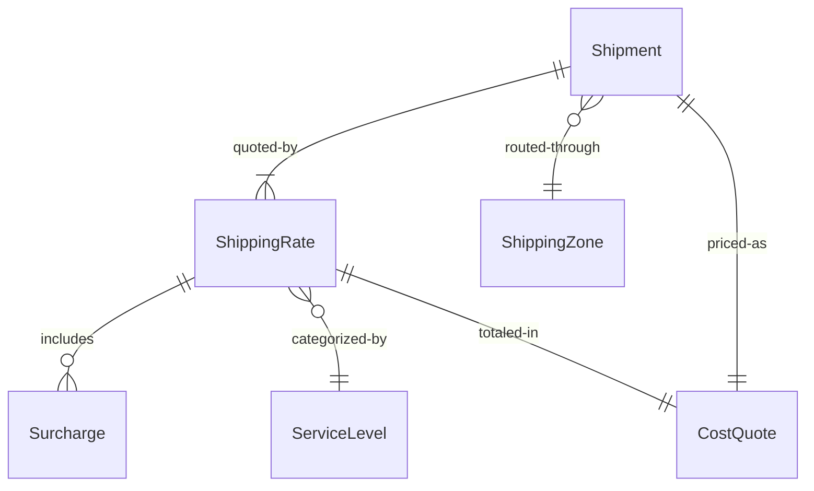
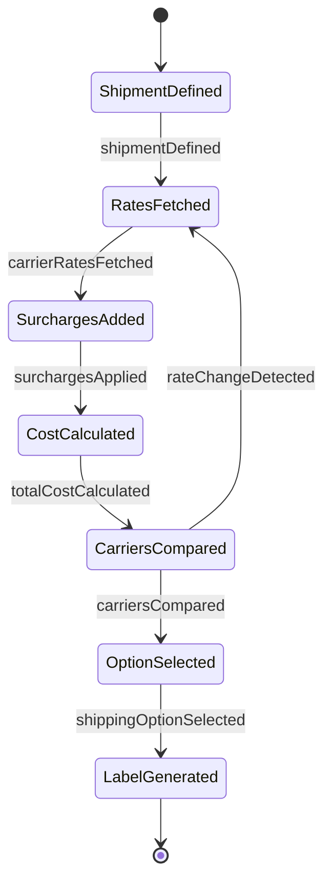
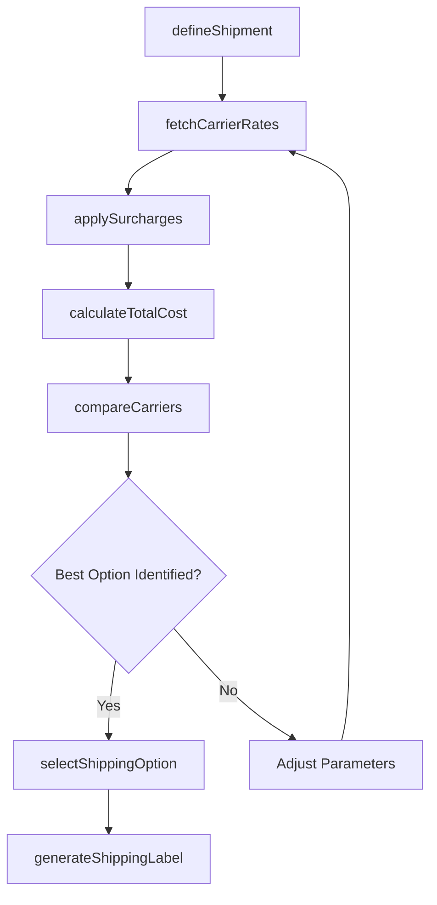
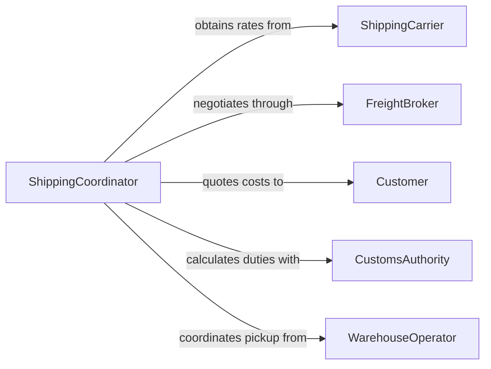

# Calculate Shipping Costs

> Business-as-Code definition for calculating shipping costs. Models the freight and delivery cost computation process from shipment specification through carrier rate selection and cost optimization.

## Overview

Calculating shipping costs involves determining transportation expenses based on package dimensions, weight, origin, destination, service level, and carrier rates. This definition exposes actions for shipment parameter capture, rate comparison, surcharge application, and cost optimization, along with events for tracking rate changes and enabling automated shipping workflows.

## Actors

| Actor | Description |
|-------|-------------|
| ShippingCarrier | Provides transportation services and publishes rate schedules |
| FreightBroker | Negotiates rates and matches shipments with carriers |
| Customer | Receives shipped goods and may bear shipping charges |
| CustomsAuthority | Imposes duties and fees on international shipments |
| WarehouseOperator | Originates shipments and provides packaging specifications |

## Roles

| Role | Description |
|------|-------------|
| ShippingCoordinator | Manages shipment logistics and selects optimal carriers |
| RateAnalyst | Evaluates carrier pricing and negotiates volume discounts |
| LogisticsManager | Oversees shipping operations and cost control strategies |
| OrderFulfillmentAgent | Initiates shipping calculations as part of order processing |

## Entities

| Entity | Description |
|--------|-------------|
| Shipment | A package or freight consignment with defined origin and destination |
| ShippingRate | A carrier-specific price for transporting goods under defined conditions |
| Surcharge | Additional fees such as fuel, dimensional, residential, or hazmat charges |
| ServiceLevel | The speed and handling tier such as ground, express, or overnight |
| ShippingZone | A geographic classification that determines base transportation rates |
| CostQuote | A calculated total shipping cost for a specific shipment configuration |

## Actions

| Action | Description |
|--------|-------------|
| defineShipment | Specify package dimensions, weight, origin, destination, and contents |
| fetchCarrierRates | Retrieve current rates from one or more shipping carriers |
| applySurcharges | Add applicable surcharges for fuel, dimensions, or special handling |
| calculateTotalCost | Compute the all-in shipping cost including base rate and surcharges |
| compareCarriers | Evaluate cost and service across multiple carrier options |
| selectShippingOption | Choose the carrier and service level for the shipment |
| generateShippingLabel | Produce shipping documentation at the selected rate |

## Events

| Event | Description |
|-------|-------------|
| shipmentDefined | Package specifications and routing have been captured |
| carrierRatesFetched | Current rates have been retrieved from carriers |
| surchargesApplied | Additional fees have been calculated and added |
| totalCostCalculated | The complete shipping cost has been computed |
| carriersCompared | Multi-carrier rate comparison is complete |
| shippingOptionSelected | A carrier and service level have been chosen |
| rateChangeDetected | A carrier has updated its rate schedule |

## Searches

| Search | Description |
|--------|-------------|
| findShippingRates | List available rates by carrier, zone, service level, or weight range |
| getCostHistory | Retrieve historical shipping costs for a route or customer |
| getSurcharges | List applicable surcharges by carrier, shipment type, or destination |
| getZoneMapping | Look up shipping zones for origin-destination pairs |

## Entity Relationships



## State Diagram



## Workflow



## Actor Relationships



## Usage

### Calling Actions

```typescript
import { calculateShippingCosts } from '@headlessly/calculate-shipping-costs'

const shipping = calculateShippingCosts()

// Define a shipment
const shipment = await shipping.defineShipment({
  origin: { zip: '90210', country: 'US' },
  destination: { zip: '10001', country: 'US' },
  packages: [
    { length: 30, width: 20, height: 15, weight: 4.5, unit: 'cm-kg' }
  ],
  contents: 'electronics',
  declaredValue: 299.99
})

// Fetch and compare carrier rates
const rates = await shipping.fetchCarrierRates({
  shipmentId: shipment.id,
  carriers: ['ups', 'fedex', 'usps'],
  serviceLevels: ['ground', 'express']
})

// Calculate total cost with surcharges
const cost = await shipping.calculateTotalCost({
  shipmentId: shipment.id,
  selectedRate: rates.bestMatch.id,
  includeInsurance: true
})
```

### Event-Driven Automation

```typescript
// Recalculate shipping costs when carrier rates change
shipping.rateChangeDetected(async ({ carrier, effectiveDate }) => {
  await notify({
    to: 'rate-analyst',
    message: `${carrier} rate schedule updated effective ${effectiveDate}`
  })
})

// Apply free shipping threshold automatically
shipping.totalCostCalculated(async ({ shipmentId, totalCost, orderValue }) => {
  if (orderValue > 100) {
    await shipping.selectShippingOption({
      shipmentId,
      carrierOverride: 'best-ground',
      customerCharge: 0,
      reason: 'free-shipping-threshold'
    })
  }
})
```
