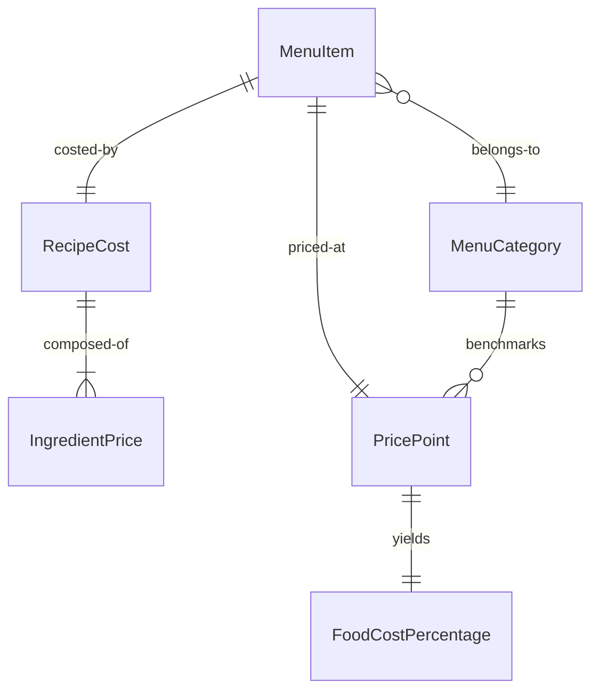
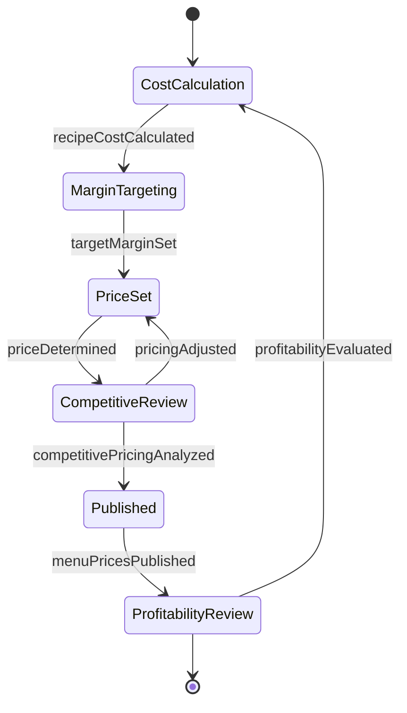
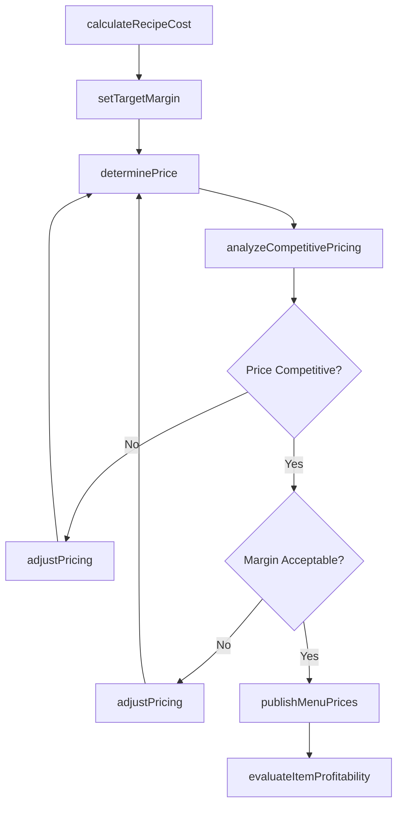
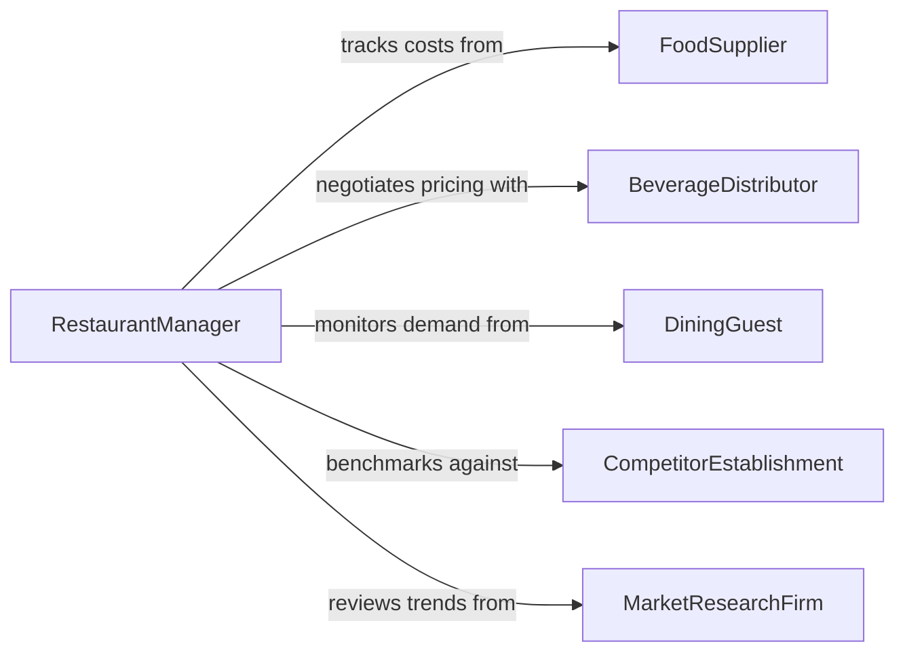

# Determine Prices Menu Items

> Business-as-Code definition for determining prices for menu items. Models the food and beverage pricing process from cost analysis through margin optimization and menu publication.

## Overview

Determining prices for menu items involves calculating ingredient costs, applying labor and overhead factors, analyzing competitive positioning, and setting prices that achieve target profit margins while remaining attractive to guests. This definition exposes actions for recipe costing, price calculation, margin analysis, and menu price management, along with events for tracking price changes and profitability.

## Actors

| Actor | Description |
|-------|-------------|
| FoodSupplier | Provides ingredients and communicates price changes |
| BeverageDistributor | Supplies beverages and manages pricing agreements |
| DiningGuest | Consumes menu items and influences demand-based pricing |
| CompetitorEstablishment | Sets market pricing benchmarks for comparable offerings |
| MarketResearchFirm | Provides consumer spending and dining trend data |

## Roles

| Role | Description |
|------|-------------|
| ExecutiveChef | Designs recipes and determines ingredient specifications |
| RestaurantManager | Approves final menu pricing and oversees profitability |
| FoodCostController | Tracks ingredient costs and monitors food cost percentages |
| MenuEngineer | Analyzes item popularity and profitability to optimize the menu |

## Entities

| Entity | Description |
|--------|-------------|
| MenuItem | A dish or beverage offered on the menu with its pricing |
| RecipeCost | The aggregate ingredient cost for preparing a single menu item |
| IngredientPrice | Current market price for a specific ingredient or component |
| PricePoint | The assigned selling price for a menu item |
| FoodCostPercentage | The ratio of ingredient cost to selling price |
| MenuCategory | A grouping of related items such as appetizers, entrees, or desserts |

## Actions

| Action | Description |
|--------|-------------|
| calculateRecipeCost | Compute the total ingredient cost for a menu item |
| setTargetMargin | Define the desired profit margin for an item or category |
| determinePrice | Calculate the selling price based on costs and margin targets |
| analyzeCompetitivePricing | Compare pricing against similar establishments in the market |
| adjustPricing | Modify prices based on cost changes, demand, or strategy |
| publishMenuPrices | Finalize and distribute updated pricing across all menus |
| evaluateItemProfitability | Assess the contribution margin and sales volume of each item |

## Events

| Event | Description |
|-------|-------------|
| recipeCostCalculated | Ingredient costs for a menu item have been computed |
| targetMarginSet | Profit margin targets have been defined for items or categories |
| priceDetermined | A selling price has been calculated for a menu item |
| competitivePricingAnalyzed | Market price comparison has been completed |
| pricingAdjusted | Menu item pricing has been modified |
| menuPricesPublished | Updated pricing has been distributed to all service channels |
| profitabilityEvaluated | Item-level profitability analysis is complete |

## Searches

| Search | Description |
|--------|-------------|
| findMenuItems | List menu items by category, price range, or profitability |
| getRecipeCosts | Retrieve ingredient cost breakdowns for specific items |
| getFoodCostPercentages | Find items by food cost ratio to identify pricing issues |
| getPricingHistory | Track price changes for an item over time |

## Entity Relationships



## State Diagram



## Workflow



## Actor Relationships



## Usage

### Calling Actions

```typescript
import { determinePricesMenuItems } from '@headlessly/determine-prices-menu-items'

const menu = determinePricesMenuItems()

// Calculate recipe cost for a menu item
const recipeCost = await menu.calculateRecipeCost({
  itemId: 'MENU-ENTREE-042',
  name: 'Pan-Seared Salmon',
  ingredients: [
    { item: 'atlantic-salmon-fillet', quantity: 0.25, unit: 'kg', unitPrice: 28.00 },
    { item: 'seasonal-vegetables', quantity: 0.15, unit: 'kg', unitPrice: 6.50 },
    { item: 'herb-butter', quantity: 0.03, unit: 'kg', unitPrice: 18.00 }
  ]
})

// Determine the selling price
const price = await menu.determinePrice({
  itemId: 'MENU-ENTREE-042',
  recipeCost: recipeCost.totalCost,
  targetFoodCostPercent: 30,
  category: 'entree'
})

// Publish updated menu prices
await menu.publishMenuPrices({
  effectiveDate: '2026-03-01',
  channels: ['dine-in', 'takeout', 'delivery']
})
```

### Event-Driven Automation

```typescript
// Recalculate prices when ingredient costs change
menu.recipeCostCalculated(async ({ itemId, totalCost, previousCost }) => {
  const changePercent = ((totalCost - previousCost) / previousCost) * 100
  if (Math.abs(changePercent) > 5) {
    await menu.adjustPricing({
      itemId,
      reason: `Ingredient cost changed by ${changePercent.toFixed(1)}%`
    })
  }
})

// Alert management on low-profitability items
menu.profitabilityEvaluated(async ({ itemId, contributionMargin }) => {
  if (contributionMargin < 0.15) {
    await notify({
      to: 'restaurant-manager',
      message: `Low margin on ${itemId}: ${(contributionMargin * 100).toFixed(1)}%`
    })
  }
})
```
