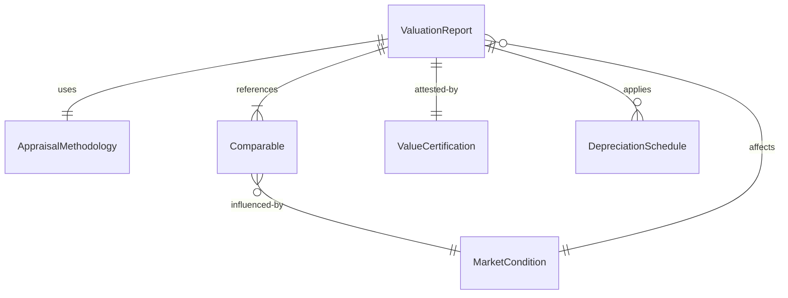
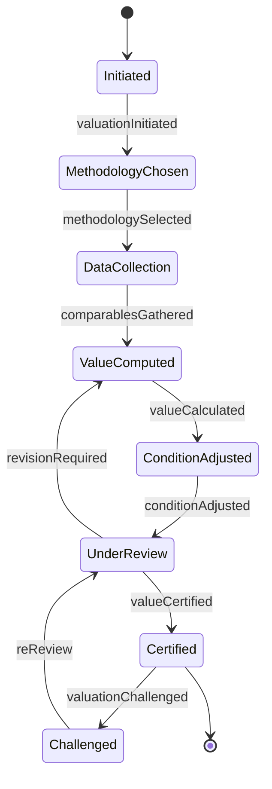
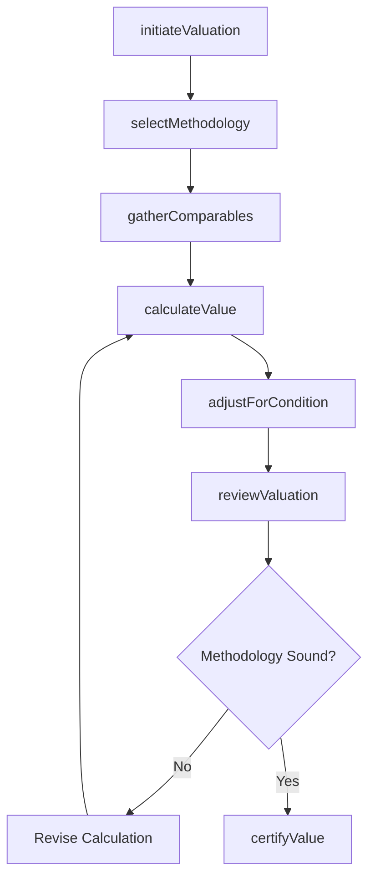
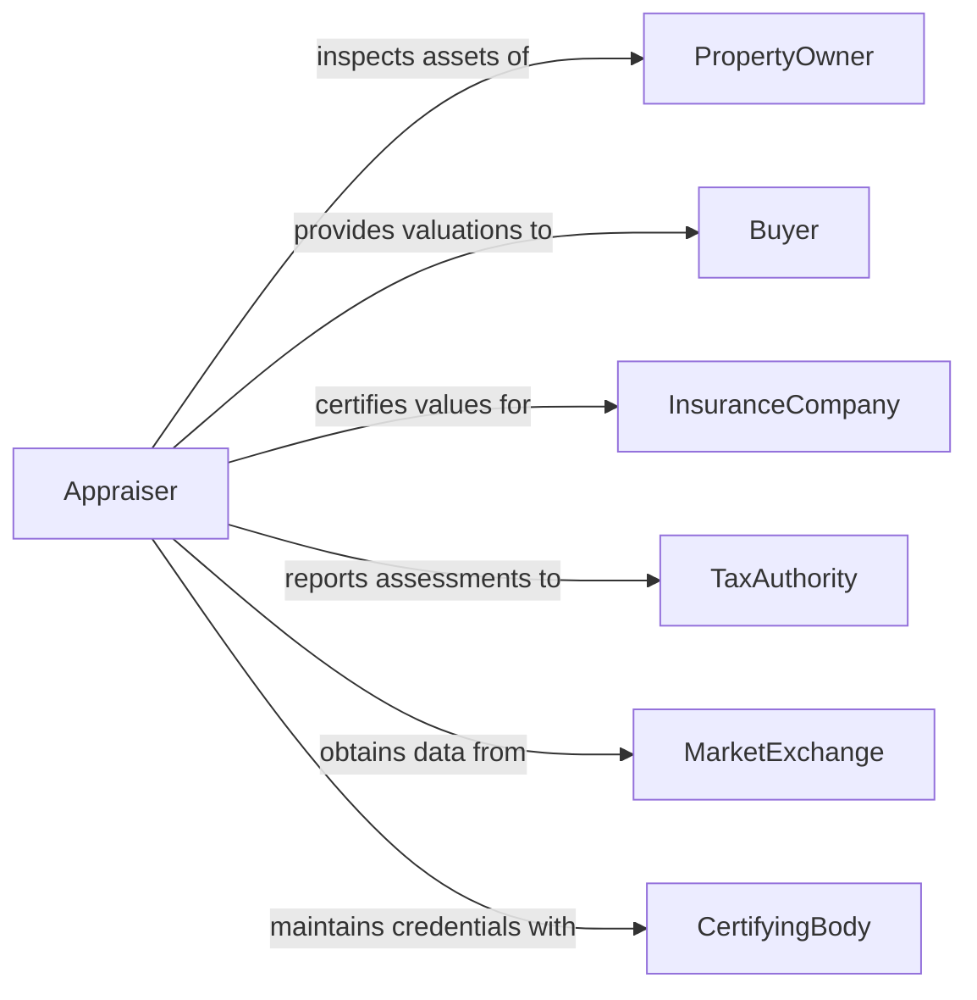

# Determine Value Goods Services

> Business-as-Code definition for determining the value of goods or services. Models the valuation process from market analysis through appraisal methodology application and value certification.

## Overview

Determining the value of goods or services involves applying appropriate valuation methodologies to assess fair market value, replacement cost, or economic worth based on condition, comparables, and market dynamics. This definition exposes actions for appraisal initiation, methodology selection, comparative analysis, and value certification, along with events for tracking valuation changes and compliance requirements.

## Actors

| Actor | Description |
|-------|-------------|
| PropertyOwner | Possesses the goods or assets being valued |
| Buyer | Seeks to acquire goods or services at a fair price |
| InsuranceCompany | Requires valuations for coverage and claims purposes |
| TaxAuthority | Uses valuations for assessment and compliance purposes |
| MarketExchange | Provides comparable transaction data and market benchmarks |
| CertifyingBody | Accredits valuers and validates appraisal methodologies |

## Roles

| Role | Description |
|------|-------------|
| Appraiser | Conducts the valuation using established methodologies |
| ValuationReviewer | Verifies appraisal quality and methodology compliance |
| MarketAnalyst | Researches comparable transactions and market conditions |
| SeniorValuer | Certifies final valuations and signs appraisal reports |

## Entities

| Entity | Description |
|--------|-------------|
| ValuationReport | A formal document stating the assessed value with supporting analysis |
| Comparable | A reference transaction or item used for comparative valuation |
| AppraisalMethodology | The approach used to determine value such as cost, income, or market |
| MarketCondition | Current economic factors influencing the value of goods or services |
| ValueCertification | A formal attestation of the determined value by a qualified appraiser |
| DepreciationSchedule | A model for calculating value reduction over time due to usage or age |

## Actions

| Action | Description |
|--------|-------------|
| initiateValuation | Begin the appraisal process by defining scope and purpose |
| selectMethodology | Choose the appropriate valuation approach based on asset type and purpose |
| gatherComparables | Collect comparable transaction data and market benchmarks |
| calculateValue | Apply the selected methodology to determine the assessed value |
| adjustForCondition | Modify the base value for physical condition, obsolescence, or enhancements |
| certifyValue | Formally attest to the determined value in a signed report |
| reviewValuation | Independently verify the methodology and conclusions |

## Events

| Event | Description |
|-------|-------------|
| valuationInitiated | A new appraisal engagement has been started |
| methodologySelected | The valuation approach has been chosen and documented |
| comparablesGathered | Market comparison data has been collected and analyzed |
| valueCalculated | The assessed value has been computed using the selected methodology |
| conditionAdjusted | The base value has been modified for condition or market factors |
| valueCertified | The final valuation has been formally attested by the appraiser |
| valuationChallenged | A party has disputed the determined value |

## Searches

| Search | Description |
|--------|-------------|
| findValuations | List valuation reports by asset type, date, or status |
| getComparables | Retrieve comparable transactions by category, location, or date |
| getValuationHistory | Track value assessments for a specific asset over time |
| getMarketTrends | Analyze market condition changes affecting valuations |

## Entity Relationships



## State Diagram



## Workflow



## Actor Relationships



## Usage

### Calling Actions

```typescript
import { determineValueGoodsServices } from '@headlessly/determine-value-goods-services'

const valuations = determineValueGoodsServices()

// Initiate a valuation engagement
const engagement = await valuations.initiateValuation({
  assetType: 'commercial-equipment',
  description: 'CNC machining center, Model VMC-850, 2022',
  purpose: 'insurance-coverage',
  requestedBy: 'property-owner'
})

// Calculate value using market approach
const value = await valuations.calculateValue({
  engagementId: engagement.id,
  methodology: 'market-comparison',
  comparables: ['COMP-001', 'COMP-002', 'COMP-003'],
  adjustments: { condition: 'good', utilization: 'moderate', age: 4 }
})

// Certify the final valuation
await valuations.certifyValue({
  engagementId: engagement.id,
  determinedValue: value.assessedValue,
  effectiveDate: '2026-02-01',
  certifiedBy: 'senior-valuer'
})
```

### Event-Driven Automation

```typescript
// Notify stakeholders when valuations are certified
valuations.valueCertified(async ({ engagementId, determinedValue, assetType }) => {
  await notify({
    to: ['property-owner', 'insurance-company'],
    message: `Valuation complete for ${assetType}: $${determinedValue}`
  })
})

// Flag challenged valuations for senior review
valuations.valuationChallenged(async ({ engagementId, challengedBy, reason }) => {
  await notify({
    to: 'valuation-reviewer',
    message: `Valuation ${engagementId} challenged by ${challengedBy}: ${reason}`
  })
})
```
