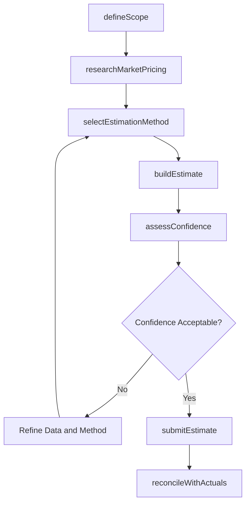
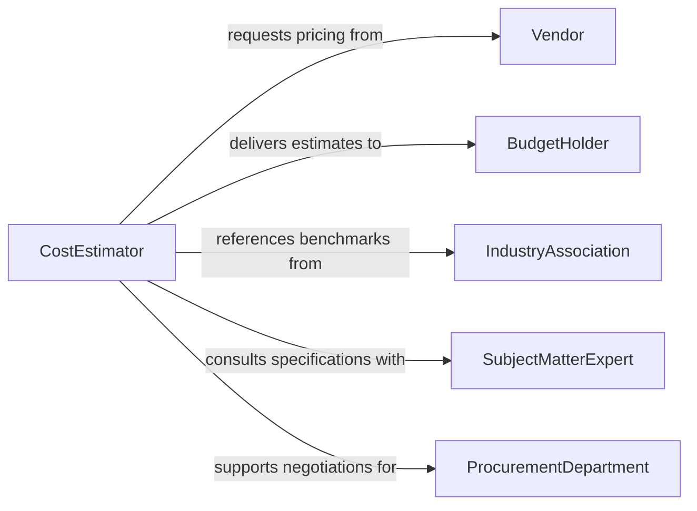

# Estimate Costs Goods Services

> Business-as-Code definition for estimating costs of goods or services. Models the cost estimation process from scope definition through pricing analysis and budget projection.

## Overview

Estimating costs of goods or services involves analyzing requirements, researching market pricing, applying estimation methodologies, and producing cost projections that inform procurement, budgeting, and negotiation activities. This definition exposes actions for scope analysis, market research, estimation buildup, and confidence assessment, along with events for tracking estimate lifecycle and accuracy.

## Actors

| Actor | Description |
|-------|-------------|
| Vendor | Supplies goods or services and provides indicative pricing |
| BudgetHolder | Commissions cost estimates for financial planning purposes |
| IndustryAssociation | Publishes cost benchmarks and indices for reference |
| SubjectMatterExpert | Provides technical input on specifications and complexity factors |
| ProcurementDepartment | Uses estimates to negotiate contracts and issue purchase orders |

## Roles

| Role | Description |
|------|-------------|
| CostEstimator | Develops cost projections using appropriate estimation techniques |
| FinancialPlanner | Integrates cost estimates into budgets and forecasts |
| CategoryManager | Provides market intelligence and vendor pricing context |
| QualityReviewer | Validates estimation assumptions and methodology rigor |

## Entities

| Entity | Description |
|--------|-------------|
| CostEstimate | A projection of expected costs for specified goods or services |
| ScopeDefinition | A detailed description of the goods or services being estimated |
| PriceBenchmark | Published or historical pricing data used as a reference point |
| EstimationMethod | The technique applied such as analogous, parametric, or detailed |
| ConfidenceRange | The statistical range within which the actual cost is expected to fall |
| CostDriver | A factor that significantly influences the total estimated cost |

## Actions

| Action | Description |
|--------|-------------|
| defineScope | Document the specifications and quantities of goods or services to estimate |
| researchMarketPricing | Gather current vendor pricing, benchmarks, and historical data |
| selectEstimationMethod | Choose the appropriate technique based on available data and accuracy needs |
| buildEstimate | Construct the cost projection by aggregating all cost components |
| assessConfidence | Determine the accuracy range and risk factors of the estimate |
| submitEstimate | Deliver the finalized estimate with supporting documentation |
| reconcileWithActuals | Compare the estimate against actual costs once incurred |

## Events

| Event | Description |
|-------|-------------|
| scopeDefined | The specifications for the cost estimate have been documented |
| marketPricingResearched | Current pricing data and benchmarks have been collected |
| estimationMethodSelected | The cost estimation technique has been chosen |
| estimateBuilt | The cost projection has been assembled from component data |
| confidenceAssessed | The accuracy range and risk profile have been determined |
| estimateSubmitted | The finalized estimate has been delivered to the requestor |
| estimateDeviationDetected | Actual costs differ materially from the original estimate |

## Searches

| Search | Description |
|--------|-------------|
| findEstimates | List estimates by category, date range, status, or confidence level |
| getPriceBenchmarks | Retrieve market pricing data by product category or service type |
| getCostDrivers | Identify the primary factors influencing cost for a specific estimate |
| getEstimateAccuracy | Compare historical estimates to actuals for accuracy analysis |

## Workflow



## Actor Relationships



## Usage

### Calling Actions

```typescript
import { estimateCostsGoodsServices } from '@headlessly/estimate-costs-goods-services'

const estimates = estimateCostsGoodsServices()

// Define scope for the estimate
const scope = await estimates.defineScope({
  category: 'professional-services',
  description: 'Annual IT support and maintenance contract',
  specifications: {
    users: 500,
    supportHours: '24x7',
    slaTarget: '99.9%',
    includedServices: ['helpdesk', 'infrastructure-monitoring', 'patch-management']
  }
})

// Research market pricing
await estimates.researchMarketPricing({
  scopeId: scope.id,
  sources: ['vendor-quotes', 'industry-benchmarks', 'historical-contracts'],
  region: 'north-america'
})

// Build and submit the estimate
const estimate = await estimates.buildEstimate({
  scopeId: scope.id,
  method: 'parametric',
  components: [
    { item: 'Tier 1 helpdesk support', unitCost: 45, units: 2400, basis: 'hours-annually' },
    { item: 'Infrastructure monitoring', monthlyCost: 8500, months: 12 },
    { item: 'On-site escalation', unitCost: 175, units: 200, basis: 'hours-annually' }
  ]
})

await estimates.submitEstimate({ estimateId: estimate.id, deliverTo: 'budget-holder' })
```

### Event-Driven Automation

```typescript
// Alert stakeholders when estimates deviate from actuals
estimates.estimateDeviationDetected(async ({ estimateId, deviationPercent }) => {
  if (Math.abs(deviationPercent) > 10) {
    await notify({
      to: 'financial-planner',
      message: `Estimate ${estimateId} deviates ${deviationPercent}% from actual costs`
    })
  }
})

// Auto-trigger re-estimation when market prices shift
estimates.marketPricingResearched(async ({ scopeId, priceChangePercent }) => {
  if (Math.abs(priceChangePercent) > 15) {
    await estimates.buildEstimate({ scopeId, recalculate: true })
  }
})
```
