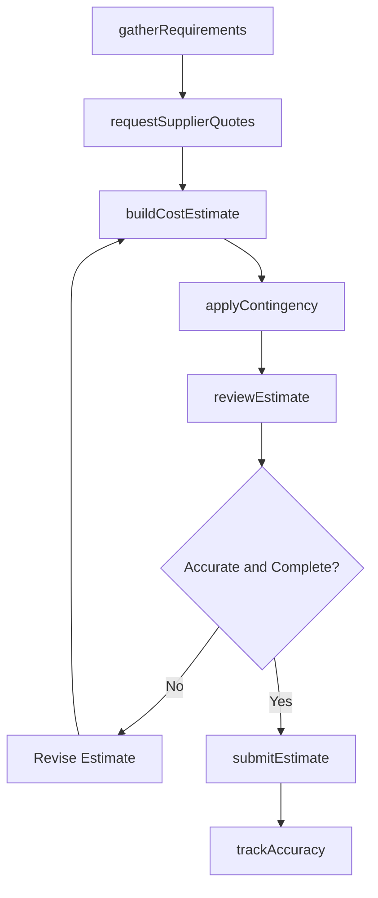
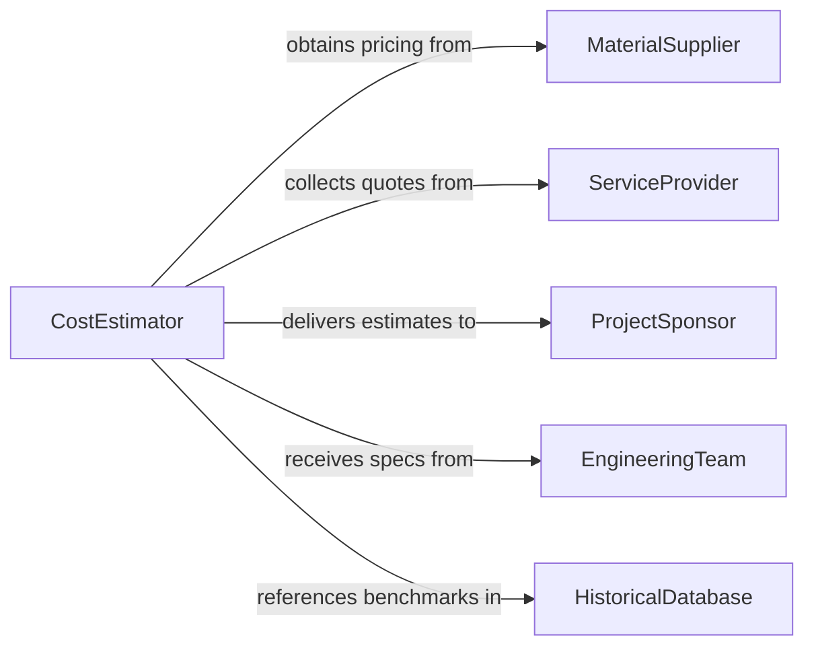

# Estimate Costs Products Services Materials

> Business-as-Code definition for estimating costs of products, services, or materials. Models the comprehensive cost estimation process from requirements gathering through detailed buildup and variance analysis.

## Overview

Estimating costs of products, services, or materials involves analyzing specifications, gathering supplier pricing, calculating labor and overhead components, and producing reliable cost projections for budgeting, bidding, or planning purposes. This definition exposes actions for cost buildup, supplier quoting, estimation methodology selection, and accuracy tracking, along with events for workflow automation and cost intelligence.

## Actors

| Actor | Description |
|-------|-------------|
| MaterialSupplier | Provides pricing and availability for raw materials and components |
| ServiceProvider | Quotes labor rates and delivery timelines for outsourced services |
| ProjectSponsor | Commissions cost estimates for planning and decision-making |
| EngineeringTeam | Provides technical specifications and quantity takeoffs |
| HistoricalDatabase | Supplies benchmark data from prior projects and purchases |

## Roles

| Role | Description |
|------|-------------|
| CostEstimator | Develops detailed cost projections using appropriate methodologies |
| ProcurementSpecialist | Gathers supplier quotations and validates material pricing |
| ProjectManager | Reviews estimates for completeness and alignment with scope |
| SeniorEstimator | Approves final estimates and validates assumptions |

## Entities

| Entity | Description |
|--------|-------------|
| CostEstimate | A comprehensive projection of all costs for a product, service, or material |
| LineItemEstimate | An individual cost component within the overall estimate |
| SupplierQuote | A vendor-provided price for a specific material or service |
| EstimationBasis | The methodology, assumptions, and data sources underlying the estimate |
| ContingencyAllowance | A reserve for uncertainties and risks not fully quantified |
| EstimateRevision | A versioned update to a previously submitted cost estimate |

## Actions

| Action | Description |
|--------|-------------|
| gatherRequirements | Collect specifications, quantities, and scope to define estimation inputs |
| requestSupplierQuotes | Solicit pricing from suppliers for materials and services |
| buildCostEstimate | Develop the detailed cost projection using selected methodology |
| applyContingency | Add risk-based contingency reserves to the base estimate |
| reviewEstimate | Validate assumptions, completeness, and accuracy of the estimate |
| submitEstimate | Deliver the finalized cost estimate to the requesting party |
| trackAccuracy | Compare actual costs to estimates for continuous improvement |

## Events

| Event | Description |
|-------|-------------|
| requirementsGathered | Specifications and scope have been collected for estimation |
| supplierQuotesReceived | Vendor pricing has been obtained for required materials or services |
| costEstimateBuilt | A detailed cost projection has been completed |
| contingencyApplied | Risk reserves have been added to the base estimate |
| estimateReviewed | The estimate has been validated for accuracy and completeness |
| estimateSubmitted | The finalized estimate has been delivered to the requestor |
| estimateVarianceIdentified | Actual costs deviate from the original estimate |

## Searches

| Search | Description |
|--------|-------------|
| findEstimates | List cost estimates by project, product, status, or date range |
| getSupplierQuotes | Retrieve vendor quotations by material, supplier, or validity |
| getEstimateAccuracy | Compare estimates to actuals for historical accuracy analysis |
| getBenchmarkCosts | Retrieve historical cost data for similar products or services |
| getEstimateRevisions | Track version history and changes to an estimate |

## Workflow



## Actor Relationships



## Usage

### Calling Actions

```typescript
import { estimateCostsProductsServicesMaterials } from '@headlessly/estimate-costs-products-services-materials'

const estimates = estimateCostsProductsServicesMaterials()

// Gather requirements for a cost estimate
const requirements = await estimates.gatherRequirements({
  projectId: 'PROJ-2026-0087',
  description: 'Custom manufacturing tooling for new product line',
  specifications: { material: 'tool-steel-D2', tolerances: '0.01mm' },
  quantity: 5,
  deliveryTimeline: '8-weeks'
})

// Build the detailed cost estimate
const estimate = await estimates.buildCostEstimate({
  requirementsId: requirements.id,
  methodology: 'bottom-up',
  lineItems: [
    { category: 'materials', description: 'Tool steel blanks', amount: 12500 },
    { category: 'labor', description: 'CNC machining - 120 hours', amount: 18000 },
    { category: 'labor', description: 'Heat treatment', amount: 3500 },
    { category: 'overhead', description: 'Shop overhead at 25%', amount: 8500 }
  ]
})

// Apply contingency and submit
await estimates.applyContingency({ estimateId: estimate.id, percentage: 10, basis: 'scope-uncertainty' })
await estimates.submitEstimate({ estimateId: estimate.id, deliverTo: 'project-sponsor' })
```

### Event-Driven Automation

```typescript
// Track estimate accuracy when actuals are available
estimates.estimateVarianceIdentified(async ({ estimateId, variancePercent }) => {
  if (Math.abs(variancePercent) > 15) {
    await notify({
      to: 'senior-estimator',
      message: `Estimate ${estimateId} variance of ${variancePercent}% exceeds threshold`
    })
  }
})

// Auto-update estimates when supplier quotes change
estimates.supplierQuotesReceived(async ({ estimateId, materialId, newPrice }) => {
  await estimates.buildCostEstimate({
    estimateId,
    recalculate: true,
    updatedQuotes: [{ materialId, price: newPrice }]
  })
})
```
