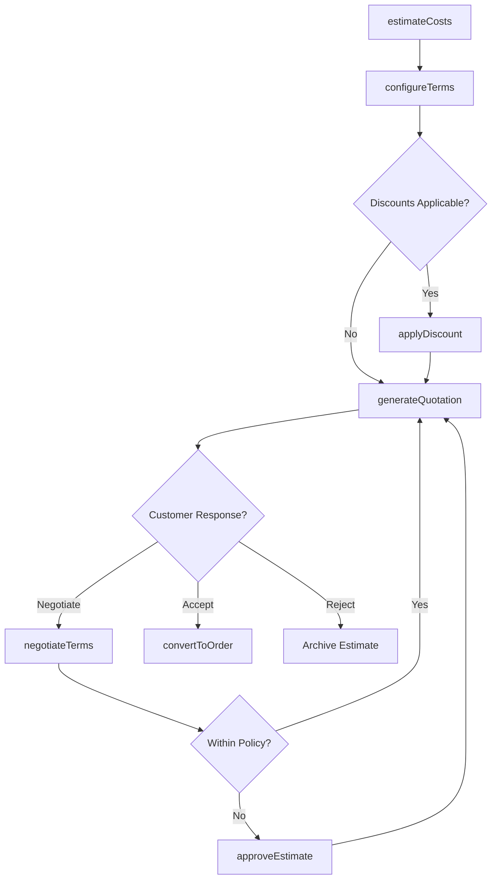
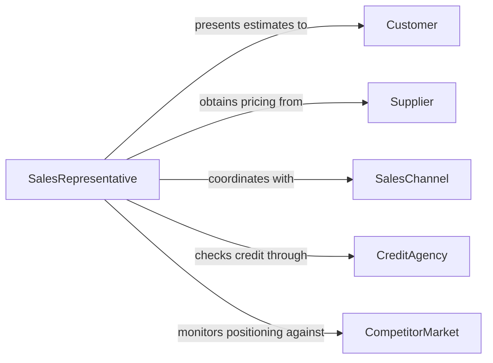

# Estimate Costs Terms Sales

> Business-as-Code definition for estimating costs or terms of sales. Models the quotation and proposal process from cost analysis through terms negotiation and finalization.

## Overview

Estimating costs or terms of sales involves analyzing product or service costs, applying pricing strategies, defining payment and delivery terms, and preparing formal quotations or proposals for customers. This definition exposes actions for cost estimation, terms configuration, discount application, and proposal generation, along with events for tracking estimate lifecycle and conversion outcomes.

## Actors

| Actor | Description |
|-------|-------------|
| Customer | Requests pricing information and negotiates terms |
| Supplier | Provides material and component pricing for cost buildup |
| SalesChannel | Distributes products through reseller or partner networks |
| CreditAgency | Provides creditworthiness data for payment term decisions |
| CompetitorMarket | Influences pricing strategies through market positioning |

## Roles

| Role | Description |
|------|-------------|
| SalesRepresentative | Prepares estimates and presents terms to customers |
| PricingManager | Sets pricing policies and approves non-standard terms |
| Estimator | Calculates detailed cost buildups for custom or complex orders |
| SalesDirector | Reviews high-value estimates and approves special terms |

## Entities

| Entity | Description |
|--------|-------------|
| CostEstimate | A calculated projection of costs for a product or service |
| SalesQuotation | A formal offer with pricing, terms, and validity period |
| PaymentTerms | Conditions governing payment schedules and methods |
| DeliveryTerms | Conditions governing shipment, transit, and delivery logistics |
| DiscountSchedule | Pricing reductions based on volume, relationship, or promotion |
| ProposalDocument | A comprehensive sales proposal combining pricing with terms |

## Actions

| Action | Description |
|--------|-------------|
| estimateCosts | Calculate projected costs based on specifications and quantities |
| configureTerms | Define payment schedules, delivery conditions, and warranties |
| applyDiscount | Apply volume, promotional, or negotiated discounts to pricing |
| generateQuotation | Create a formal sales quotation with all terms and conditions |
| negotiateTerms | Adjust pricing or conditions based on customer feedback |
| approveEstimate | Authorize non-standard pricing or terms that exceed policy limits |
| convertToOrder | Transform an accepted estimate into a confirmed sales order |

## Events

| Event | Description |
|-------|-------------|
| costsEstimated | A cost projection has been completed for the request |
| termsConfigured | Payment and delivery terms have been defined |
| discountApplied | Pricing adjustments have been applied to the estimate |
| quotationGenerated | A formal quotation has been issued to the customer |
| termsNegotiated | Terms have been revised based on customer negotiation |
| estimateApproved | Non-standard pricing or terms have been authorized |
| estimateConverted | The estimate has been accepted and converted to an order |

## Searches

| Search | Description |
|--------|-------------|
| findEstimates | List estimates by customer, product, status, or date range |
| getQuotationHistory | Retrieve past quotations for a customer or product |
| getConversionRates | Analyze estimate-to-order conversion by period or segment |
| getDiscountUsage | Track discount applications by type, customer, or product |

## Workflow



## Actor Relationships



## Usage

### Calling Actions

```typescript
import { estimateCostsTermsSales } from '@headlessly/estimate-costs-terms-sales'

const estimates = estimateCostsTermsSales()

// Estimate costs for a customer request
const estimate = await estimates.estimateCosts({
  customerId: 'CUST-2026-1184',
  items: [
    { productId: 'SVC-CONSULTING', quantity: 40, unit: 'hours' },
    { productId: 'LIC-ENTERPRISE', quantity: 1, unit: 'annual' }
  ],
  specifications: { region: 'north-america', supportLevel: 'premium' }
})

// Configure payment and delivery terms
await estimates.configureTerms({
  estimateId: estimate.id,
  paymentTerms: { net: 30, method: 'invoice' },
  deliveryTerms: { method: 'electronic', timeline: '5-business-days' },
  warranty: '12-months'
})

// Generate the formal quotation
const quote = await estimates.generateQuotation({
  estimateId: estimate.id,
  validUntil: '2026-04-30',
  currency: 'USD'
})
```

### Event-Driven Automation

```typescript
// Follow up on expiring quotations
estimates.quotationGenerated(async ({ estimateId, validUntil }) => {
  await scheduleReminder({
    daysBeforeExpiry: 7,
    to: 'sales-representative',
    message: `Quotation for ${estimateId} expires on ${validUntil}`
  })
})

// Track conversion metrics
estimates.estimateConverted(async ({ estimateId, customerId, amount }) => {
  await recordMetric({
    type: 'estimate-conversion',
    customerId,
    amount,
    source: estimateId
  })
})
```
