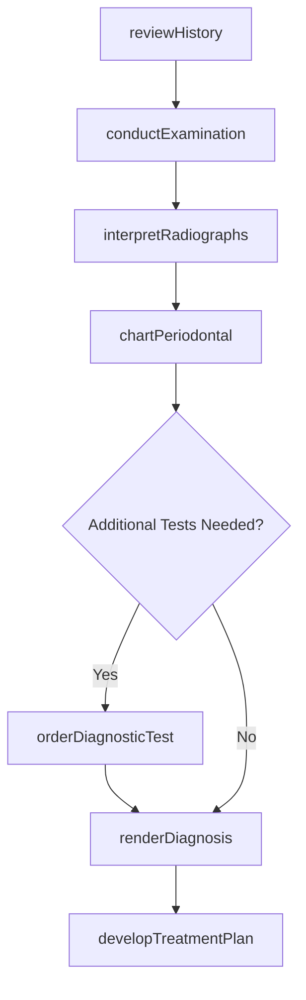
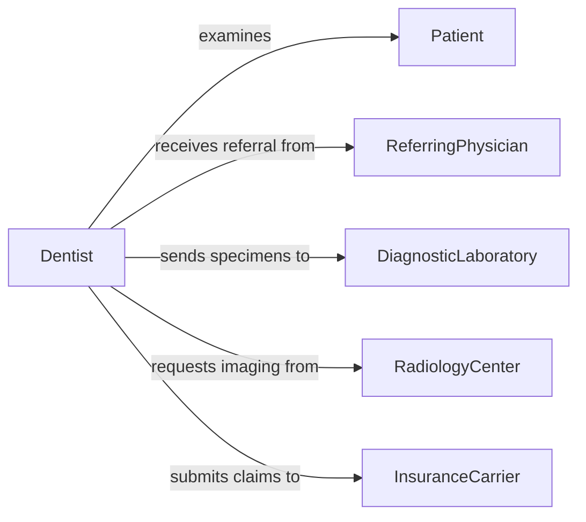

# Diagnose Dental Conditions

> Business-as-Code definition for diagnosing dental conditions. Models the clinical evaluation process from patient examination and radiographic analysis through differential diagnosis and treatment planning.

## Overview

Diagnosing dental conditions involves conducting clinical examinations, interpreting radiographic images, analyzing patient symptoms and history, and applying diagnostic criteria to identify oral diseases, structural defects, and periodontal disorders. This definition exposes actions for clinical assessment and diagnosis, events for care coordination automation, and searches for patient records and diagnostic reference data.

## Actors

| Actor | Description |
|-------|-------------|
| Patient | Presents symptoms and provides medical and dental history |
| InsuranceCarrier | Authorizes coverage for diagnostic procedures and treatments |
| ReferringPhysician | Provides relevant medical history and referral information |
| DiagnosticLaboratory | Processes biopsy specimens and oral pathology samples |
| RadiologyCenter | Provides advanced imaging services such as CBCT scans |

## Roles

| Role | Description |
|------|-------------|
| Dentist | Performs clinical examination and renders diagnostic decisions |
| DentalHygienist | Conducts preliminary assessments and periodontal charting |
| OralRadiologist | Interprets radiographic and advanced imaging studies |
| Periodontist | Evaluates and diagnoses periodontal disease conditions |

## Entities

| Entity | Description |
|--------|-------------|
| ClinicalExam | A comprehensive oral examination recording findings by tooth and tissue |
| Radiograph | A dental X-ray image used for diagnostic interpretation |
| PeriodontalChart | Probing depth and attachment level measurements for all teeth |
| Diagnosis | A formal clinical determination of a dental condition |
| TreatmentPlan | Proposed procedures and sequencing based on diagnosis |
| PatientHistory | Medical, dental, and medication history relevant to diagnosis |

## Actions

| Action | Description |
|--------|-------------|
| conductExamination | Perform a comprehensive clinical oral examination |
| interpretRadiographs | Analyze dental X-rays and advanced imaging for pathology |
| chartPeriodontal | Record probing depths, bleeding points, and recession measurements |
| reviewHistory | Evaluate patient medical and dental history for diagnostic relevance |
| renderDiagnosis | Determine the specific dental condition based on collected findings |
| orderDiagnosticTest | Request biopsy, culture, or additional imaging studies |
| developTreatmentPlan | Create a sequenced treatment plan based on the diagnosis |

## Events

| Event | Description |
|-------|-------------|
| examinationCompleted | Clinical oral examination has been performed |
| radiographsInterpreted | Dental images have been analyzed with findings recorded |
| periodontalCharted | Periodontal measurements have been documented |
| historyReviewed | Patient medical and dental history has been evaluated |
| diagnosisRendered | A formal dental diagnosis has been determined |
| diagnosticTestOrdered | An additional diagnostic procedure has been requested |
| treatmentPlanDeveloped | A treatment plan has been created from the diagnosis |

## Searches

| Search | Description |
|--------|-------------|
| findPatientRecords | Retrieve patient examination history by name, ID, or date |
| getDiagnoses | List diagnoses by condition type, severity, or date range |
| getRadiographs | Look up dental images by patient, date, or tooth number |
| getPeriodontalTrends | Track periodontal measurements over time for a patient |

## Workflow



## Actor Relationships



## Usage

### Calling Actions

```typescript
import { diagnoseDentalConditions } from '@headlessly/diagnose-dental-conditions'

const dental = diagnoseDentalConditions()

// Conduct a comprehensive examination
const exam = await dental.conductExamination({
  patientId: 'PT-2026-8842',
  examType: 'comprehensive',
  findings: {
    teeth: [
      { number: 14, finding: 'mesial-caries', severity: 'moderate' },
      { number: 30, finding: 'cracked-cusp', severity: 'significant' }
    ],
    softTissue: { status: 'inflamed-gingiva', location: 'mandibular-anterior' }
  }
})

// Interpret radiographic images
const radiology = await dental.interpretRadiographs({
  patientId: 'PT-2026-8842',
  imageType: 'full-mouth-series',
  findings: [
    { tooth: 14, finding: 'radiolucency-mesial', extent: 'into-dentin' },
    { tooth: 30, finding: 'vertical-fracture-line', extent: 'subgingival' }
  ]
})

// Render formal diagnosis
const diagnosis = await dental.renderDiagnosis({
  patientId: 'PT-2026-8842',
  examId: exam.id,
  radiographId: radiology.id,
  conditions: [
    { tooth: 14, diagnosis: 'dental-caries', icdCode: 'K02.1' },
    { tooth: 30, diagnosis: 'cracked-tooth-syndrome', icdCode: 'K03.81' }
  ]
})
```

### Event-Driven Automation

```typescript
// Auto-generate treatment plan when diagnosis is rendered
dental.diagnosisRendered(async ({ patientId, diagnosisId, conditions }) => {
  await dental.developTreatmentPlan({
    patientId,
    diagnosisId,
    urgency: conditions.some(c => c.severity === 'urgent') ? 'immediate' : 'routine'
  })
})

// Notify referring physician of significant findings
dental.diagnosticTestOrdered(async ({ patientId, testType, clinicalIndication }) => {
  await notify({
    to: 'referring-physician',
    message: `Diagnostic ${testType} ordered for patient ${patientId}: ${clinicalIndication}`
  })
})
```
