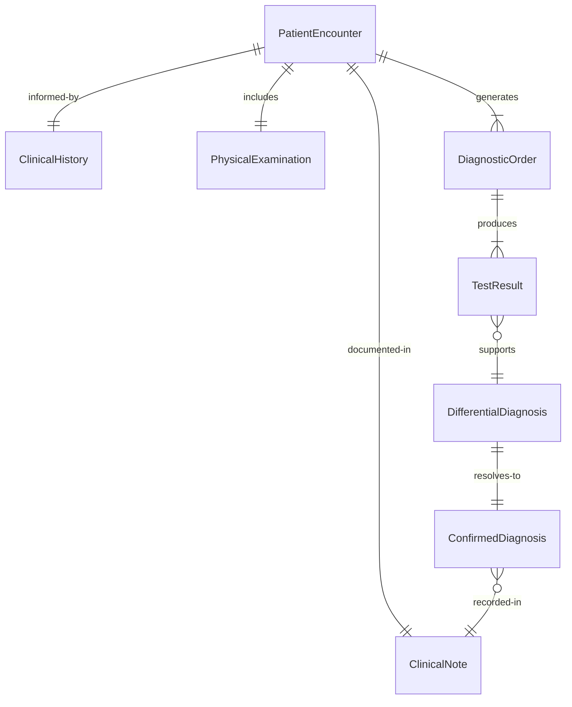
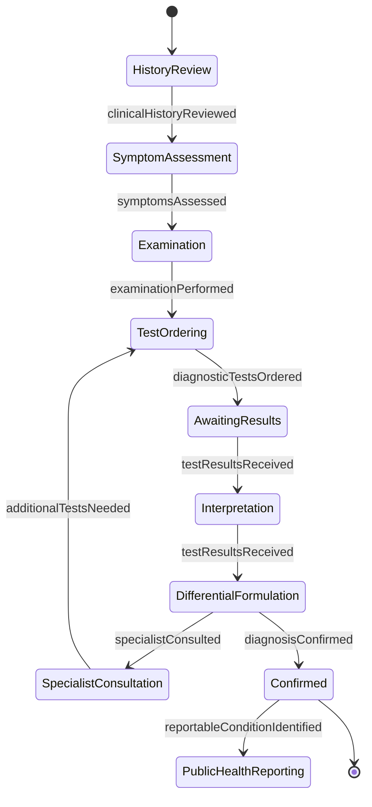
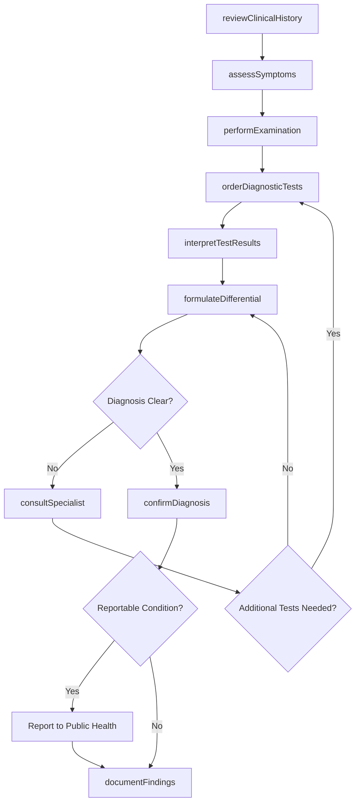
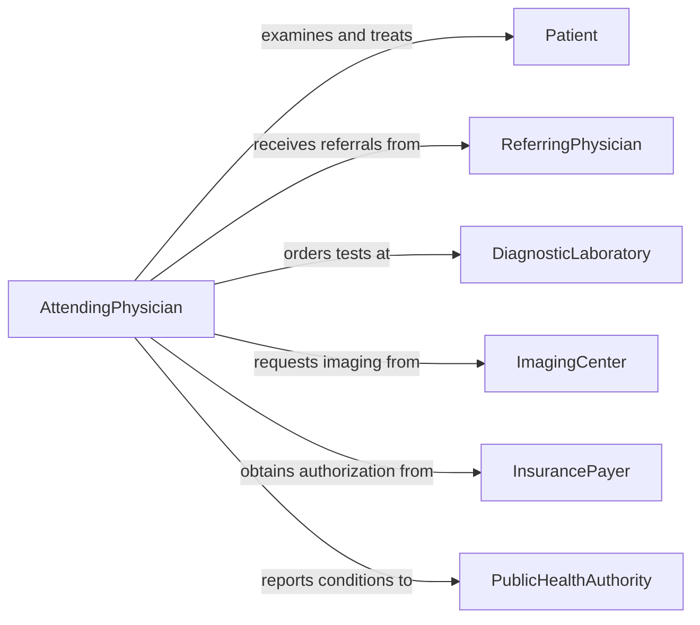

# Diagnose Medical Conditions

> Business-as-Code definition for diagnosing medical conditions. Models the clinical diagnostic lifecycle from patient presentation through history taking, examination, testing, differential diagnosis, and confirmed diagnosis.

## Overview

Diagnosing medical conditions involves systematically gathering clinical information, performing physical examinations, ordering and interpreting diagnostic tests, formulating differential diagnoses, and arriving at confirmed diagnoses. This encompasses patient history review, symptom assessment, laboratory and imaging interpretation, specialist consultation, and documentation in medical records. The definition exposes actions for each phase of the diagnostic process, events for clinical workflow automation, and searches for patient and clinical reference data.

## Actors

| Actor | Description |
|-------|-------------|
| Patient | Individual presenting with symptoms or health concerns |
| ReferringPhysician | Clinician who referred the patient for diagnostic evaluation |
| DiagnosticLaboratory | Facility performing blood work, cultures, and pathology analysis |
| ImagingCenter | Facility providing radiological and imaging diagnostic services |
| InsurancePayer | Health plan authorizing coverage for diagnostic procedures |
| PublicHealthAuthority | Government body requiring reporting of certain diagnosed conditions |

## Roles

| Role | Description |
|------|-------------|
| AttendingPhysician | Primary clinician responsible for the diagnostic workup |
| Specialist | Physician with expertise in a specific organ system or disease |
| Nurse | Clinical staff collecting vitals, history, and assisting examinations |
| Pathologist | Laboratory physician interpreting tissue and fluid specimens |
| Radiologist | Physician interpreting diagnostic imaging studies |
| MedicalRecordsCoder | Specialist who assigns diagnostic codes for documentation and billing |

## Entities

| Entity | Description |
|--------|-------------|
| PatientEncounter | A clinical visit during which the diagnostic process occurs |
| ClinicalHistory | Documented past medical, surgical, family, and social history |
| PhysicalExamination | Findings from the systematic assessment of body systems |
| DiagnosticOrder | Request for laboratory tests, imaging, or other diagnostic procedures |
| TestResult | Output from a laboratory, imaging, or functional diagnostic test |
| DifferentialDiagnosis | Ranked list of possible conditions explaining the patient presentation |
| ConfirmedDiagnosis | The established medical condition assigned a diagnostic code |
| ClinicalNote | Physician documentation of findings, reasoning, and plan |

## Actions

| Action | Description |
|--------|-------------|
| reviewClinicalHistory | Examine the patient's past medical and family history |
| assessSymptoms | Evaluate presenting complaints, onset, duration, and severity |
| performExamination | Conduct a systematic physical examination of relevant body systems |
| orderDiagnosticTests | Request laboratory, imaging, or functional diagnostic procedures |
| interpretTestResults | Analyze diagnostic test findings in clinical context |
| formulateDifferential | Develop a ranked list of possible diagnoses |
| consultSpecialist | Request expert evaluation from a physician specialist |
| confirmDiagnosis | Establish the definitive diagnosis with an assigned diagnostic code |
| documentFindings | Record all clinical findings and diagnostic reasoning in the chart |

## Events

| Event | Description |
|-------|-------------|
| clinicalHistoryReviewed | Patient history review has been completed |
| symptomsAssessed | Presenting complaints have been evaluated and documented |
| examinationPerformed | Physical examination findings have been recorded |
| diagnosticTestsOrdered | Laboratory or imaging studies have been requested |
| testResultsReceived | Diagnostic test results are available for interpretation |
| differentialFormulated | A ranked list of possible diagnoses has been developed |
| specialistConsulted | An expert opinion has been received from a specialist |
| diagnosisConfirmed | A definitive diagnosis has been established and coded |
| reportableConditionIdentified | A condition requiring public health notification has been diagnosed |

## Searches

| Search | Description |
|--------|-------------|
| findPatientEncounters | List encounters by patient, date range, or presenting complaint |
| getTestResults | Retrieve diagnostic test results by patient, test type, or date |
| getDifferentialDiagnoses | Find differential diagnoses by encounter or condition category |
| getClinicalHistory | Retrieve patient history by condition type or time period |
| findDiagnosesByCode | Search confirmed diagnoses by ICD code, category, or physician |

## Entity Relationships



## State Diagram



## Workflow



## Actor Relationships



## Usage

### Calling Actions

```typescript
import { diagnoseMedicalConditions } from '@headlessly/diagnose-medical-conditions'

const clinical = diagnoseMedicalConditions()

// Assess a patient presenting with chest pain
const symptoms = await clinical.assessSymptoms({
  patientId: 'PT-2026-88431',
  chiefComplaint: 'chest-pain',
  onset: 'acute',
  duration: '2-hours',
  associatedSymptoms: ['dyspnea', 'diaphoresis', 'nausea'],
  severity: 8
})

// Order diagnostic tests
const orders = await clinical.orderDiagnosticTests({
  encounterId: symptoms.encounterId,
  tests: [
    { type: 'lab', name: 'troponin-i', stat: true },
    { type: 'lab', name: 'complete-metabolic-panel' },
    { type: 'imaging', name: 'chest-xray' },
    { type: 'procedure', name: '12-lead-ecg' }
  ]
})

// Confirm diagnosis after test interpretation
await clinical.confirmDiagnosis({
  encounterId: symptoms.encounterId,
  diagnosis: 'acute-myocardial-infarction',
  icdCode: 'I21.9',
  basis: ['elevated-troponin', 'st-elevation-ecg', 'clinical-presentation'],
  confidence: 'high'
})
```

### Event-Driven Automation

```typescript
// Alert care team when critical test results arrive
clinical.testResultsReceived(async ({ patientId, testName, results }) => {
  if (results.critical) {
    await notify({
      to: 'attending-physician',
      priority: 'urgent',
      message: `Critical result for ${testName}: ${results.value} ${results.units}`
    })
  }
})

// Trigger public health reporting for notifiable conditions
clinical.reportableConditionIdentified(async ({ patientId, diagnosis, icdCode }) => {
  await submitPublicHealthReport({
    patientId,
    condition: diagnosis,
    icdCode,
    reportingJurisdiction: 'state-health-department',
    reportDate: new Date()
  })
})
```
