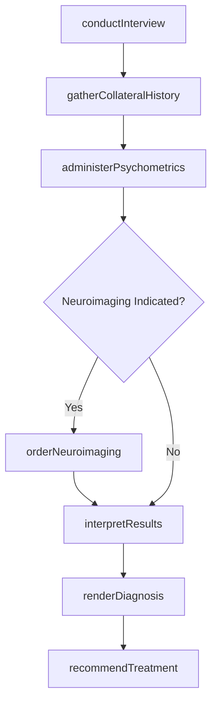
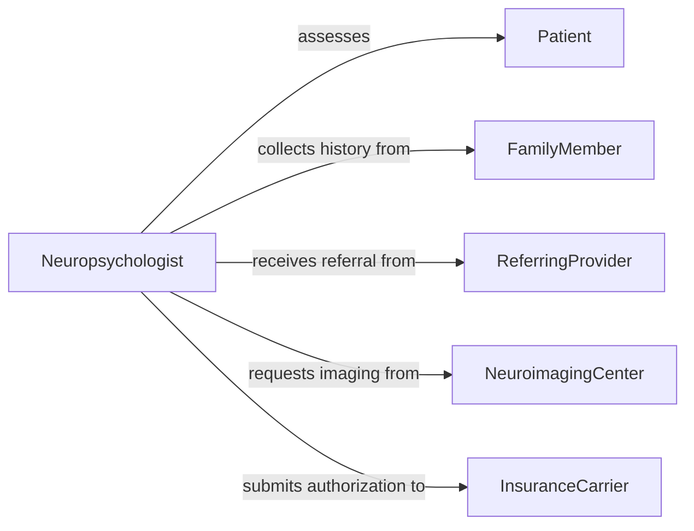

# Diagnose Neural Psychological Disorders

> Business-as-Code definition for diagnosing neural or psychological disorders. Models the clinical assessment process from intake interviews and psychometric testing through neuroimaging interpretation and differential diagnosis.

## Overview

Diagnosing neural or psychological disorders involves conducting structured clinical interviews, administering psychometric instruments, ordering and interpreting neuroimaging or electrophysiological studies, and synthesizing findings into a differential diagnosis using DSM-5 or ICD criteria. This definition exposes actions for multi-modal assessment, events for care team coordination, and searches for patient history and diagnostic reference data.

## Actors

| Actor | Description |
|-------|-------------|
| Patient | Presents symptoms and participates in diagnostic assessments |
| FamilyMember | Provides collateral history and behavioral observations |
| ReferringProvider | Initiates referral with preliminary clinical concerns |
| NeuroimagingCenter | Performs MRI, CT, PET, or EEG studies |
| InsuranceCarrier | Authorizes coverage for diagnostic procedures |

## Roles

| Role | Description |
|------|-------------|
| Neurologist | Evaluates neurological function and interprets brain imaging |
| ClinicalPsychologist | Administers psychometric testing and renders psychological diagnoses |
| Psychiatrist | Conducts psychiatric evaluation and prescribes diagnostic workup |
| Neuropsychologist | Assesses cognitive function through standardized testing batteries |

## Entities

| Entity | Description |
|--------|-------------|
| ClinicalInterview | A structured or semi-structured diagnostic interview record |
| PsychometricAssessment | Results from standardized psychological testing instruments |
| NeuroimagingStudy | Brain imaging data from MRI, CT, PET, or fMRI scans |
| ElectrophysiologicalRecord | EEG or evoked potential study results |
| Diagnosis | A formal determination of a neurological or psychological condition |
| TreatmentRecommendation | Proposed interventions based on diagnostic findings |

## Actions

| Action | Description |
|--------|-------------|
| conductInterview | Perform a structured clinical interview with the patient |
| gatherCollateralHistory | Collect behavioral observations from family or caregivers |
| administerPsychometrics | Administer standardized psychological or cognitive testing |
| orderNeuroimaging | Request brain imaging studies for diagnostic clarification |
| interpretResults | Analyze imaging, electrophysiology, and test results |
| renderDiagnosis | Determine the specific disorder using DSM-5 or ICD criteria |
| recommendTreatment | Propose therapeutic interventions based on the diagnosis |

## Events

| Event | Description |
|-------|-------------|
| interviewCompleted | Clinical interview has been performed and documented |
| collateralHistoryGathered | Family or caregiver observations have been collected |
| psychometricsAdministered | Psychological or cognitive testing has been completed |
| neuroimagingOrdered | Brain imaging study has been requested |
| resultsInterpreted | Diagnostic data has been analyzed and synthesized |
| diagnosisRendered | A formal neurological or psychological diagnosis has been made |
| treatmentRecommended | Therapeutic recommendations have been formulated |

## Searches

| Search | Description |
|--------|-------------|
| findPatientAssessments | Retrieve assessment records by patient, date, or instrument |
| getDiagnoses | List diagnoses by condition, severity, or clinician |
| getNeuroimagingStudies | Look up brain imaging results by patient or study type |
| getPsychometricScores | Find standardized test scores and normative comparisons |

## Workflow



## Actor Relationships



## Usage

### Calling Actions

```typescript
import { diagnoseNeuralPsychologicalDisorders } from '@headlessly/diagnose-neural-psychological-disorders'

const neuro = diagnoseNeuralPsychologicalDisorders()

// Conduct a structured clinical interview
const interview = await neuro.conductInterview({
  patientId: 'PT-2026-4417',
  instrument: 'SCID-5-CV',
  presentingComplaints: ['memory-loss', 'difficulty-concentrating', 'mood-changes'],
  durationOfSymptoms: '6 months'
})

// Administer neuropsychological testing battery
const testing = await neuro.administerPsychometrics({
  patientId: 'PT-2026-4417',
  battery: ['WAIS-IV', 'WMS-IV', 'Trail-Making-A-B', 'Wisconsin-Card-Sort'],
  sessionDate: '2026-03-15'
})

// Render diagnosis based on all collected evidence
const diagnosis = await neuro.renderDiagnosis({
  patientId: 'PT-2026-4417',
  interviewId: interview.id,
  psychometricId: testing.id,
  criteria: 'DSM-5',
  conditions: [
    { disorder: 'mild-neurocognitive-disorder', code: 'G31.84', confidence: 'probable' }
  ]
})
```

### Event-Driven Automation

```typescript
// Auto-recommend treatment when diagnosis is rendered
neuro.diagnosisRendered(async ({ patientId, diagnosisId, conditions }) => {
  await neuro.recommendTreatment({
    patientId,
    diagnosisId,
    modalities: ['cognitive-rehabilitation', 'pharmacotherapy-evaluation']
  })
})

// Notify care team when neuroimaging results arrive
neuro.resultsInterpreted(async ({ patientId, studyType, findings }) => {
  await notify({
    to: 'care-team',
    message: `${studyType} results for patient ${patientId}: ${findings.summary}`
  })
})
```
