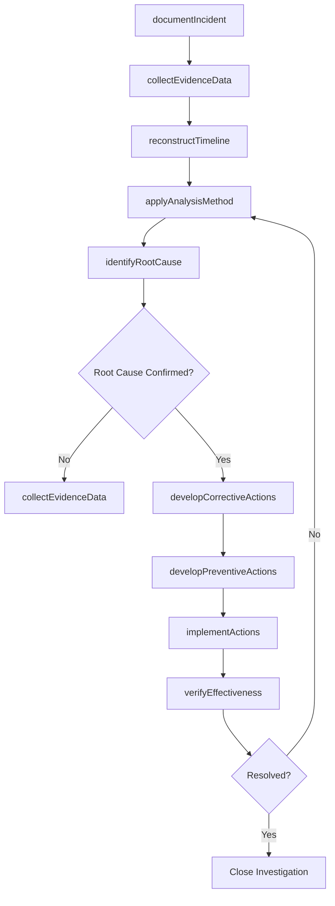
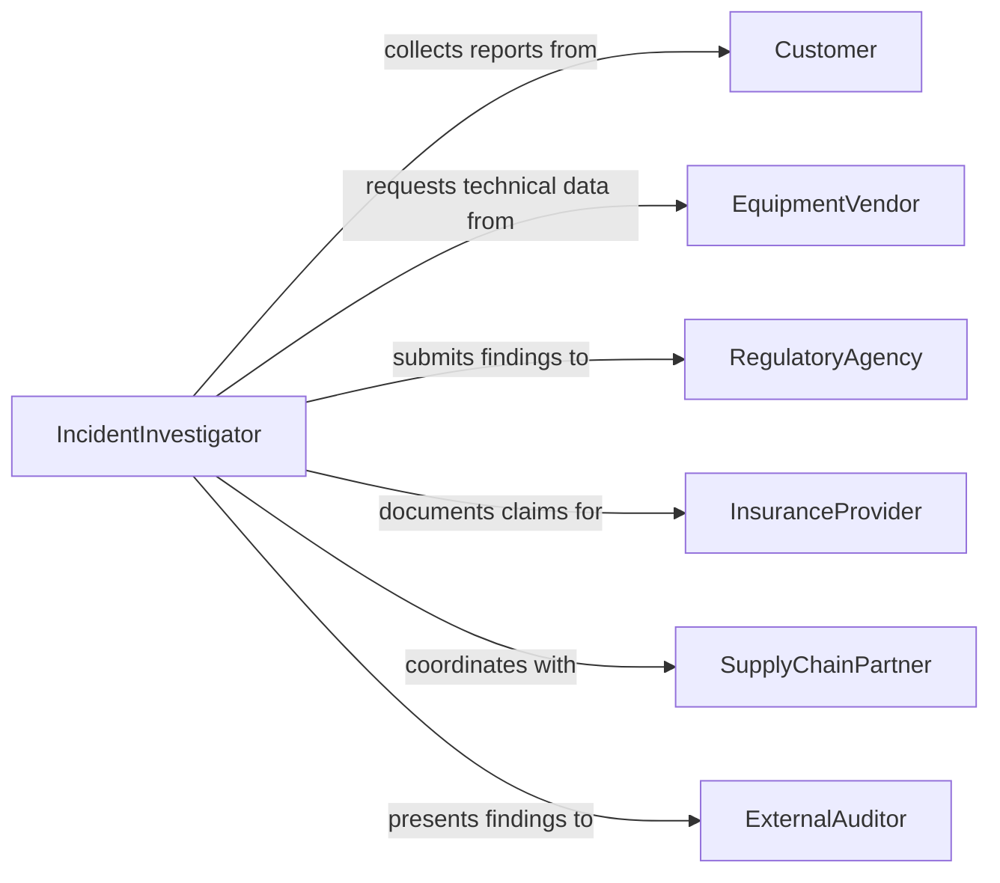

# Determine Causes of Operational Problems or Failures

> Business-as-Code definition for determining causes of operational problems or failures. Models the investigation lifecycle from incident detection through data collection, root cause analysis, corrective action development, and effectiveness verification.

## Overview

Determining causes of operational problems or failures involves systematically investigating disruptions, defects, and performance degradations across production, logistics, technology, and service delivery systems. This encompasses incident documentation, data collection from multiple sources, application of structured analysis methodologies (5 Whys, fishbone diagrams, fault tree analysis), identification of contributing factors, development of corrective and preventive actions, and verification of resolution effectiveness. The definition exposes actions for each phase of the investigation process, events for operational workflow automation, and searches for incident and performance data.

## Actors

| Actor | Description |
|-------|-------------|
| Customer | End user reporting product or service failures and defects |
| EquipmentVendor | Manufacturer providing technical support for equipment failures |
| RegulatoryAgency | Authority requiring investigation of safety or compliance incidents |
| InsuranceProvider | Underwriter assessing operational failure claims |
| SupplyChainPartner | Upstream or downstream partner whose operations affect performance |
| ExternalAuditor | Third-party reviewer validating investigation thoroughness and findings |

## Roles

| Role | Description |
|------|-------------|
| IncidentInvestigator | Leads the root cause analysis and investigation process |
| OperationsManager | Provides operational context and authorizes corrective actions |
| QualityEngineer | Applies structured analysis methodologies to identify root causes |
| DataAnalyst | Collects and analyzes operational data to identify failure patterns |
| ProcessOwner | Accountable for the process where the failure occurred |
| ContinuousImprovementLead | Ensures corrective actions lead to lasting process improvements |

## Entities

| Entity | Description |
|--------|-------------|
| IncidentReport | Initial documentation of the operational problem or failure |
| RootCauseAnalysis | Structured investigation applying analytical methodologies |
| ContributingFactor | Condition or event that played a role in the failure |
| RootCause | The fundamental reason the operational problem occurred |
| CorrectiveAction | Specific remedy addressing the identified root cause |
| PreventiveAction | Measure implemented to avoid recurrence of the problem |
| EffectivenessVerification | Assessment confirming corrective actions resolved the issue |
| FailureModeRecord | Documented pattern of how specific systems or processes fail |
| TimelineReconstruction | Chronological sequence of events leading to the failure |

## Actions

| Action | Description |
|--------|-------------|
| documentIncident | Create a formal record of the operational problem or failure |
| collectEvidenceData | Gather logs, sensor data, records, and witness accounts |
| reconstructTimeline | Map the chronological sequence of events leading to the failure |
| applyAnalysisMethod | Use structured methodologies to identify contributing factors |
| identifyRootCause | Determine the fundamental cause of the operational problem |
| developCorrectiveActions | Define specific remedies addressing the root cause |
| developPreventiveActions | Establish measures to prevent recurrence across the organization |
| implementActions | Execute the corrective and preventive action plans |
| verifyEffectiveness | Confirm that actions resolved the problem and prevented recurrence |

## Events

| Event | Description |
|-------|-------------|
| incidentDocumented | An operational problem or failure has been formally recorded |
| evidenceCollected | Relevant data and documentation have been gathered |
| timelineReconstructed | The sequence of events leading to the failure has been mapped |
| analysisMethodApplied | A structured root cause methodology has been executed |
| rootCauseIdentified | The fundamental cause of the problem has been determined |
| correctiveActionsDeveloped | Specific remedies have been defined for the root cause |
| preventiveActionsDeveloped | Measures to prevent recurrence have been established |
| actionsImplemented | Corrective and preventive actions have been put into effect |
| effectivenessVerified | Post-implementation review confirms the problem is resolved |

## Searches

| Search | Description |
|--------|-------------|
| findIncidents | List incidents by system, severity, date range, or status |
| getRootCauseAnalyses | Retrieve completed analyses by process area, method, or root cause |
| getContributingFactors | Find contributing factors by incident or factor category |
| getCorrectiveActions | List corrective actions by status, owner, or target date |
| findRecurringProblems | Identify repeated failures by system, process, or failure mode |

## Workflow



## Actor Relationships



## Usage

### Calling Actions

```typescript
import { determineCausesOfOperationalProblemsOrFailures } from '@headlessly/determine-causes-of-operational-problems-or-failures'

const investigation = determineCausesOfOperationalProblemsOrFailures()

// Document an incident where production yield dropped unexpectedly
const incident = await investigation.documentIncident({
  title: 'Widget Assembly Line B - 40% Yield Drop',
  system: 'assembly-line-b',
  severity: 'major',
  impact: { yieldLoss: 0.40, downtime: '6h', affectedOrders: 142 },
  reportedBy: 'shift-supervisor-night'
})

// Apply root cause analysis methodology
const analysis = await investigation.applyAnalysisMethod({
  incidentId: incident.id,
  method: 'fishbone-analysis',
  categories: ['machine', 'material', 'method', 'manpower', 'environment'],
  participants: ['quality-engineer', 'line-supervisor', 'maintenance-tech']
})

// Verify effectiveness of corrective actions
await investigation.verifyEffectiveness({
  incidentId: incident.id,
  verificationMethod: 'statistical-process-control',
  monitoringPeriod: '30-days',
  successCriteria: { yieldRate: '>= 97%', defectRate: '<= 0.5%' }
})
```

### Event-Driven Automation

```typescript
// Escalate when root cause reveals systemic issue
investigation.rootCauseIdentified(async ({ incidentId, rootCause, affectedSystems }) => {
  if (affectedSystems.length > 1) {
    await notify({
      to: 'operations-leadership',
      priority: 'high',
      message: `Systemic root cause identified: ${rootCause.description} affects ${affectedSystems.length} systems`
    })
  }
})

// Track recurring problems for reliability improvement
investigation.effectivenessVerified(async ({ incidentId, resolved, system }) => {
  if (!resolved) {
    const recurring = await investigation.findRecurringProblems({
      system,
      lookbackDays: 365
    })
    if (recurring.count >= 3) {
      await escalateToReliabilityProgram({
        system,
        incidentCount: recurring.count,
        recommendation: 'capital-replacement-review'
      })
    }
  }
})
```
