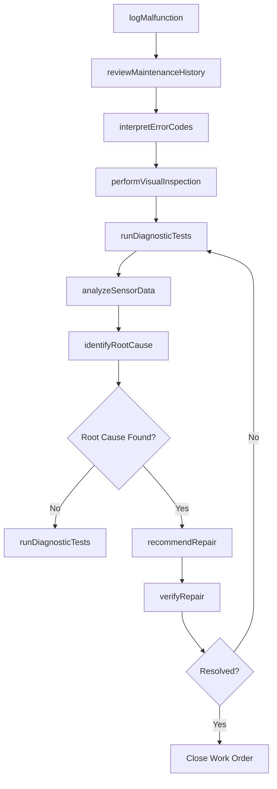
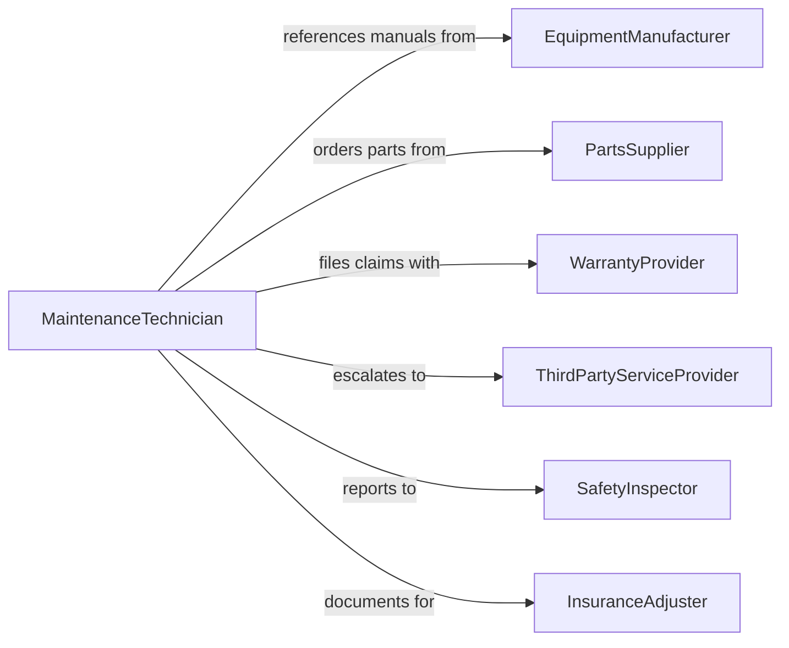

# Diagnose Equipment Malfunctions

> Business-as-Code definition for diagnosing equipment malfunctions. Models the full diagnostic lifecycle from symptom identification through root cause analysis, repair recommendation, and verification testing.

## Overview

Diagnosing equipment malfunctions involves systematically identifying, isolating, and determining the root cause of failures in mechanical, electrical, hydraulic, and pneumatic systems. This encompasses interpreting error codes and sensor data, performing visual and functional inspections, running diagnostic tests, analyzing failure patterns, and recommending corrective actions. The definition exposes actions for each phase of the diagnostic process, events for maintenance workflow automation, and searches for equipment history and failure data.

## Actors

| Actor | Description |
|-------|-------------|
| EquipmentManufacturer | OEM providing technical manuals, parts, and diagnostic specifications |
| PartsSupplier | Vendor supplying replacement components and consumables |
| WarrantyProvider | Entity covering repair costs under equipment warranty agreements |
| ThirdPartyServiceProvider | External maintenance contractor for specialized repairs |
| SafetyInspector | Authority verifying equipment meets operational safety standards |
| InsuranceAdjuster | Underwriter assessing equipment damage claims |

## Roles

| Role | Description |
|------|-------------|
| MaintenanceTechnician | Performs hands-on diagnostic testing and inspection of equipment |
| MaintenanceEngineer | Analyzes complex failure modes and designs diagnostic strategies |
| EquipmentOperator | Reports malfunction symptoms and provides operational context |
| ReliabilityEngineer | Studies failure patterns to predict and prevent recurring issues |
| MaintenanceSupervisor | Prioritizes diagnostic work orders and allocates technician resources |
| InventoryCoordinator | Manages spare parts availability for diagnostic and repair activities |

## Entities

| Entity | Description |
|--------|-------------|
| WorkOrder | Formal request documenting an equipment malfunction requiring diagnosis |
| DiagnosticReport | Detailed findings from the diagnostic investigation |
| FailureMode | Specific way in which the equipment failed or degraded |
| RootCause | Underlying reason for the equipment malfunction |
| ErrorCode | Machine-generated code indicating a specific fault condition |
| SensorReading | Data captured from equipment sensors during diagnostic testing |
| MaintenanceHistory | Chronological record of past repairs and service events |
| RepairRecommendation | Prescribed corrective action to resolve the diagnosed malfunction |

## Actions

| Action | Description |
|--------|-------------|
| logMalfunction | Record the initial malfunction report with symptoms and context |
| reviewMaintenanceHistory | Examine past service records for recurring issues or patterns |
| interpretErrorCodes | Decode machine-generated fault codes to identify potential causes |
| performVisualInspection | Conduct a physical examination of the equipment for visible damage |
| runDiagnosticTests | Execute functional, electrical, or mechanical tests to isolate faults |
| analyzeSensorData | Review sensor readings and telemetry to identify anomalies |
| identifyRootCause | Determine the underlying cause of the malfunction |
| recommendRepair | Prescribe corrective actions, parts, and labor for resolution |
| verifyRepair | Confirm the repair resolved the malfunction through testing |

## Events

| Event | Description |
|-------|-------------|
| malfunctionLogged | An equipment malfunction has been formally reported |
| maintenanceHistoryReviewed | Past service records have been examined for the equipment |
| errorCodesInterpreted | Machine fault codes have been decoded and analyzed |
| visualInspectionCompleted | Physical examination of the equipment is finished |
| diagnosticTestsRun | Functional or mechanical diagnostic tests are complete |
| sensorDataAnalyzed | Equipment telemetry and sensor data review is finished |
| rootCauseIdentified | The underlying cause of the malfunction has been determined |
| repairRecommended | A corrective action plan has been prescribed |
| repairVerified | Post-repair testing confirms the malfunction is resolved |

## Searches

| Search | Description |
|--------|-------------|
| findWorkOrders | List malfunction work orders by equipment, priority, or status |
| getMaintenanceHistory | Retrieve service records by equipment ID or date range |
| getErrorCodes | Find error code definitions by equipment model or code value |
| getDiagnosticReports | Search diagnostic findings by equipment, failure mode, or technician |
| findRecurringFailures | Identify equipment with repeated malfunctions by failure mode |

## Workflow



## Actor Relationships



## Usage

### Calling Actions

```typescript
import { diagnoseEquipmentMalfunctions } from '@headlessly/diagnose-equipment-malfunctions'

const diagnostics = diagnoseEquipmentMalfunctions()

// Log a malfunction report
const workOrder = await diagnostics.logMalfunction({
  equipmentId: 'CNC-LATHE-007',
  reportedBy: 'operator-jsmith',
  symptoms: ['excessive-vibration', 'spindle-noise', 'tolerance-drift'],
  severity: 'critical',
  productionImpact: 'line-stopped'
})

// Run diagnostic tests to isolate the fault
const testResults = await diagnostics.runDiagnosticTests({
  workOrderId: workOrder.id,
  tests: ['spindle-runout', 'bearing-vibration-analysis', 'thermal-imaging'],
  equipmentId: 'CNC-LATHE-007'
})

// Identify root cause based on all findings
const rootCause = await diagnostics.identifyRootCause({
  workOrderId: workOrder.id,
  findings: testResults.findings,
  errorCodes: ['E-4012', 'E-4015'],
  method: 'fishbone-analysis'
})
```

### Event-Driven Automation

```typescript
// Auto-order parts when repair is recommended
diagnostics.repairRecommended(async ({ workOrderId, parts, urgency }) => {
  for (const part of parts) {
    await orderPart({
      partNumber: part.id,
      quantity: part.quantity,
      priority: urgency,
      workOrderId
    })
  }
})

// Alert reliability team on recurring failures
diagnostics.rootCauseIdentified(async ({ equipmentId, failureMode }) => {
  const history = await diagnostics.findRecurringFailures({
    equipmentId,
    failureMode,
    lookbackDays: 180
  })
  if (history.count >= 3) {
    await notify({
      to: 'reliability-engineering',
      message: `Recurring failure: ${failureMode} on ${equipmentId} (${history.count} occurrences in 180 days)`
    })
  }
})
```
