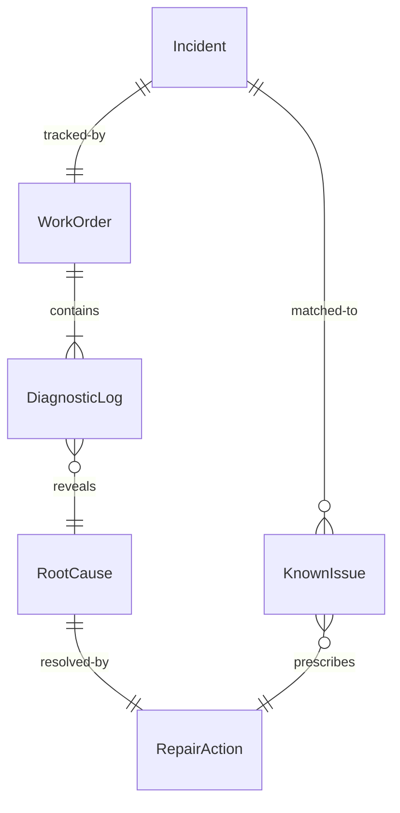
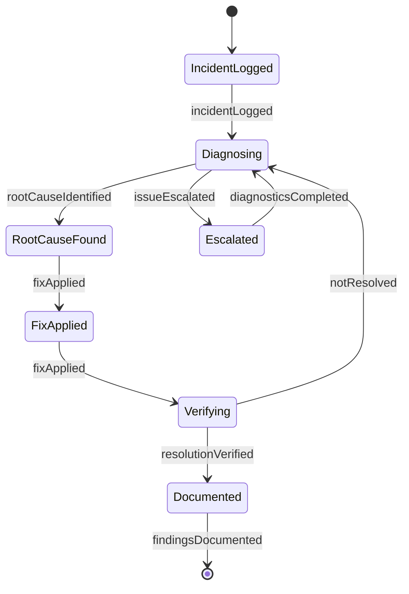
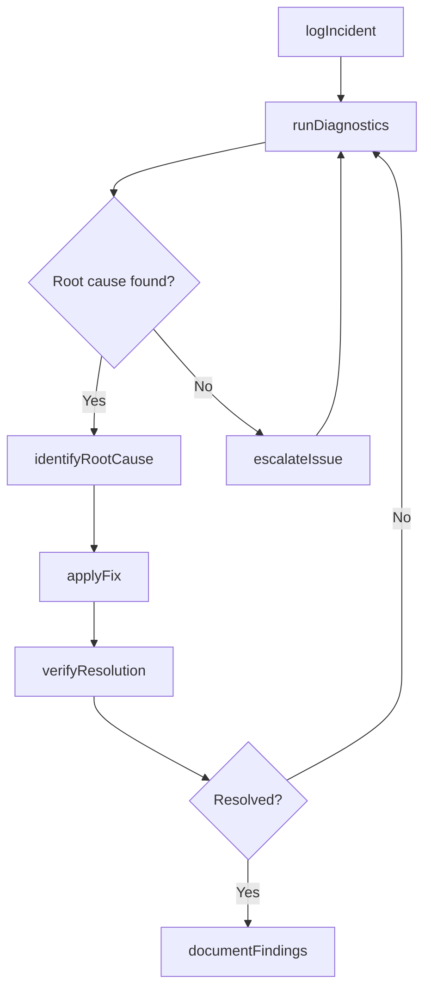
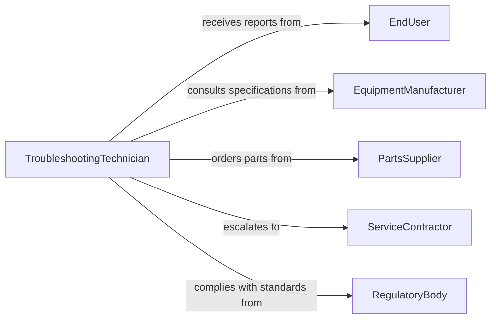

# Troubleshoot Equipment Systems Operation Problems

> Business-as-Code definition for troubleshooting equipment and systems operation problems. Models the diagnostic lifecycle from symptom identification through root cause analysis and resolution verification.

## Overview

Troubleshooting equipment and systems operation problems involves systematically identifying, diagnosing, and resolving malfunctions in mechanical, electrical, and software-driven systems. This definition exposes actions for each phase of the diagnostic process, events for escalation and resolution tracking, and searches for accessing equipment histories and known issue databases.

## Actors

| Actor | Description |
|-------|-------------|
| EquipmentManufacturer | Provides technical specifications, firmware updates, and warranty support |
| ServiceContractor | Third-party technician dispatched for specialized or on-site repairs |
| PartsSupplier | Supplies replacement components and consumables |
| EndUser | Reports symptoms and operational anomalies on equipment |
| RegulatoryBody | Enforces equipment safety and compliance standards |

## Roles

| Role | Description |
|------|-------------|
| TroubleshootingTechnician | Leads diagnosis and resolution of equipment faults |
| MaintenanceSupervisor | Prioritizes and assigns troubleshooting work orders |
| SystemsEngineer | Provides advanced technical analysis for complex failures |
| QualityInspector | Verifies that repairs restore equipment to operational standards |

## Entities

| Entity | Description |
|--------|-------------|
| Incident | A reported equipment malfunction or performance degradation |
| DiagnosticLog | Recorded observations, measurements, and test results during troubleshooting |
| RootCause | The identified underlying reason for the equipment failure |
| WorkOrder | A formal assignment to investigate and resolve an incident |
| KnownIssue | A catalogued problem with documented symptoms and resolution steps |
| RepairAction | A corrective measure applied to restore equipment functionality |

## Actions

| Action | Description |
|--------|-------------|
| logIncident | Record a new equipment malfunction report with symptoms and context |
| runDiagnostics | Execute systematic tests to isolate the source of the problem |
| identifyRootCause | Determine the underlying cause of the equipment failure |
| applyFix | Implement the corrective action to resolve the identified issue |
| verifyResolution | Confirm the equipment operates within specification after repair |
| escalateIssue | Route the incident to a higher-level technician or manufacturer support |
| documentFindings | Record the diagnosis, root cause, and resolution for future reference |

## Events

| Event | Description |
|-------|-------------|
| incidentLogged | A new equipment problem has been reported and recorded |
| diagnosticsCompleted | Systematic tests have been executed and results captured |
| rootCauseIdentified | The underlying cause of the failure has been determined |
| fixApplied | A corrective action has been implemented on the equipment |
| resolutionVerified | The equipment has been confirmed operational after repair |
| issueEscalated | The incident has been routed to a higher support tier |
| findingsDocumented | The complete troubleshooting record has been saved |

## Searches

| Search | Description |
|--------|-------------|
| findIncidents | Retrieve incidents by equipment type, severity, or status |
| getKnownIssues | Search catalogued problems by symptom pattern or equipment model |
| getDiagnosticHistory | Retrieve past diagnostic logs for a specific piece of equipment |
| findOpenWorkOrders | List unresolved troubleshooting work orders by priority or assignment |

## Entity Relationships



## State Diagram



## Workflow



## Actor Relationships



## Usage

### Calling Actions

```typescript
import { troubleshootEquipmentSystemsOperationProblems } from '@headlessly/troubleshoot-equipment-systems-operation-problems'

const troubleshoot = troubleshootEquipmentSystemsOperationProblems()

// Log a new equipment incident
const incident = await troubleshoot.logIncident({
  equipmentId: 'CNC-MILL-042',
  symptoms: ['excessive vibration', 'spindle temperature alarm'],
  severity: 'high',
  reportedBy: 'operator-jsmith'
})

// Run diagnostic tests
const diagnostics = await troubleshoot.runDiagnostics({
  incidentId: incident.id,
  tests: ['vibration-analysis', 'thermal-scan', 'bearing-inspection']
})

// Identify root cause and apply fix
await troubleshoot.identifyRootCause({
  incidentId: incident.id,
  rootCause: 'worn spindle bearing',
  evidence: diagnostics.results
})

await troubleshoot.applyFix({
  incidentId: incident.id,
  action: 'replace-spindle-bearing',
  partsUsed: ['BRG-7204-BE']
})
```

### Event-Driven Automation

```typescript
// Escalate high-severity incidents that remain unresolved
troubleshoot.diagnosticsCompleted(async ({ incidentId, results }) => {
  if (!results.rootCauseFound && results.severity === 'critical') {
    await troubleshoot.escalateIssue({
      incidentId,
      tier: 'manufacturer-support',
      reason: 'Diagnostics inconclusive on critical equipment'
    })
  }
})

// Update knowledge base when issues are resolved
troubleshoot.resolutionVerified(async ({ incidentId, rootCause, fix }) => {
  await knowledgeBase.addKnownIssue({
    symptoms: rootCause.symptoms,
    cause: rootCause.description,
    resolution: fix.action,
    sourceIncident: incidentId
  })
})
```
