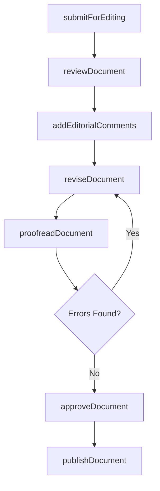
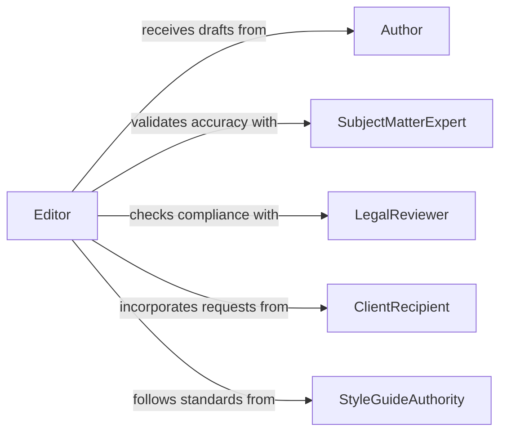

# Edit Documents

> Business-as-Code definition for editing documents. Models the complete document editing lifecycle including review, revision, proofreading, formatting, and approval of written materials such as reports, proposals, policies, and publications.

## Overview

Editing documents involves reviewing written materials for clarity, accuracy, grammar, consistency, and adherence to style guidelines, then making revisions to improve quality before publication or distribution. This process applies to business reports, technical manuals, marketing copy, legal documents, and internal communications. The definition provides actions for document review and revision workflows, events for tracking editing progress, and searches for accessing documents and revision history.

## Actors

| Actor | Description |
|-------|-------------|
| Author | Creates the original document content and incorporates editorial feedback |
| SubjectMatterExpert | Validates technical accuracy of the document content |
| LegalReviewer | Ensures documents comply with legal and regulatory requirements |
| ClientRecipient | Receives the final document and may request specific revisions |
| StyleGuideAuthority | Maintains the organizational style guide and branding standards |

## Roles

| Role | Description |
|------|-------------|
| Editor | Reviews and revises documents for clarity, grammar, and style compliance |
| Proofreader | Performs final checks for typographical, spelling, and formatting errors |
| ManagingEditor | Oversees the editing workflow and assigns documents to editors |
| PublicationCoordinator | Manages the approval and release of finalized documents |

## Entities

| Entity | Description |
|--------|-------------|
| Document | A written work such as a report, proposal, manual, or article |
| Revision | A tracked set of changes made during an editing pass |
| EditorialComment | Feedback or suggested changes attached to specific document sections |
| StyleGuide | A reference defining formatting, tone, and language standards |
| ApprovalRecord | A formal sign-off confirming the document is ready for publication |
| VersionHistory | A log of all document versions with timestamps and change summaries |

## Actions

| Action | Description |
|--------|-------------|
| submitForEditing | Route a document to the editorial team for review |
| reviewDocument | Read and assess the document for content, structure, and style |
| addEditorialComments | Attach feedback and suggested changes to specific sections |
| reviseDocument | Apply edits and incorporate feedback into the document |
| proofreadDocument | Perform a final check for typographical and formatting errors |
| approveDocument | Grant formal approval for the document to be published or distributed |
| publishDocument | Release the finalized document for its intended audience |

## Events

| Event | Description |
|-------|-------------|
| documentSubmitted | A document has been submitted for editorial review |
| documentReviewed | An editor has completed their review of the document |
| editorialCommentsAdded | Feedback has been attached to the document |
| documentRevised | Edits have been applied and a new revision created |
| documentProofread | Final proofreading checks are complete |
| documentApproved | The document has received formal approval |
| documentPublished | The finalized document has been released |

## Searches

| Search | Description |
|--------|-------------|
| findDocumentsByStatus | List documents by editing stage such as in-review, revised, or approved |
| getVersionHistory | Retrieve the revision history for a specific document |
| getPendingReviews | Find documents awaiting editorial review or approval |
| searchByAuthor | Locate documents by author, department, or content type |

## Workflow



## Actor Relationships



## Usage

### Calling Actions

```typescript
import { editDocuments } from '@headlessly/edit-documents'

const docs = editDocuments()

// Submit a document for editing
const submission = await docs.submitForEditing({
  documentId: 'annual-report-2026',
  author: 'finance-department',
  type: 'annual-report',
  deadline: '2026-03-15'
})

// Review and add comments
await docs.reviewDocument({
  documentId: submission.documentId,
  reviewer: 'senior-editor',
  focusAreas: ['clarity', 'consistency', 'style-compliance']
})

await docs.addEditorialComments({
  documentId: submission.documentId,
  comments: [
    { section: 'executive-summary', text: 'Tighten opening paragraph for conciseness' },
    { section: 'financial-results', text: 'Verify Q4 revenue figure against audited statements' }
  ]
})

// Approve and publish
await docs.approveDocument({ documentId: submission.documentId })
await docs.publishDocument({ documentId: submission.documentId, channel: 'investor-portal' })
```

### Event-Driven Automation

```typescript
// Notify author when editorial comments are added
docs.editorialCommentsAdded(async ({ documentId, commentCount }) => {
  await notify({
    to: 'document-author',
    message: `${commentCount} editorial comments added to document ${documentId} - revisions needed`
  })
})

// Auto-assign proofreader after revisions
docs.documentRevised(async ({ documentId, revisionNumber }) => {
  await docs.proofreadDocument({
    documentId,
    assignee: 'proofreading-pool',
    revisionNumber
  })
})
```
