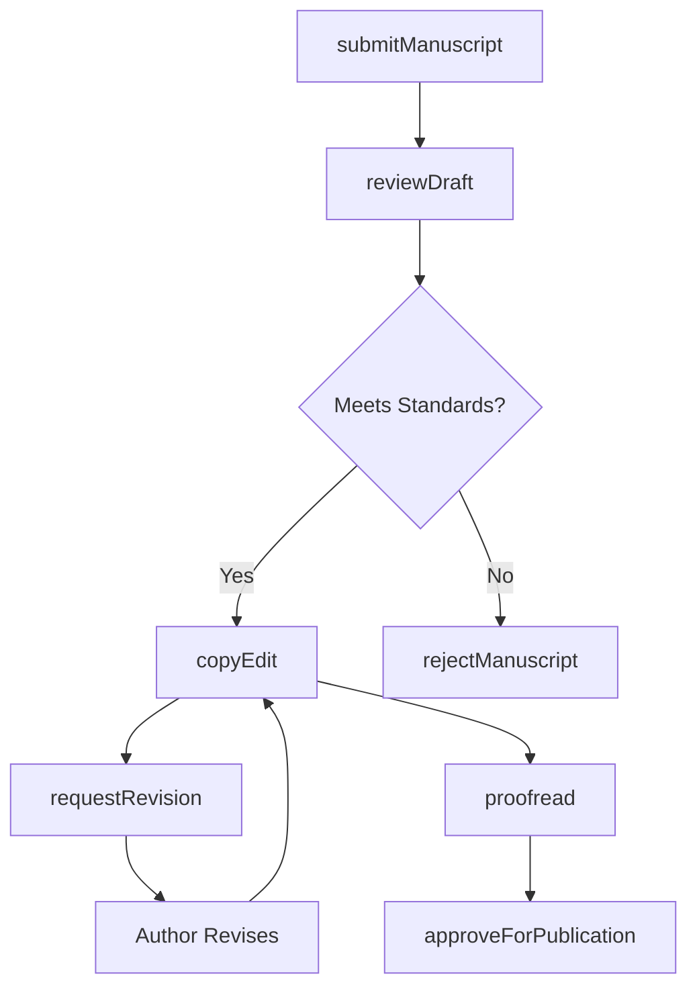
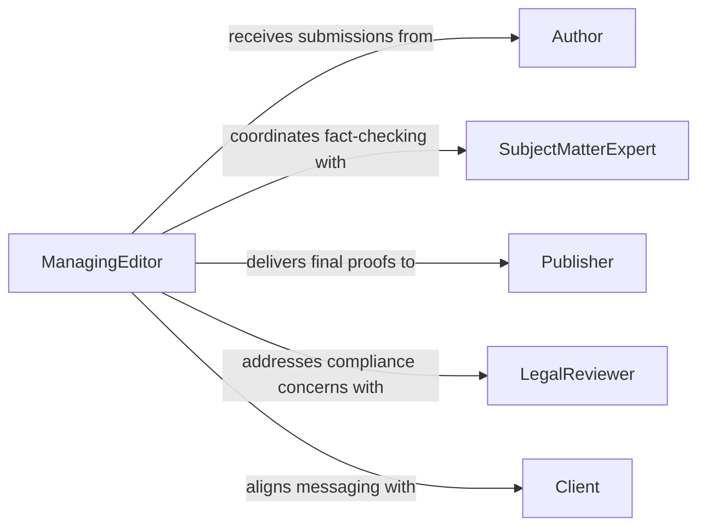

# Edit Written Materials

> Business-as-Code definition for editing written materials. Models the complete editorial lifecycle from manuscript intake through revision, proofreading, and final publication approval.

## Overview

Editing written materials encompasses reviewing, revising, and refining documents such as articles, reports, manuscripts, marketing copy, and technical publications. This process ensures clarity, accuracy, grammatical correctness, and adherence to style guidelines before content reaches its intended audience. The definition exposes actions for each stage of the editorial workflow, events for tracking revision cycles, and searches for managing document queues.

## Actors

| Actor | Description |
|-------|-------------|
| Author | Submits original manuscripts and drafts for editorial review |
| Publisher | Sets editorial standards and approves final content for release |
| SubjectMatterExpert | Provides domain-specific fact-checking and technical accuracy review |
| Client | Commissions content and provides direction on tone and messaging |
| LegalReviewer | Ensures content complies with regulations, copyright, and defamation standards |

## Roles

| Role | Description |
|------|-------------|
| ManagingEditor | Oversees the editorial pipeline and assigns work to editors |
| CopyEditor | Reviews text for grammar, punctuation, spelling, and style consistency |
| ProofReader | Performs final checks on typeset or formatted content before publication |
| ContentStrategist | Aligns editorial output with organizational messaging and audience needs |

## Entities

| Entity | Description |
|--------|-------------|
| Manuscript | The original written document submitted for editing |
| Revision | A tracked set of changes applied to a manuscript version |
| StyleGuide | The authoritative reference for formatting, tone, and usage conventions |
| EditorialComment | An annotation or suggestion attached to a specific passage |
| PublicationProof | The final formatted version of a document ready for sign-off |

## Actions

| Action | Description |
|--------|-------------|
| submitManuscript | Intake a new document into the editorial pipeline |
| reviewDraft | Perform an initial read-through and structural assessment |
| copyEdit | Apply grammar, punctuation, and style corrections to the text |
| requestRevision | Send the document back to the author with required changes |
| proofread | Conduct a final check on the formatted publication proof |
| approveForPublication | Sign off on the document as ready for release |
| rejectManuscript | Decline a submission that does not meet editorial standards |

## Events

| Event | Description |
|-------|-------------|
| manuscriptSubmitted | A new document has entered the editorial pipeline |
| draftReviewed | Initial structural review of the document is complete |
| copyEditCompleted | Grammar and style corrections have been applied |
| revisionRequested | The document has been returned to the author for changes |
| proofreadCompleted | Final proofreading pass has been finished |
| publicationApproved | The document has been cleared for release |
| manuscriptRejected | A submission has been declined |

## Searches

| Search | Description |
|--------|-------------|
| findManuscripts | List manuscripts by status, author, or submission date |
| getRevisionHistory | Retrieve all revisions and comments for a given document |
| getPendingReviews | Find documents awaiting editorial action |

## Workflow



## Actor Relationships



## Usage

### Calling Actions

```typescript
import { editWrittenMaterials } from '@headlessly/edit-written-materials'

const editorial = editWrittenMaterials()

// Submit a new manuscript for editing
const manuscript = await editorial.submitManuscript({
  title: 'Q3 Market Analysis Report',
  author: 'J. Martinez',
  content: documentBuffer,
  styleGuide: 'corporate-style-v2'
})

// Perform copy editing
await editorial.copyEdit({
  manuscriptId: manuscript.id,
  focus: ['grammar', 'punctuation', 'style-consistency'],
  styleGuide: 'corporate-style-v2'
})

// Approve for publication
await editorial.approveForPublication({
  manuscriptId: manuscript.id,
  approvedBy: 'editor-in-chief'
})
```

### Event-Driven Automation

```typescript
// Notify author when revision is requested
editorial.revisionRequested(async ({ manuscriptId, comments }) => {
  await notify({
    to: 'author',
    message: `Revisions requested on manuscript ${manuscriptId}: ${comments.length} items to address`
  })
})

// Trigger publishing pipeline on approval
editorial.publicationApproved(async ({ manuscriptId, title }) => {
  await publishingPipeline.queue({
    manuscriptId,
    title,
    channel: 'website'
  })
})
```
