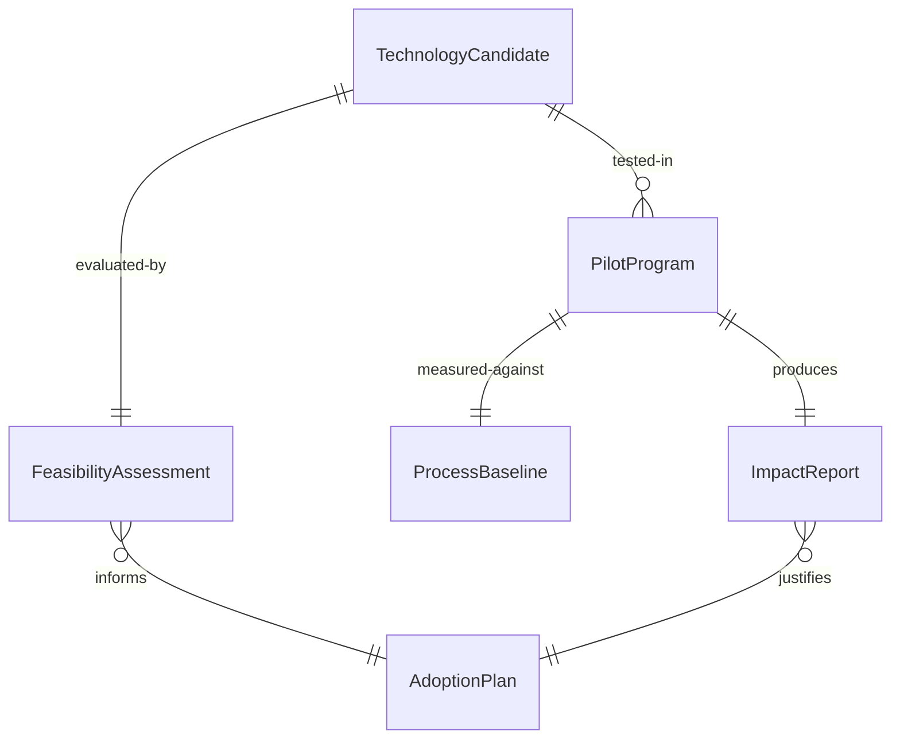
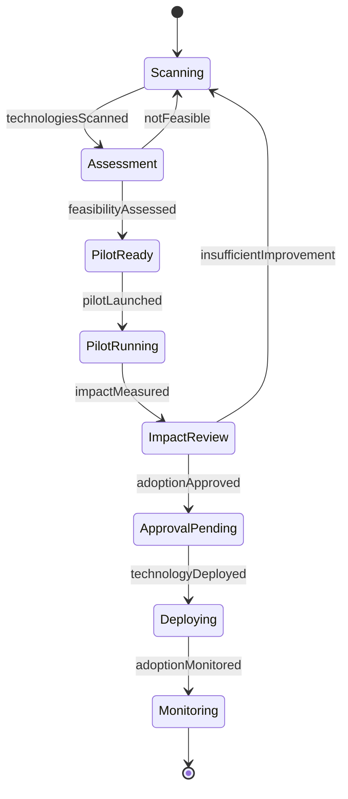
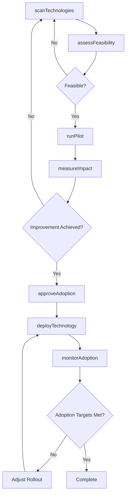
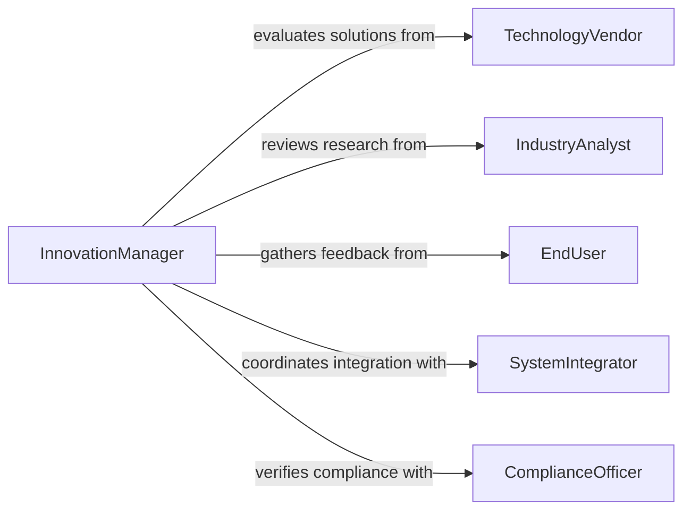

# Apply New Technologies Improve Work

> Business-as-Code definition for applying new technologies to improve work processes. Models the evaluation, piloting, and deployment of emerging tools, platforms, and automation capabilities to enhance operational efficiency.

## Overview

Applying new technologies to improve work processes involves scanning for emerging tools and platforms, evaluating their fit against current workflows, running controlled pilots, and deploying proven solutions across the organization. This definition exposes actions for technology assessment and adoption, events for rollout automation, and searches for tool evaluation and adoption metrics.

## Actors

| Actor | Description |
|-------|-------------|
| TechnologyVendor | Provides software, hardware, or platform solutions |
| IndustryAnalyst | Publishes research on emerging technology trends and capabilities |
| EndUser | Uses the technology in daily work and provides adoption feedback |
| SystemIntegrator | Implements technical integrations with existing infrastructure |
| ComplianceOfficer | Ensures new technology meets regulatory and security standards |

## Roles

| Role | Description |
|------|-------------|
| InnovationManager | Identifies and champions technology adoption opportunities |
| ITArchitect | Assesses technical feasibility and integration requirements |
| ProcessOwner | Defines current workflow pain points and improvement criteria |
| ChangeManager | Plans and executes organizational adoption and training |

## Entities

| Entity | Description |
|--------|-------------|
| TechnologyCandidate | A tool, platform, or solution under consideration for adoption |
| FeasibilityAssessment | Technical and business evaluation of a candidate technology |
| PilotProgram | A controlled trial of a technology in a limited operational scope |
| AdoptionPlan | Phased rollout strategy including training and support |
| ProcessBaseline | Current workflow metrics used to measure improvement |
| ImpactReport | Measured outcomes comparing pre- and post-adoption performance |

## Actions

| Action | Description |
|--------|-------------|
| scanTechnologies | Identify emerging tools and platforms relevant to operations |
| assessFeasibility | Evaluate technical compatibility, cost, and risk of a candidate |
| runPilot | Deploy a technology in a controlled environment to test effectiveness |
| measureImpact | Compare pilot results against the process baseline |
| approveAdoption | Formally authorize organization-wide deployment |
| deployTechnology | Roll out the approved technology across target teams or processes |
| monitorAdoption | Track usage metrics and user feedback post-deployment |

## Events

| Event | Description |
|-------|-------------|
| technologiesScanned | Emerging technology candidates have been identified |
| feasibilityAssessed | A candidate technology has been evaluated for fit |
| pilotLaunched | A controlled technology trial has begun |
| impactMeasured | Pilot results have been compared against baseline metrics |
| adoptionApproved | Technology has been formally approved for deployment |
| technologyDeployed | Technology has been rolled out to target groups |
| adoptionMonitored | Post-deployment usage and feedback data has been collected |

## Searches

| Search | Description |
|--------|-------------|
| findCandidates | List technology candidates by category, vendor, or status |
| getAssessments | Retrieve feasibility evaluations by technology or criteria |
| getPilotResults | Look up pilot program outcomes and measured improvements |
| getAdoptionMetrics | Find usage rates and feedback scores for deployed technologies |

## Entity Relationships



## State Diagram



## Workflow



## Actor Relationships



## Usage

### Calling Actions

```typescript
import { applyNewTechnologiesImproveWork } from '@headlessly/apply-new-technologies-improve-work'

const innovation = applyNewTechnologiesImproveWork()

// Scan for automation technologies relevant to order processing
const candidates = await innovation.scanTechnologies({
  domain: 'order-processing',
  categories: ['RPA', 'workflow-automation', 'document-AI'],
  maturityLevel: 'production-ready'
})

// Assess feasibility of the top candidate
const assessment = await innovation.assessFeasibility({
  candidateId: candidates[0].id,
  integrationPoints: ['ERP', 'CRM', 'warehouse-management'],
  budget: 150000,
  timeline: '3 months'
})

// Run a pilot program
const pilot = await innovation.runPilot({
  candidateId: candidates[0].id,
  scope: 'east-region-orders',
  duration: '6 weeks',
  baselineMetrics: {
    processingTime: '45 min/order',
    errorRate: '3.2%'
  }
})
```

### Event-Driven Automation

```typescript
// Auto-measure impact when pilot period ends
innovation.pilotLaunched(async ({ pilotId, endDate }) => {
  scheduleAt(endDate, async () => {
    await innovation.measureImpact({ pilotId })
  })
})

// Notify leadership when adoption is approved
innovation.adoptionApproved(async ({ candidateId, projectedSavings, deploymentDate }) => {
  await notify({
    to: 'executive-leadership',
    message: `Technology ${candidateId} approved for deployment on ${deploymentDate} with projected annual savings of $${projectedSavings.toLocaleString()}`
  })
})
```
