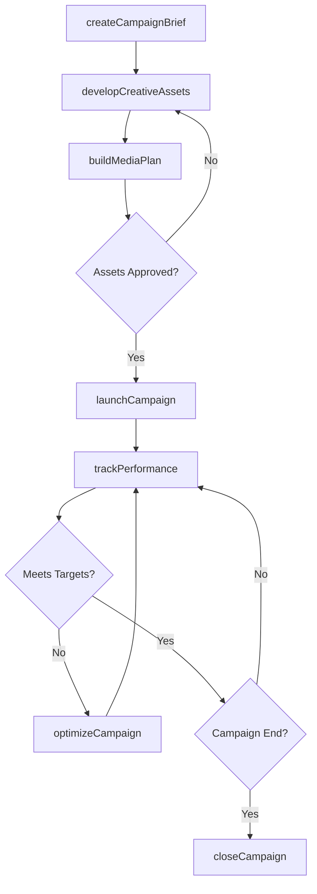
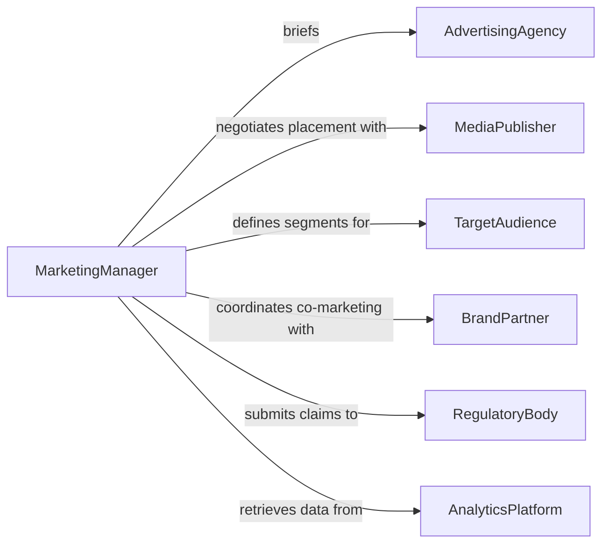

# Implement Advertising Marketing Initiatives

> Business-as-Code definition for implementing advertising and marketing initiatives. Models the end-to-end execution of campaigns from brief through launch and performance measurement.

## Overview

Implementing advertising or marketing initiatives involves translating strategic marketing plans into executable campaigns across channels. This definition exposes actions for campaign setup, creative production, media buying, launch execution, and performance tracking, along with events that enable automated optimization and reporting workflows.

## Actors

| Actor | Description |
|-------|-------------|
| AdvertisingAgency | Develops creative assets and media strategies |
| MediaPublisher | Provides advertising inventory across channels |
| TargetAudience | The consumer segments campaigns are designed to reach |
| BrandPartner | Co-marketing partners who collaborate on joint initiatives |
| RegulatoryBody | Reviews advertising claims for compliance with standards |
| AnalyticsPlatform | Provides campaign performance data and attribution |

## Roles

| Role | Description |
|------|-------------|
| MarketingManager | Oversees initiative planning and execution |
| CampaignCoordinator | Manages day-to-day campaign logistics and timelines |
| CreativeDirector | Approves creative assets and brand consistency |
| MediaBuyer | Negotiates and places advertising across channels |
| PerformanceAnalyst | Tracks campaign metrics and optimization opportunities |

## Entities

| Entity | Description |
|--------|-------------|
| Campaign | A structured marketing initiative with defined objectives and budget |
| CreativeAsset | Advertising materials such as copy, images, or video |
| MediaPlan | Channel allocation and scheduling for ad placement |
| CampaignBrief | Document defining objectives, audience, messaging, and budget |
| PerformanceReport | Aggregated metrics on campaign reach, engagement, and conversions |
| AudienceSegment | A defined group of consumers targeted by the campaign |

## Actions

| Action | Description |
|--------|-------------|
| createCampaignBrief | Define objectives, target audience, budget, and timeline |
| developCreativeAssets | Produce advertising materials aligned with the brief |
| buildMediaPlan | Allocate budget across channels and schedule placements |
| launchCampaign | Activate the campaign across all planned channels |
| trackPerformance | Monitor real-time metrics against campaign objectives |
| optimizeCampaign | Adjust targeting, creative, or spend based on performance data |
| closeCampaign | Finalize the initiative and generate post-campaign analysis |

## Events

| Event | Description |
|-------|-------------|
| campaignBriefCreated | A new campaign brief has been defined and approved |
| creativeAssetsApproved | All creative materials have passed review |
| mediaPlanFinalized | Channel allocation and scheduling is locked |
| campaignLaunched | The campaign has gone live across channels |
| performanceThresholdReached | A key metric has hit a predefined target or alert level |
| campaignOptimized | Adjustments have been applied to improve performance |
| campaignClosed | The initiative has concluded and final reporting is complete |

## Searches

| Search | Description |
|--------|-------------|
| findCampaigns | List campaigns by status, channel, date range, or budget |
| getPerformanceMetrics | Retrieve KPIs for a specific campaign or time period |
| getCreativeAssets | Find creative materials by campaign, format, or approval status |
| getAudienceSegments | Retrieve audience definitions and targeting parameters |
| getMediaPlacements | List active and scheduled ad placements by channel |

## Workflow



## Actor Relationships



## Usage

### Calling Actions

```typescript
import { implementAdvertisingMarketingInitiatives } from '@headlessly/implement-advertising-marketing-initiatives'

const campaigns = implementAdvertisingMarketingInitiatives()

// Create a new campaign brief
const brief = await campaigns.createCampaignBrief({
  name: 'Q2 Product Launch',
  objective: 'Drive awareness and trial for new product line',
  targetAudience: { segment: 'tech-early-adopters', ageRange: '25-44' },
  budget: 250000,
  channels: ['digital', 'social', 'email'],
  timeline: { start: '2026-04-01', end: '2026-06-30' }
})

// Launch the campaign once assets and media plan are ready
await campaigns.launchCampaign({
  campaignId: brief.id,
  activationDate: '2026-04-01'
})

// Track performance against objectives
const metrics = await campaigns.trackPerformance({
  campaignId: brief.id,
  period: 'week-1'
})
```

### Event-Driven Automation

```typescript
// Optimize underperforming campaigns automatically
campaigns.performanceThresholdReached(async ({ campaignId, metric, value }) => {
  if (metric === 'clickThroughRate' && value < 0.02) {
    await campaigns.optimizeCampaign({
      campaignId,
      adjustments: { action: 'refresh-creative', reallocateBudget: true }
    })
  }
})

// Generate final report when campaign closes
campaigns.campaignClosed(async ({ campaignId }) => {
  const report = await campaigns.trackPerformance({ campaignId, period: 'full' })
  await distribute({ to: 'marketing-leadership', report })
})
```
