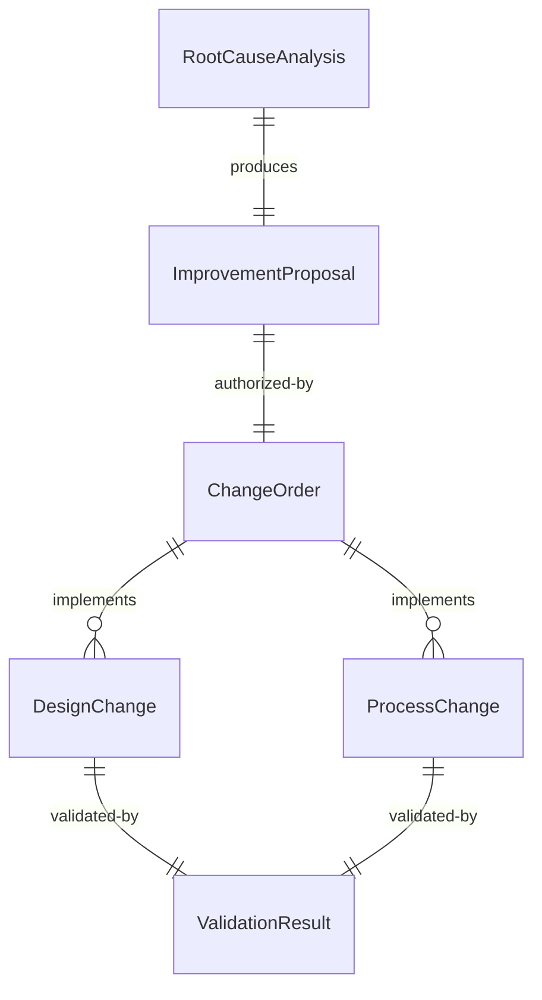
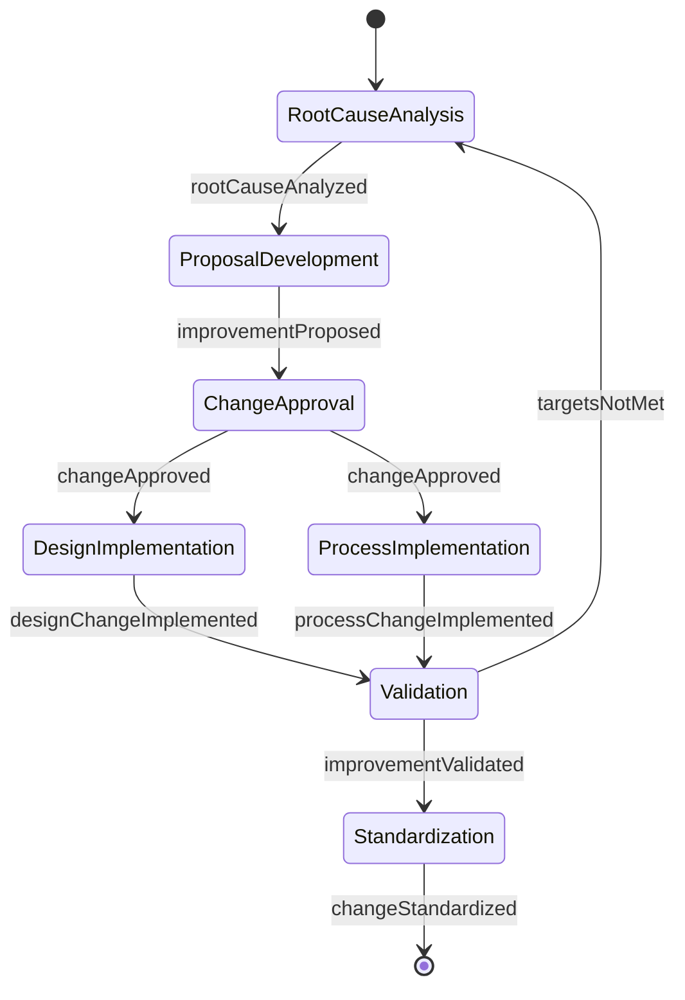
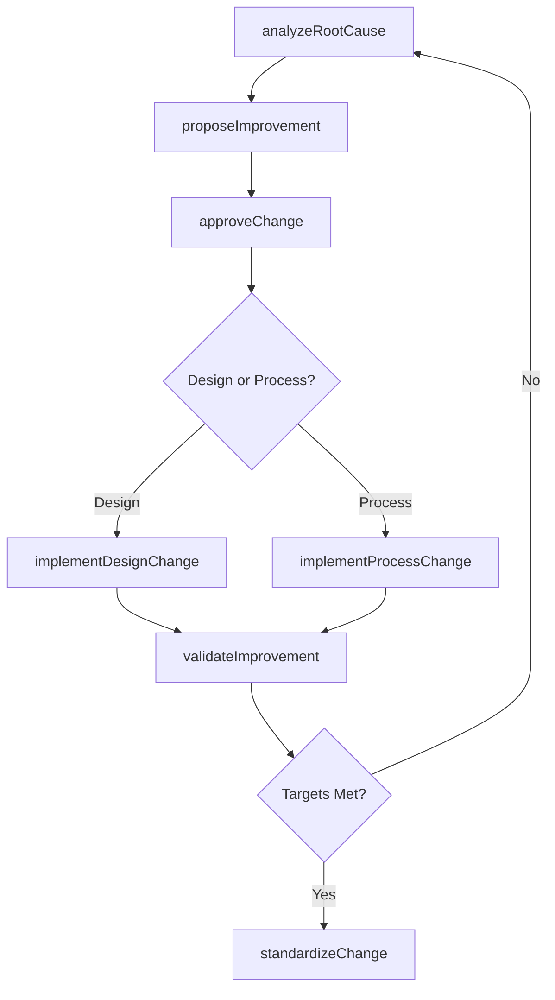
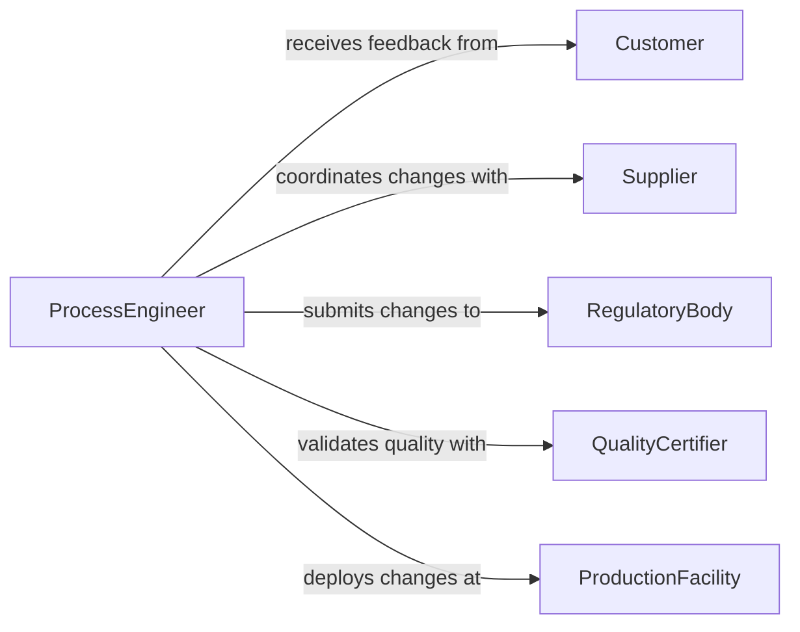

# Implement Design Process Improvements

> Business-as-Code definition for implementing design or process improvements. Models the execution of engineering design changes and operational process optimizations from root cause analysis through implementation and validation.

## Overview

Implementing design or process improvements involves identifying inefficiencies or defects in existing designs and workflows, developing corrective solutions, executing changes through controlled implementation, and validating that improvements achieve target outcomes. This definition exposes actions for improvement execution and validation, events for change management automation, and searches for performance and change history data.

## Actors

| Actor | Description |
|-------|-------------|
| Customer | Reports quality issues and validates improvement outcomes |
| Supplier | Adjusts components or materials to support design changes |
| RegulatoryBody | Approves design changes affecting safety or compliance |
| QualityCertifier | Audits improved processes for quality management standards |
| ProductionFacility | Executes physical process changes on the manufacturing floor |

## Roles

| Role | Description |
|------|-------------|
| ProcessEngineer | Analyzes current processes and designs improvements |
| DesignEngineer | Develops engineering design changes and updated specifications |
| QualityManager | Validates that improvements meet quality and performance targets |
| ChangeCoordinator | Manages the change control workflow and stakeholder communication |

## Entities

| Entity | Description |
|--------|-------------|
| ImprovementProposal | A documented plan for a design or process change |
| RootCauseAnalysis | Investigation identifying the underlying cause of a deficiency |
| DesignChange | A modification to engineering drawings, specifications, or models |
| ProcessChange | A modification to operational workflows, parameters, or procedures |
| ValidationResult | Measured outcomes confirming improvement effectiveness |
| ChangeOrder | A formal authorization to implement a design or process modification |

## Actions

| Action | Description |
|--------|-------------|
| analyzeRootCause | Investigate the underlying cause of a design or process deficiency |
| proposeImprovement | Document the proposed change with expected benefits and risks |
| approveChange | Authorize the improvement through the change control process |
| implementDesignChange | Execute engineering modifications to drawings or specifications |
| implementProcessChange | Deploy workflow or procedural modifications to operations |
| validateImprovement | Measure outcomes against targets to confirm effectiveness |
| standardizeChange | Update standard operating procedures and documentation |

## Events

| Event | Description |
|-------|-------------|
| rootCauseAnalyzed | The underlying cause of a deficiency has been identified |
| improvementProposed | A design or process change has been formally documented |
| changeApproved | An improvement has been authorized for implementation |
| designChangeImplemented | Engineering modifications have been executed |
| processChangeImplemented | Workflow or procedural changes have been deployed |
| improvementValidated | Outcomes have been measured and confirmed against targets |
| changeStandardized | Updated procedures and documentation have been published |

## Searches

| Search | Description |
|--------|-------------|
| findImprovements | List improvement proposals by status, type, or priority |
| getChangeOrders | Retrieve change orders by project, date, or approval status |
| getValidationResults | Look up validation outcomes by improvement or metric |
| getRootCauseAnalyses | Find root cause investigations by deficiency type or area |

## Entity Relationships



## State Diagram



## Workflow



## Actor Relationships



## Usage

### Calling Actions

```typescript
import { implementDesignProcessImprovements } from '@headlessly/implement-design-process-improvements'

const improvements = implementDesignProcessImprovements()

// Analyze root cause of a product defect
const rca = await improvements.analyzeRootCause({
  deficiencyId: 'DEF-2026-0087',
  description: 'Weld joint failure at bracket assembly',
  method: 'fishbone-analysis',
  data: ['inspection-reports', 'metallurgy-results', 'process-logs']
})

// Propose an improvement
const proposal = await improvements.proposeImprovement({
  rootCauseId: rca.id,
  changeType: 'design',
  description: 'Increase weld throat dimension from 6mm to 8mm and add pre-heat requirement',
  expectedBenefit: 'Eliminate bracket weld failures, reduce warranty claims by 40%',
  estimatedCost: 12000
})

// Validate after implementation
const validation = await improvements.validateImprovement({
  proposalId: proposal.id,
  metrics: [
    { name: 'weld-failure-rate', target: '< 0.1%', actual: '0.02%' },
    { name: 'warranty-claims', target: '40% reduction', actual: '47% reduction' }
  ]
})
```

### Event-Driven Automation

```typescript
// Auto-notify suppliers when design changes are approved
improvements.changeApproved(async ({ proposalId, changeType, affectedComponents }) => {
  if (changeType === 'design') {
    await notify({
      to: 'supplier-liaison',
      message: `Design change ${proposalId} approved - update specs for: ${affectedComponents.join(', ')}`
    })
  }
})

// Standardize procedures when validation passes
improvements.improvementValidated(async ({ proposalId, allTargetsMet }) => {
  if (allTargetsMet) {
    await improvements.standardizeChange({
      proposalId,
      updateDocuments: ['SOP', 'work-instructions', 'control-plan']
    })
  }
})
```
