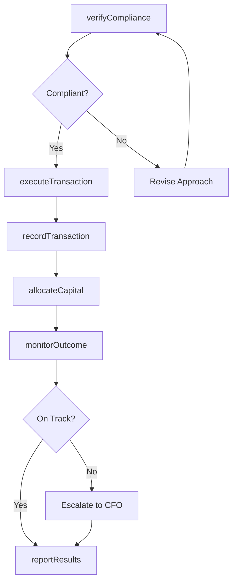
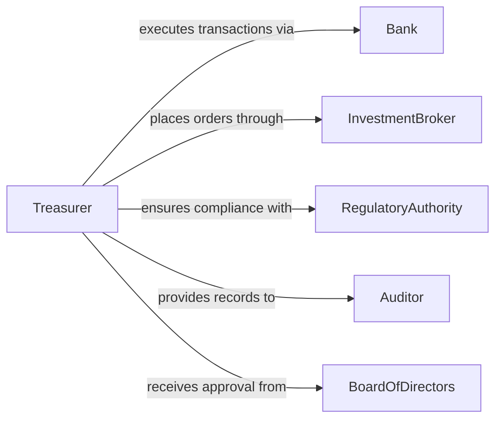

# Implement Financial Decisions

> Business-as-Code definition for implementing financial decisions. Models the execution of approved financial strategies including capital allocation, investment execution, cost restructuring, and financial policy changes.

## Overview

Implementing financial decisions involves translating approved financial strategies and policies into operational actions such as capital deployment, investment transactions, cost adjustments, and compliance updates. This definition exposes actions for financial execution and monitoring, events for audit trail automation, and searches for transaction and compliance data.

## Actors

| Actor | Description |
|-------|-------------|
| Bank | Processes financial transactions and provides account services |
| InvestmentBroker | Executes securities transactions and provides market access |
| RegulatoryAuthority | Sets financial reporting and compliance requirements |
| Auditor | Reviews transaction records for accuracy and compliance |
| BoardOfDirectors | Approves major financial strategy decisions |

## Roles

| Role | Description |
|------|-------------|
| CFO | Authorizes and oversees implementation of financial decisions |
| Treasurer | Manages cash flow, investments, and banking relationships |
| FinancialController | Ensures transactions are recorded accurately and comply with policy |
| ComplianceOfficer | Verifies financial actions meet regulatory requirements |

## Entities

| Entity | Description |
|--------|-------------|
| FinancialDecision | An approved directive to take a specific financial action |
| Transaction | A recorded financial operation such as a payment, investment, or transfer |
| CapitalAllocation | Distribution of financial resources to approved projects or accounts |
| ComplianceCheck | Verification that a financial action meets regulatory standards |
| AuditTrail | Chronological record of all actions taken on a financial decision |
| FinancialPolicy | Organizational rules governing financial operations |

## Actions

| Action | Description |
|--------|-------------|
| executeTransaction | Carry out a specific financial transaction as directed |
| allocateCapital | Distribute funds to approved projects, departments, or investments |
| updatePolicy | Modify financial policies based on approved decisions |
| verifyCompliance | Check that financial actions meet regulatory and internal standards |
| recordTransaction | Document the financial action in the general ledger |
| monitorOutcome | Track the results and impact of implemented financial decisions |
| reportResults | Generate summary reports on decision implementation status |

## Events

| Event | Description |
|-------|-------------|
| transactionExecuted | A financial transaction has been carried out |
| capitalAllocated | Funds have been distributed to approved targets |
| policyUpdated | A financial policy has been modified |
| complianceVerified | A financial action has passed regulatory and internal checks |
| transactionRecorded | A financial action has been entered into the ledger |
| outcomeMonitored | Results of a financial decision have been evaluated |
| resultsReported | Implementation status report has been generated |

## Searches

| Search | Description |
|--------|-------------|
| findTransactions | List transactions by decision, date, amount, or category |
| getAllocations | Retrieve capital allocation records by project or department |
| getComplianceStatus | Check compliance verification status for financial actions |
| getAuditTrail | Look up the complete action history for a financial decision |

## Workflow



## Actor Relationships



## Usage

### Calling Actions

```typescript
import { implementFinancialDecisions } from '@headlessly/implement-financial-decisions'

const finance = implementFinancialDecisions()

// Verify compliance before executing a capital allocation
const compliance = await finance.verifyCompliance({
  decisionId: 'FD-2026-Q1-014',
  actionType: 'capital-allocation',
  amount: 2500000,
  regulations: ['SOX', 'GAAP']
})

// Execute the approved financial transaction
const transaction = await finance.executeTransaction({
  decisionId: 'FD-2026-Q1-014',
  type: 'wire-transfer',
  fromAccount: 'CORP-OPERATING-001',
  toAccount: 'PROJECT-EXPANSION-042',
  amount: 2500000,
  currency: 'USD'
})

// Record and monitor the outcome
await finance.recordTransaction({
  transactionId: transaction.id,
  ledgerAccount: '1200-Capital-Projects',
  period: '2026-Q1'
})
```

### Event-Driven Automation

```typescript
// Create audit trail entry for every executed transaction
finance.transactionExecuted(async ({ transactionId, decisionId, amount }) => {
  await finance.recordTransaction({
    transactionId,
    decisionId,
    timestamp: new Date().toISOString()
  })
})

// Alert compliance team when large transactions are executed
finance.capitalAllocated(async ({ decisionId, amount, department }) => {
  if (amount > 1000000) {
    await notify({
      to: 'compliance-team',
      message: `Capital allocation of $${amount.toLocaleString()} to ${department} requires review (Decision: ${decisionId})`
    })
  }
})
```
