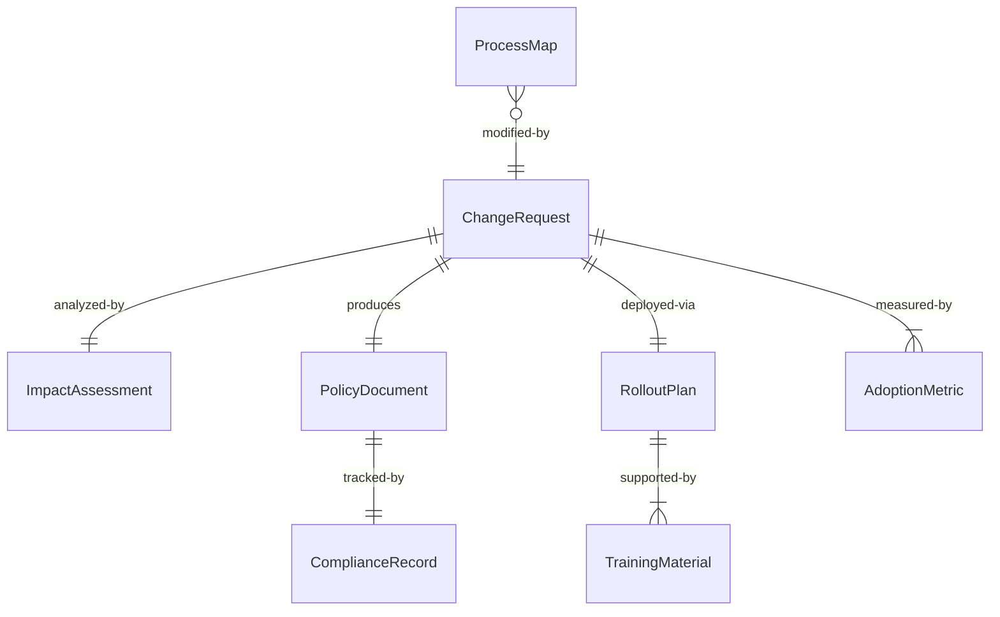
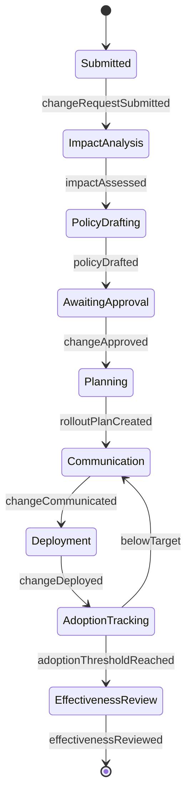
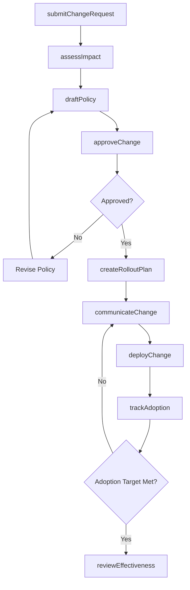
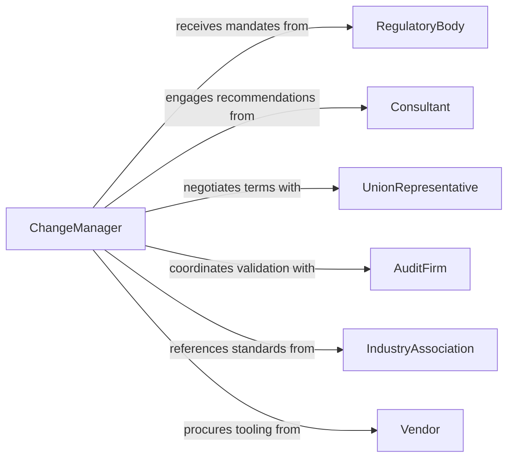

# Implement Organizational Process and Policy Changes

> Business-as-Code definition for implementing organizational process and policy changes. Models the lifecycle from change identification through rollout, adoption tracking, and compliance verification.

## Overview

Implementing organizational process and policy changes involves planning, communicating, and executing modifications to existing workflows, procedures, and governance policies. This encompasses impact assessment, stakeholder alignment, change communication, phased rollout, training coordination, and post-implementation review. The definition exposes actions for each phase of the change management lifecycle, events for workflow automation, and searches for tracking adoption and compliance.

## Actors

| Actor | Description |
|-------|-------------|
| RegulatoryBody | External authority mandating compliance-driven policy changes |
| Consultant | External advisor recommending process improvements |
| UnionRepresentative | Labor representative reviewing changes affecting workforce terms |
| AuditFirm | Third-party organization validating policy compliance |
| IndustryAssociation | Trade group issuing best practice guidance and standards |
| Vendor | Technology or service provider supporting new process tooling |

## Roles

| Role | Description |
|------|-------------|
| ChangeManager | Leads the change initiative from planning through adoption |
| PolicyAnalyst | Drafts and revises policy documents and process maps |
| DepartmentHead | Sponsors changes within their organizational unit |
| ComplianceOfficer | Ensures changes meet regulatory and internal standards |
| TrainingCoordinator | Develops and delivers change-related training programs |
| ProjectSponsor | Executive champion who authorizes and funds the change effort |

## Entities

| Entity | Description |
|--------|-------------|
| ChangeRequest | Formal proposal describing a process or policy modification |
| PolicyDocument | Written policy governing organizational behavior |
| ProcessMap | Visual representation of a workflow before and after changes |
| ImpactAssessment | Analysis of how a change affects departments, systems, and people |
| RolloutPlan | Phased schedule for deploying a change across the organization |
| TrainingMaterial | Educational content supporting adoption of new processes |
| ComplianceRecord | Documentation proving adherence to updated policies |
| AdoptionMetric | Quantitative measure of how effectively a change has been adopted |

## Actions

| Action | Description |
|--------|-------------|
| submitChangeRequest | Initiate a formal request to modify a process or policy |
| assessImpact | Evaluate the organizational impact of a proposed change |
| draftPolicy | Create or revise a policy document reflecting the change |
| approveChange | Formally authorize the change for implementation |
| createRolloutPlan | Define phased deployment schedule and milestones |
| communicateChange | Distribute change notifications to affected stakeholders |
| deployChange | Execute the change according to the rollout plan |
| trackAdoption | Monitor compliance rates and adoption metrics post-deployment |
| reviewEffectiveness | Evaluate whether the change achieved intended outcomes |

## Events

| Event | Description |
|-------|-------------|
| changeRequestSubmitted | A new change request has been formally submitted |
| impactAssessed | The organizational impact analysis is complete |
| policyDrafted | A new or revised policy document has been prepared |
| changeApproved | The change has been formally authorized for rollout |
| rolloutPlanCreated | A deployment plan with milestones has been established |
| changeCommunicated | Stakeholders have been notified of the upcoming change |
| changeDeployed | The change has been put into effect for a target group |
| adoptionThresholdReached | Adoption metrics have met the target compliance rate |
| effectivenessReviewed | Post-implementation review has been completed |

## Searches

| Search | Description |
|--------|-------------|
| findChangeRequests | List change requests by status, department, or priority |
| getPolicyDocuments | Retrieve policies by category, effective date, or version |
| getImpactAssessments | Find impact analyses by change request or affected department |
| getAdoptionMetrics | Retrieve adoption rates by department, change, or time period |
| findNonCompliantUnits | Identify departments that have not adopted the change |

## Entity Relationships



## State Diagram



## Workflow



## Actor Relationships



## Usage

### Calling Actions

```typescript
import { implementOrganizationalProcessPolicyChanges } from '@headlessly/implement-organizational-process-policy-changes'

const changes = implementOrganizationalProcessPolicyChanges()

// Submit a change request for a new remote work policy
const request = await changes.submitChangeRequest({
  title: 'Hybrid Remote Work Policy',
  description: 'Transition from full-time office to hybrid 3/2 schedule',
  affectedDepartments: ['Engineering', 'Marketing', 'Finance'],
  requestedBy: 'VP of People Operations',
  priority: 'high'
})

// Assess organizational impact
const impact = await changes.assessImpact({
  changeRequestId: request.id,
  dimensions: ['workforce', 'technology', 'facilities', 'compliance']
})

// Deploy the change after approval
await changes.deployChange({
  changeRequestId: request.id,
  phase: 'pilot',
  targetDepartments: ['Engineering'],
  effectiveDate: '2026-03-01'
})
```

### Event-Driven Automation

```typescript
// Notify leadership when adoption falls below target
changes.changeDeployed(async ({ changeRequestId, targetDepartments }) => {
  await scheduleAdoptionCheck({
    changeRequestId,
    checkDate: addDays(new Date(), 30),
    targetRate: 0.85
  })
})

// Trigger review once adoption threshold is reached
changes.adoptionThresholdReached(async ({ changeRequestId, adoptionRate }) => {
  await changes.reviewEffectiveness({
    changeRequestId,
    metrics: ['productivity', 'satisfaction', 'compliance'],
    adoptionRate
  })
})
```
