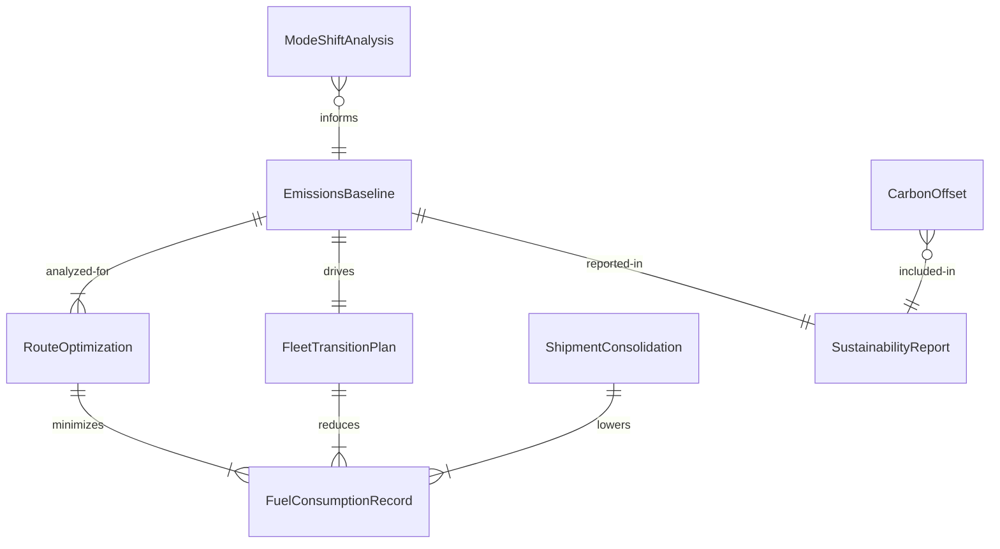
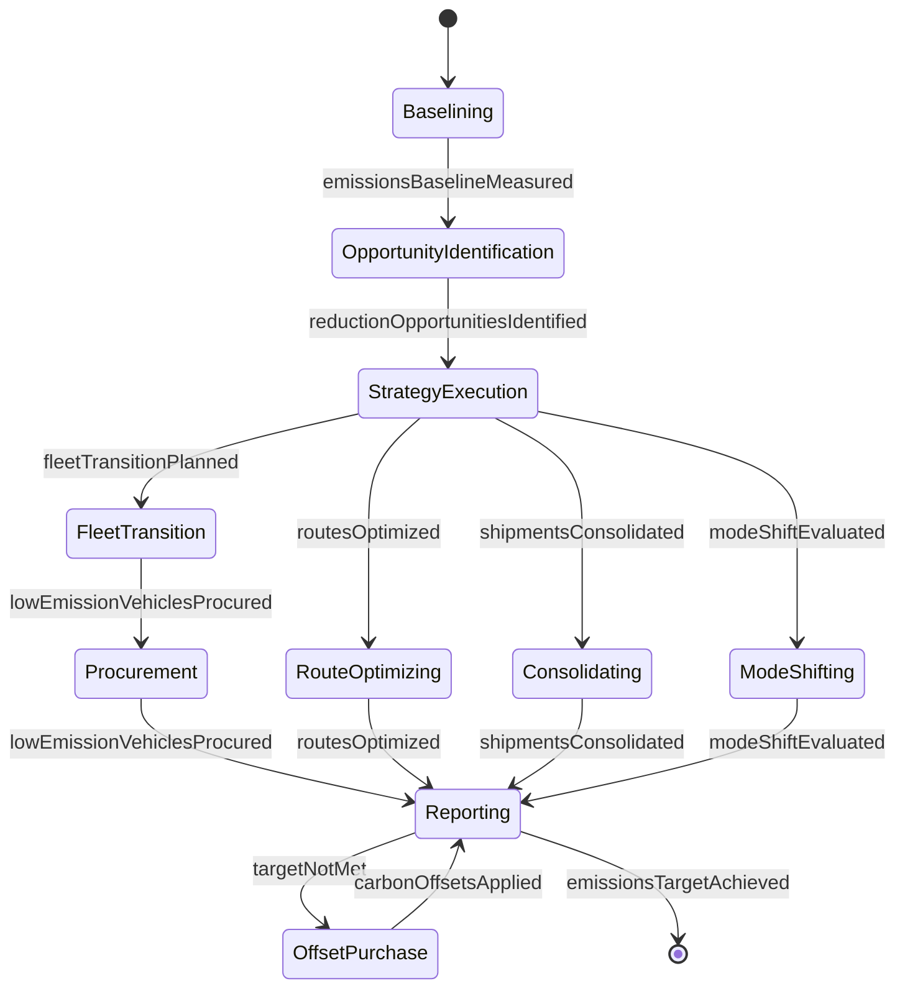
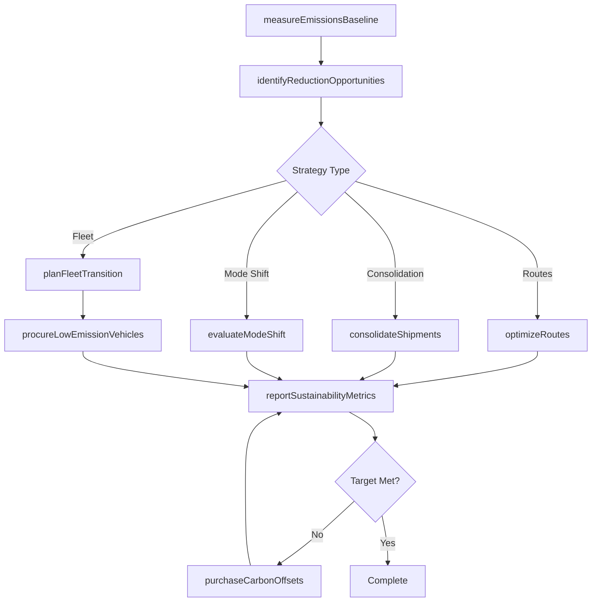
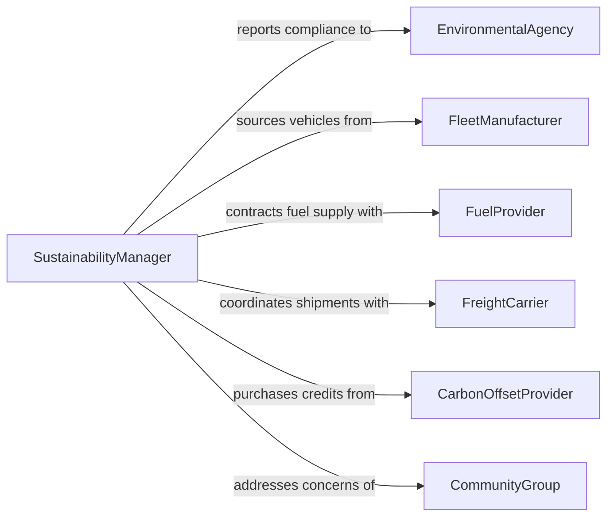

# Implement Transportation Changes to Reduce Environmental Impact

> Business-as-Code definition for implementing transportation changes that reduce environmental impact. Models the full lifecycle from emissions baselining through fleet transition, route optimization, and sustainability reporting.

## Overview

Implementing transportation changes to reduce environmental impact involves evaluating current logistics and fleet operations, identifying opportunities for emissions reduction, and executing sustainable transportation strategies. This includes transitioning to alternative fuel vehicles, optimizing delivery routes, consolidating shipments, shifting freight modes, and establishing carbon offset programs. The definition exposes actions for planning and executing green transportation initiatives, events for monitoring environmental outcomes, and searches for emissions and compliance data.

## Actors

| Actor | Description |
|-------|-------------|
| EnvironmentalAgency | Government body setting emissions standards and regulations |
| FleetManufacturer | Vehicle supplier providing low-emission and electric fleet options |
| FuelProvider | Energy supplier offering alternative fuels and charging infrastructure |
| FreightCarrier | Third-party logistics provider executing shipment transport |
| CarbonOffsetProvider | Organization selling verified carbon credits and offset programs |
| CommunityGroup | Local stakeholders affected by transportation emissions and noise |

## Roles

| Role | Description |
|------|-------------|
| SustainabilityManager | Leads environmental transportation strategy and targets |
| FleetManager | Oversees vehicle procurement, maintenance, and replacement cycles |
| LogisticsPlanner | Designs route optimization and shipment consolidation strategies |
| EnvironmentalAnalyst | Measures emissions baselines and tracks reduction progress |
| ComplianceSpecialist | Ensures adherence to environmental regulations and reporting requirements |
| OperationsDirector | Authorizes capital investments in sustainable transportation infrastructure |

## Entities

| Entity | Description |
|--------|-------------|
| EmissionsBaseline | Measured carbon footprint of current transportation operations |
| FleetTransitionPlan | Schedule for replacing conventional vehicles with low-emission alternatives |
| RouteOptimization | Analysis of delivery routes to minimize fuel consumption and distance |
| ShipmentConsolidation | Strategy for combining loads to reduce total trips |
| CarbonOffset | Purchased credit compensating for residual transportation emissions |
| SustainabilityReport | Periodic document summarizing environmental performance metrics |
| ModeShiftAnalysis | Evaluation of transitioning freight from road to rail or maritime |
| FuelConsumptionRecord | Log of fuel usage by vehicle, route, and time period |

## Actions

| Action | Description |
|--------|-------------|
| measureEmissionsBaseline | Calculate current carbon footprint of transportation operations |
| identifyReductionOpportunities | Analyze operations to find emissions reduction strategies |
| planFleetTransition | Develop a schedule for replacing vehicles with low-emission models |
| optimizeRoutes | Redesign delivery routes to minimize fuel consumption |
| consolidateShipments | Combine loads to reduce the number of transport trips |
| evaluateModeShift | Assess feasibility of shifting freight to lower-emission transport modes |
| procureLowEmissionVehicles | Acquire electric, hybrid, or alternative fuel vehicles |
| purchaseCarbonOffsets | Buy verified carbon credits to compensate for residual emissions |
| reportSustainabilityMetrics | Generate periodic environmental performance reports |

## Events

| Event | Description |
|-------|-------------|
| emissionsBaselineMeasured | The current transportation carbon footprint has been calculated |
| reductionOpportunitiesIdentified | Potential emissions reduction strategies have been cataloged |
| fleetTransitionPlanned | A vehicle replacement schedule has been established |
| routesOptimized | Delivery routes have been redesigned for lower fuel consumption |
| shipmentsConsolidated | Loads have been combined reducing total transport trips |
| modeShiftEvaluated | Freight mode transition feasibility analysis is complete |
| lowEmissionVehiclesProcured | New low-emission vehicles have been added to the fleet |
| carbonOffsetsApplied | Carbon credits have been purchased and applied to emissions balance |
| emissionsTargetAchieved | Transportation emissions have met the defined reduction target |

## Searches

| Search | Description |
|--------|-------------|
| getEmissionsData | Retrieve emissions records by vehicle, route, or time period |
| findFleetVehicles | List vehicles by fuel type, age, emissions rating, or replacement status |
| getRouteEfficiency | Retrieve fuel consumption and distance metrics by route |
| getSustainabilityReports | Find periodic sustainability reports by date range or business unit |
| findOffsetPurchases | List carbon offset transactions by provider, quantity, or period |

## Entity Relationships



## State Diagram



## Workflow



## Actor Relationships



## Usage

### Calling Actions

```typescript
import { implementTransportationChangesToReduceEnvironmentalImpact } from '@headlessly/implement-transportation-changes-to-reduce-environmental-impact'

const transport = implementTransportationChangesToReduceEnvironmentalImpact()

// Measure current emissions baseline
const baseline = await transport.measureEmissionsBaseline({
  scope: 'all-fleet',
  period: { start: '2025-01-01', end: '2025-12-31' },
  includeIndirect: true
})

// Optimize delivery routes for fuel reduction
await transport.optimizeRoutes({
  region: 'northeast',
  objectives: ['minimize-fuel', 'minimize-distance'],
  constraints: { maxDeliveryTime: '4h', vehicleCapacity: '80%' }
})

// Plan fleet transition to electric vehicles
await transport.planFleetTransition({
  targetFleetPercentage: 0.60,
  vehicleType: 'battery-electric',
  timeline: { start: '2026-Q1', end: '2028-Q4' },
  budget: 4500000
})
```

### Event-Driven Automation

```typescript
// Alert when emissions target is achieved
transport.emissionsTargetAchieved(async ({ reductionPercentage, period }) => {
  await notify({
    to: 'sustainability-team',
    message: `Transportation emissions reduced by ${reductionPercentage}% for ${period}`
  })
})

// Auto-purchase offsets when quarterly report shows gap
transport.routesOptimized(async ({ region, fuelSavingsPercent }) => {
  if (fuelSavingsPercent < 10) {
    await transport.purchaseCarbonOffsets({
      quantity: calculateOffsetGap(region),
      provider: 'verified-carbon-standard'
    })
  }
})
```
