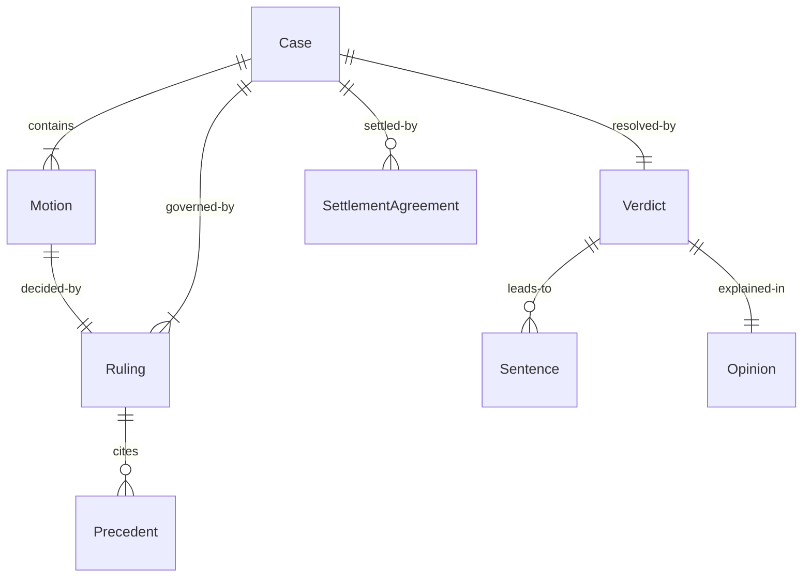
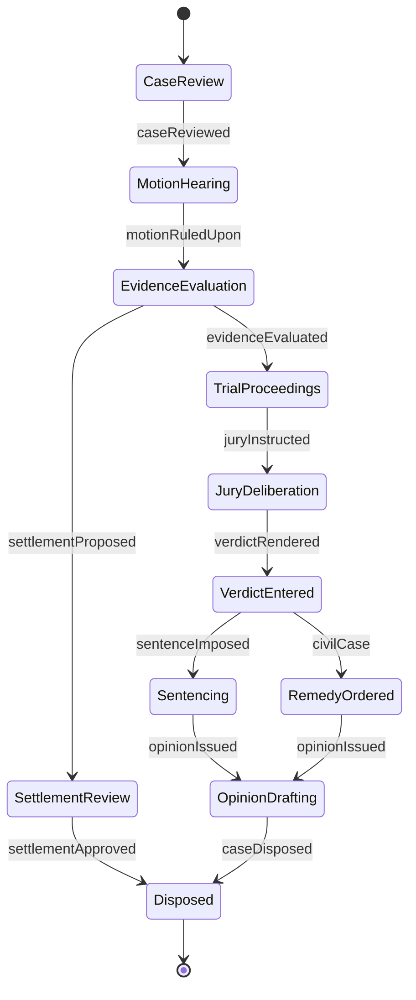
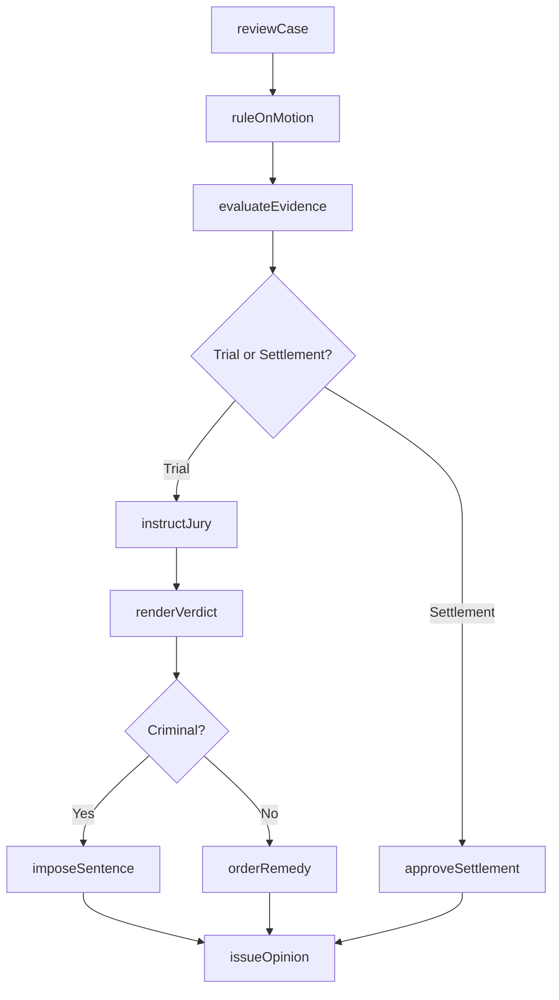
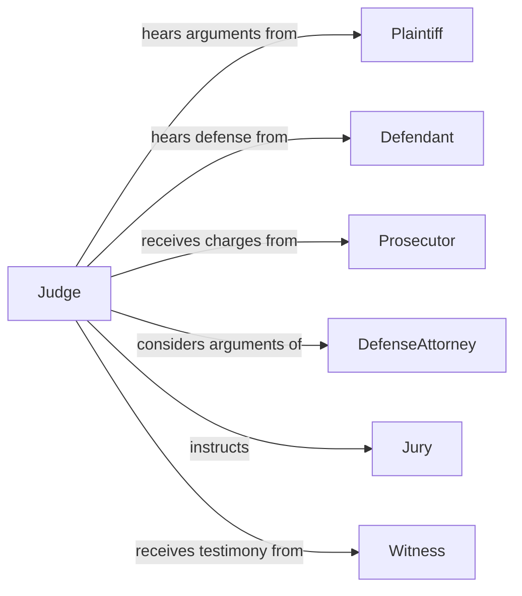

# Make Decisions in Legal Cases

> Business-as-Code definition for making decisions in legal cases. Models the judicial and legal decision-making lifecycle from case review through ruling, sentencing, and opinion publication.

## Overview

Making decisions in legal cases involves reviewing evidence, interpreting statutes and precedent, evaluating arguments from opposing parties, and rendering binding rulings or opinions. This encompasses pretrial motions, evidentiary rulings, settlement approvals, jury instructions, verdict determinations, sentencing decisions, and appellate review. The definition exposes actions for each phase of legal adjudication, events for case management automation, and searches for case law and docket retrieval.

## Actors

| Actor | Description |
|-------|-------------|
| Plaintiff | Party initiating a legal action seeking remedy or relief |
| Defendant | Party against whom the legal action is brought |
| Prosecutor | Government attorney presenting criminal charges |
| DefenseAttorney | Legal representative advocating for the defendant |
| Jury | Panel of citizens deliberating on facts and rendering verdicts |
| Witness | Individual providing testimony or evidence in proceedings |

## Roles

| Role | Description |
|------|-------------|
| Judge | Presiding officer who interprets law and renders rulings |
| Magistrate | Judicial officer handling preliminary hearings and minor cases |
| LawClerk | Legal researcher assisting the judge with case analysis |
| CourtAdministrator | Manages docket scheduling and courtroom logistics |
| Mediator | Neutral party facilitating settlement negotiations between parties |
| AppellateJustice | Reviews lower court decisions for legal errors on appeal |

## Entities

| Entity | Description |
|--------|-------------|
| Case | A legal proceeding with identified parties, claims, and docket number |
| Motion | A formal request to the court for a specific ruling or order |
| Ruling | A judicial decision on a motion, objection, or procedural matter |
| Opinion | Written explanation of the legal reasoning behind a decision |
| Verdict | The formal finding of fact by a judge or jury |
| Sentence | The punishment imposed following a guilty verdict in criminal cases |
| Precedent | A prior court decision used as authority for current rulings |
| SettlementAgreement | Negotiated resolution between parties approved by the court |

## Actions

| Action | Description |
|--------|-------------|
| reviewCase | Examine case filings, evidence, and applicable law |
| ruleOnMotion | Issue a decision on a procedural or substantive motion |
| evaluateEvidence | Assess admissibility and weight of presented evidence |
| instructJury | Provide legal instructions to the jury before deliberation |
| renderVerdict | Issue a formal finding of fact in the case |
| imposeSentence | Determine and apply punishment in criminal proceedings |
| approveSettlement | Review and authorize a negotiated settlement agreement |
| issueOpinion | Publish a written legal opinion explaining the decision |
| orderRemedy | Specify the relief or corrective action required |

## Events

| Event | Description |
|-------|-------------|
| caseReviewed | Initial case review and analysis has been completed |
| motionRuledUpon | A judicial ruling has been issued on a motion |
| evidenceEvaluated | Evidentiary assessment for admissibility is complete |
| juryInstructed | Legal instructions have been provided to the jury |
| verdictRendered | A formal verdict has been entered in the case |
| sentenceImposed | A criminal sentence has been determined and applied |
| settlementApproved | A settlement agreement has been authorized by the court |
| opinionIssued | A written legal opinion has been published |
| caseDisposed | The case has reached final disposition and is closed |

## Searches

| Search | Description |
|--------|-------------|
| findCases | List cases by party, type, status, or date range |
| getPrecedents | Retrieve relevant prior rulings by statute, topic, or jurisdiction |
| getMotions | Find pending or resolved motions by case and type |
| getDocketEntries | Retrieve chronological entries for a specific case docket |
| findRulings | Search judicial rulings by judge, case type, or outcome |

## Entity Relationships



## State Diagram



## Workflow



## Actor Relationships



## Usage

### Calling Actions

```typescript
import { makeDecisionsInLegalCases } from '@headlessly/make-decisions-in-legal-cases'

const court = makeDecisionsInLegalCases()

// Review a new case filing
const review = await court.reviewCase({
  caseId: 'CV-2026-04521',
  type: 'civil',
  claims: ['breach-of-contract', 'negligence'],
  jurisdiction: 'federal'
})

// Rule on a motion to dismiss
await court.ruleOnMotion({
  caseId: 'CV-2026-04521',
  motionType: 'motion-to-dismiss',
  filedBy: 'defendant',
  ruling: 'denied',
  reasoning: 'Plaintiff has stated sufficient facts to survive dismissal'
})

// Render a verdict after trial
await court.renderVerdict({
  caseId: 'CV-2026-04521',
  verdict: 'liability-found',
  damages: { compensatory: 250000, punitive: 0 }
})
```

### Event-Driven Automation

```typescript
// Publish opinion when verdict is rendered
court.verdictRendered(async ({ caseId, verdict }) => {
  await court.issueOpinion({
    caseId,
    type: verdict.appealable ? 'published' : 'memorandum',
    assignTo: 'law-clerk-pool'
  })
})

// Notify parties when settlement is approved
court.settlementApproved(async ({ caseId, terms }) => {
  await notifyParties({
    caseId,
    message: `Settlement approved. Compliance deadline: ${terms.complianceDate}`
  })
})
```
