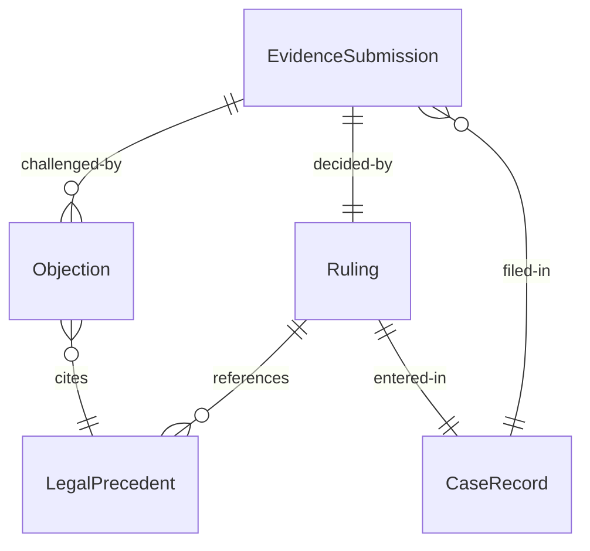
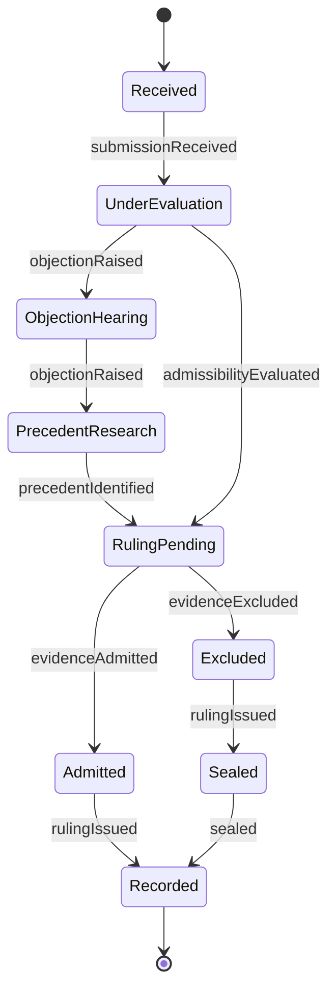
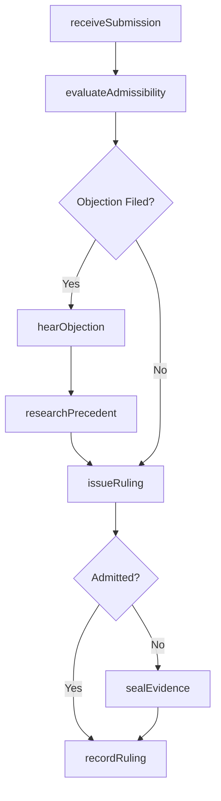
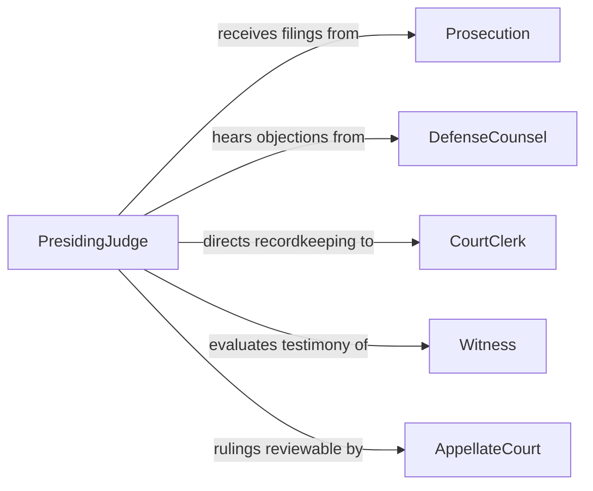

# Rule Admissibility Legal Proceedings

> Business-as-Code definition for ruling on the admissibility of evidence and motions in legal proceedings. Models the judicial decision-making process from submission through ruling and appeal.

## Overview

Ruling on admissibility in legal proceedings involves evaluating whether evidence, testimony, or motions meet the procedural and substantive standards required for consideration in a case. This definition exposes actions for receiving submissions, applying legal standards, issuing rulings, and managing objections, along with events that drive case workflow automation.

## Actors

| Actor | Description |
|-------|-------------|
| Prosecution | Files motions and presents evidence for admission |
| DefenseCounsel | Challenges admissibility and raises objections |
| CourtClerk | Manages case filings and maintains the official record |
| Witness | Provides testimony subject to admissibility review |
| AppellateCourt | Reviews challenged admissibility rulings on appeal |

## Roles

| Role | Description |
|------|-------------|
| PresidingJudge | Issues rulings on admissibility of evidence and motions |
| LawClerk | Researches legal precedents and drafts ruling memoranda |
| CourtReporter | Creates the verbatim transcript of proceedings |
| Bailiff | Maintains courtroom order during hearings |

## Entities

| Entity | Description |
|--------|-------------|
| EvidenceSubmission | A piece of evidence presented for admissibility review |
| Motion | A formal request to the court regarding evidence or procedure |
| Ruling | The judicial decision on admissibility with legal reasoning |
| Objection | A formal challenge to the admissibility of evidence |
| LegalPrecedent | Prior case law cited in support of or against admissibility |
| CaseRecord | The official file containing all filings and rulings |

## Actions

| Action | Description |
|--------|-------------|
| receiveSubmission | Accept evidence or a motion for admissibility review |
| evaluateAdmissibility | Apply rules of evidence and legal standards to the submission |
| hearObjection | Consider arguments from counsel challenging admissibility |
| researchPrecedent | Identify relevant case law and statutory authority |
| issueRuling | Render a formal decision on admissibility with written rationale |
| sealEvidence | Restrict access to sensitive or excluded evidence |
| recordRuling | Enter the ruling into the official case record |

## Events

| Event | Description |
|-------|-------------|
| submissionReceived | A new piece of evidence or motion has been filed |
| admissibilityEvaluated | Legal analysis of the submission is complete |
| objectionRaised | Counsel has formally objected to admissibility |
| precedentIdentified | Relevant case law has been located and reviewed |
| rulingIssued | The judge has rendered an admissibility decision |
| evidenceAdmitted | The submission has been accepted into the case record |
| evidenceExcluded | The submission has been denied admission |

## Searches

| Search | Description |
|--------|-------------|
| findRulings | List admissibility rulings by case, date, or outcome |
| getSubmissions | Retrieve evidence submissions by case, type, or status |
| getPrecedents | Search case law relevant to an admissibility question |
| getObjections | List objections filed by party, case, or ruling status |

## Entity Relationships



## State Diagram



## Workflow



## Actor Relationships



## Usage

### Calling Actions

```typescript
import { ruleAdmissibilityLegalProceedings } from '@headlessly/rule-admissibility-legal-proceedings'

const proceedings = ruleAdmissibilityLegalProceedings()

// Receive a new evidence submission
const submission = await proceedings.receiveSubmission({
  caseId: 'CASE-2026-04521',
  type: 'documentary',
  description: 'Financial records from defendant corporation',
  submittedBy: 'prosecution',
  exhibits: ['EX-101', 'EX-102']
})

// Evaluate admissibility against rules of evidence
const evaluation = await proceedings.evaluateAdmissibility({
  submissionId: submission.id,
  standards: ['relevance', 'hearsay', 'authentication'],
  jurisdiction: 'federal'
})

// Issue a formal ruling
await proceedings.issueRuling({
  submissionId: submission.id,
  decision: 'admitted',
  rationale: 'Documents authenticated and relevant under FRE 401-403',
  conditions: ['Redact personal identifiers per protective order']
})
```

### Event-Driven Automation

```typescript
// Notify counsel when rulings are issued
proceedings.rulingIssued(async ({ caseId, submissionId, decision }) => {
  await notify({
    to: ['prosecution', 'defense'],
    message: `Ruling on submission ${submissionId}: ${decision}`
  })
})

// Auto-seal excluded evidence
proceedings.evidenceExcluded(async ({ submissionId, caseId }) => {
  await proceedings.sealEvidence({
    submissionId,
    reason: 'Excluded from proceedings per court ruling'
  })
})
```
