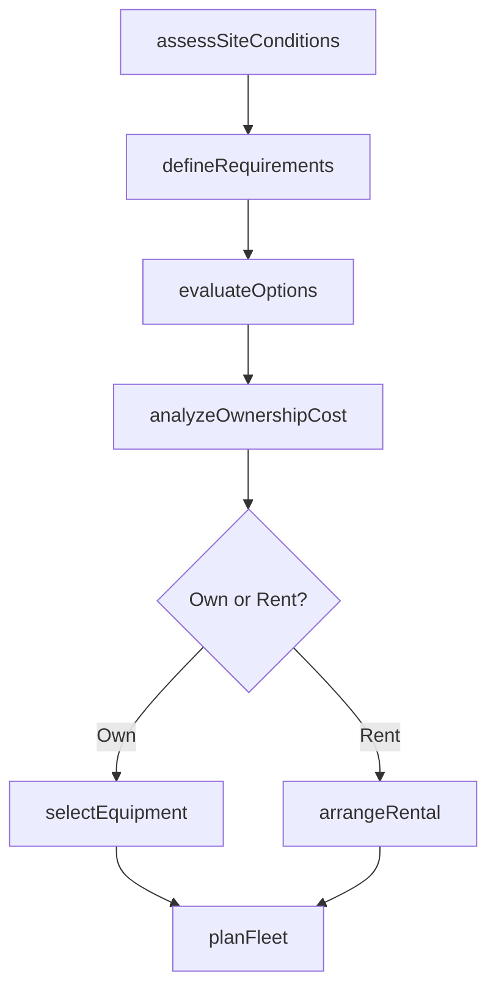
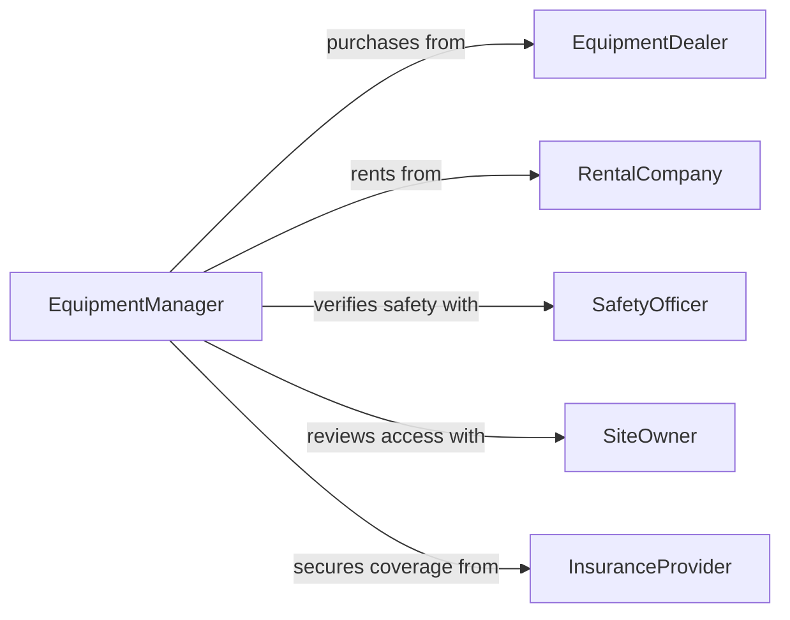

# Select Construction Equipment

> Business-as-Code definition for selecting construction equipment. Models the evaluation and procurement of heavy machinery, power tools, and specialized equipment based on project scope, site conditions, and operational requirements.

## Overview

Selecting construction equipment involves assessing project scope, site conditions, soil characteristics, lifting requirements, and production rates to determine the right machinery and tools for the job. This definition exposes actions for equipment evaluation and fleet planning, events for mobilization automation, and searches for equipment availability and specification data.

## Actors

| Actor | Description |
|-------|-------------|
| EquipmentDealer | Sells or leases construction machinery and attachments |
| RentalCompany | Provides short-term equipment rental with maintenance support |
| SafetyOfficer | Ensures selected equipment meets OSHA and site safety standards |
| SiteOwner | Defines access constraints and environmental restrictions |
| InsuranceProvider | Underwrites equipment coverage and liability policies |

## Roles

| Role | Description |
|------|-------------|
| EquipmentManager | Oversees fleet selection, utilization, and maintenance planning |
| ProjectSuperintendent | Identifies equipment needs based on construction schedule |
| CostEngineer | Analyzes ownership versus rental economics for equipment |
| OperationsPlanner | Sequences equipment deployment across project phases |

## Entities

| Entity | Description |
|--------|-------------|
| EquipmentSpecification | Performance requirements including capacity, reach, and power |
| FleetPlan | Scheduled assignment of equipment across project phases |
| RentalAgreement | Contract terms for short-term equipment use |
| SiteAssessment | Evaluation of ground conditions, access, and space constraints |
| CostComparison | Analysis of buy, lease, and rent options for equipment |
| MaintenanceSchedule | Planned service intervals for selected equipment |

## Actions

| Action | Description |
|--------|-------------|
| assessSiteConditions | Evaluate terrain, access, and space to determine equipment constraints |
| defineRequirements | Specify equipment capacity, reach, and performance needs |
| evaluateOptions | Compare equipment models on specifications, cost, and availability |
| analyzeOwnershipCost | Calculate total cost of ownership versus rental for equipment |
| selectEquipment | Choose specific equipment models for project deployment |
| planFleet | Schedule equipment mobilization and demobilization across phases |
| arrangeRental | Secure rental agreements for equipment not owned |

## Events

| Event | Description |
|-------|-------------|
| siteAssessed | Site conditions have been evaluated for equipment constraints |
| requirementsDefined | Equipment performance specifications have been established |
| optionsEvaluated | Candidate equipment has been compared and ranked |
| costAnalyzed | Ownership and rental cost analysis has been completed |
| equipmentSelected | Specific equipment has been chosen for the project |
| fleetPlanned | Equipment deployment schedule has been created |
| rentalArranged | Rental agreement has been secured for equipment |

## Searches

| Search | Description |
|--------|-------------|
| findEquipment | List available equipment by type, capacity, or manufacturer |
| getFleetPlans | Retrieve equipment deployment schedules by project or phase |
| getRentalRates | Look up rental pricing by equipment type and duration |
| getSiteAssessments | Find site condition reports for active projects |

## Workflow



## Actor Relationships



## Usage

### Calling Actions

```typescript
import { selectConstructionEquipment } from '@headlessly/select-construction-equipment'

const equipment = selectConstructionEquipment()

// Assess site conditions for a highway bridge project
const site = await equipment.assessSiteConditions({
  projectId: 'HWY-BR-2026-14',
  siteFactors: {
    soilType: 'clay',
    maxBearingCapacity: '3000 psf',
    accessWidth: '24 ft',
    overheadClearance: '45 ft'
  }
})

// Define crane requirements based on site and lift plans
const requirements = await equipment.defineRequirements({
  projectId: 'HWY-BR-2026-14',
  equipmentType: 'crawler-crane',
  specifications: {
    liftCapacity: '200 tons',
    maxRadius: '120 ft',
    boomLength: '180 ft'
  }
})

// Analyze cost of ownership vs rental
const costAnalysis = await equipment.analyzeOwnershipCost({
  requirementId: requirements.id,
  projectDuration: '18 months',
  utilizationRate: 0.65
})
```

### Event-Driven Automation

```typescript
// Notify operations when equipment selection is finalized
equipment.equipmentSelected(async ({ projectId, equipmentId, mobilizationDate }) => {
  await notify({
    to: 'operations-planning',
    message: `Equipment ${equipmentId} selected for ${projectId}, mobilize by ${mobilizationDate}`
  })
})

// Auto-arrange rental when cost analysis favors it
equipment.costAnalyzed(async ({ requirementId, recommendation, rentalSavings }) => {
  if (recommendation === 'rent' && rentalSavings > 0) {
    await equipment.arrangeRental({
      requirementId,
      preferredVendor: 'primary-rental-partner'
    })
  }
})
```
