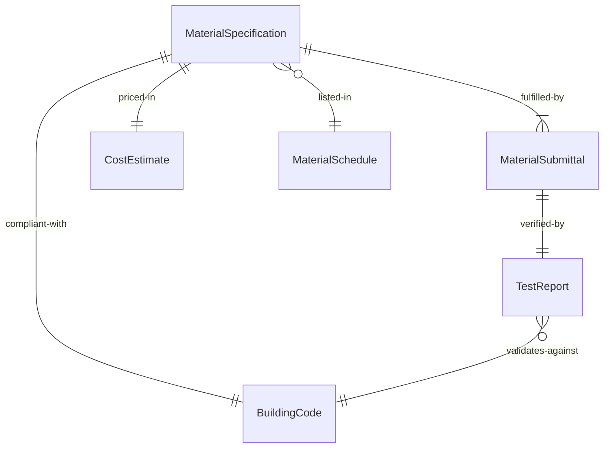
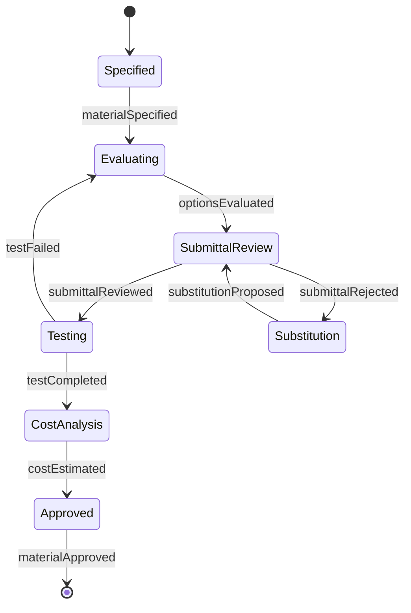
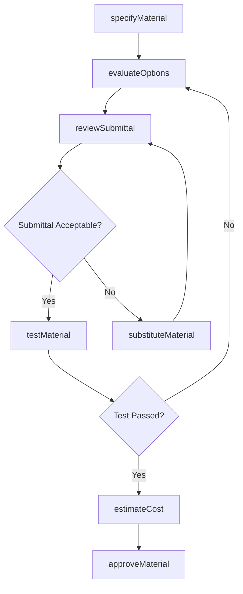
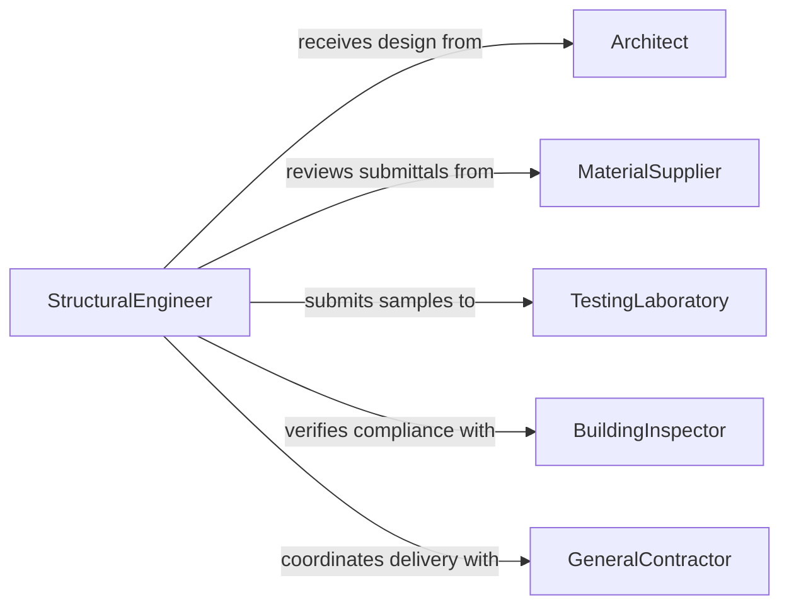

# Select Construction Materials

> Business-as-Code definition for selecting construction materials. Models the evaluation and specification of building materials based on structural requirements, building codes, cost constraints, and environmental considerations.

## Overview

Selecting construction materials involves evaluating structural specifications, load requirements, environmental exposure, building code compliance, sustainability goals, and cost parameters to determine the appropriate materials for a construction project. This definition exposes actions for material specification and approval, events for procurement workflow automation, and searches for material property and compliance data.

## Actors

| Actor | Description |
|-------|-------------|
| MaterialSupplier | Provides construction materials with technical specifications |
| BuildingInspector | Verifies material compliance with local building codes |
| TestingLaboratory | Conducts material strength, durability, and composition testing |
| Architect | Specifies material requirements based on design intent |
| GeneralContractor | Coordinates material procurement and site delivery |

## Roles

| Role | Description |
|------|-------------|
| StructuralEngineer | Determines material requirements based on load and safety analysis |
| ProjectEngineer | Manages material selection aligned with project specifications |
| EstimatorQuantitySurveyor | Calculates material quantities and cost estimates |
| SustainabilityConsultant | Evaluates environmental impact and green certification eligibility |

## Entities

| Entity | Description |
|--------|-------------|
| MaterialSpecification | Technical requirements for a material including grade, strength, and finish |
| MaterialSubmittal | Vendor documentation proving material meets project specifications |
| TestReport | Laboratory results verifying material properties and compliance |
| CostEstimate | Pricing analysis comparing material options with installation costs |
| BuildingCode | Regulatory standard governing material use in construction |
| MaterialSchedule | A project document listing all specified materials by location |

## Actions

| Action | Description |
|--------|-------------|
| specifyMaterial | Define technical requirements for a material based on design needs |
| evaluateOptions | Compare candidate materials on strength, cost, and availability |
| reviewSubmittal | Assess vendor documentation for specification compliance |
| testMaterial | Submit material samples for laboratory testing and certification |
| approveMaterial | Formally approve a material for use in the project |
| estimateCost | Calculate total material cost including waste and delivery |
| substituteMaterial | Propose an equivalent alternative when specified material is unavailable |

## Events

| Event | Description |
|-------|-------------|
| materialSpecified | Technical requirements for a material have been defined |
| optionsEvaluated | Candidate materials have been compared and ranked |
| submittalReviewed | Vendor submittal has been assessed for compliance |
| testCompleted | Laboratory testing has produced results for a material |
| materialApproved | A material has been formally approved for project use |
| costEstimated | Material cost analysis has been completed |
| substitutionProposed | An alternative material has been recommended |

## Searches

| Search | Description |
|--------|-------------|
| findMaterials | List materials by type, grade, strength, or supplier |
| getSubmittals | Retrieve vendor submittals by project, material, or status |
| getTestResults | Look up laboratory test reports for specific materials |
| getCodeRequirements | Find applicable building code standards for a material type |

## Entity Relationships



## State Diagram



## Workflow



## Actor Relationships



## Usage

### Calling Actions

```typescript
import { selectConstructionMaterials } from '@headlessly/select-construction-materials'

const materials = selectConstructionMaterials()

// Specify structural steel for a commercial building
const spec = await materials.specifyMaterial({
  projectId: 'BLDG-2026-Tower-West',
  category: 'structural-steel',
  requirements: {
    grade: 'A992',
    yieldStrength: '50 ksi',
    application: 'wide-flange-beams',
    fireRating: '2-hour'
  }
})

// Evaluate supplier options
const evaluation = await materials.evaluateOptions({
  specificationId: spec.id,
  criteria: ['cost', 'lead-time', 'mill-certification', 'domestic-sourcing']
})

// Review and approve the top submittal
const submittal = await materials.reviewSubmittal({
  submittalId: evaluation.topCandidate.submittalId,
  checkpoints: ['grade-verification', 'mill-cert', 'coating-spec']
})
```

### Event-Driven Automation

```typescript
// Notify project team when test results arrive
materials.testCompleted(async ({ materialId, testReport, passed }) => {
  await notify({
    to: 'project-engineering',
    message: `Material ${materialId} test ${passed ? 'passed' : 'failed'}: ${testReport.summary}`
  })
})

// Auto-trigger substitution when submittal is rejected
materials.submittalReviewed(async ({ submittalId, status, specificationId }) => {
  if (status === 'rejected') {
    await materials.substituteMaterial({
      specificationId,
      reason: 'submittal-rejected',
      originalSubmittalId: submittalId
    })
  }
})
```
