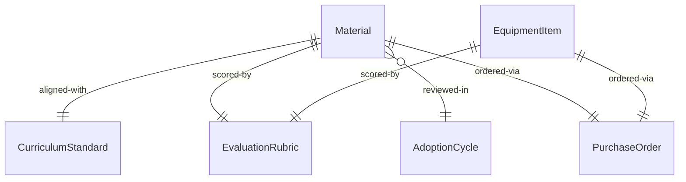
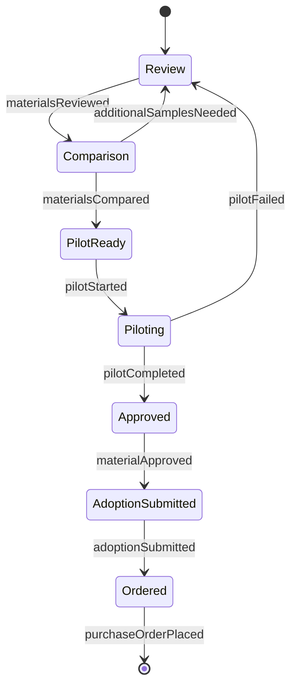
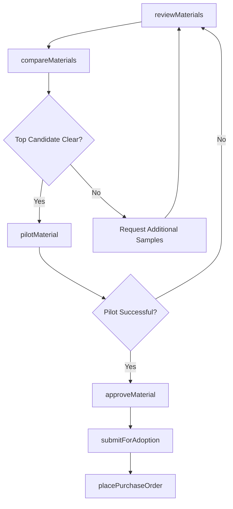
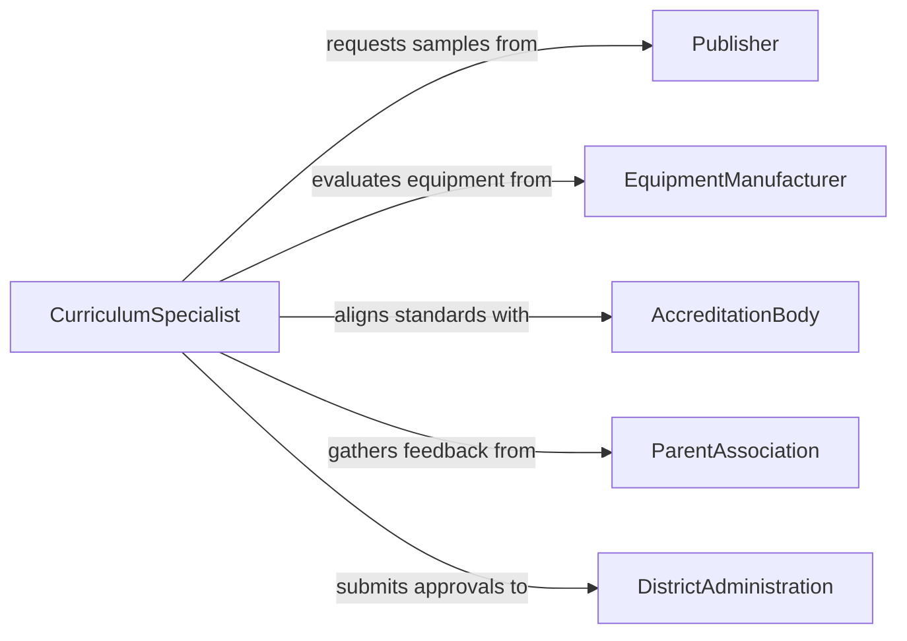

# Select Educational Materials Equipment

> Business-as-Code definition for selecting educational materials and equipment. Models the evaluation and procurement decision process for textbooks, digital resources, lab equipment, and classroom technology aligned with curriculum standards.

## Overview

Selecting educational materials and equipment involves evaluating instructional resources against curriculum requirements, learning objectives, accessibility standards, and budget constraints. This definition exposes actions for reviewing, comparing, and approving educational materials, events for adoption workflow automation, and searches for catalog and compliance data.

## Actors

| Actor | Description |
|-------|-------------|
| Publisher | Provides textbooks, digital content, and supplementary materials |
| EquipmentManufacturer | Supplies lab equipment, classroom technology, and furniture |
| AccreditationBody | Sets curriculum and material standards for compliance |
| ParentAssociation | Provides community input on material appropriateness |
| DistrictAdministration | Approves budget and procurement for educational resources |

## Roles

| Role | Description |
|------|-------------|
| CurriculumSpecialist | Evaluates materials for alignment with learning standards |
| DepartmentChair | Recommends materials for specific subject areas |
| InstructionalTechnologist | Assesses digital tools and classroom technology |
| ProcurementCoordinator | Manages vendor selection and purchase orders |

## Entities

| Entity | Description |
|--------|-------------|
| Material | A textbook, digital resource, or supplementary educational item |
| EquipmentItem | A physical tool, device, or apparatus for instruction |
| CurriculumStandard | Required learning objectives that materials must support |
| EvaluationRubric | Criteria and scoring framework for material assessment |
| AdoptionCycle | A scheduled period during which materials are reviewed and selected |
| PurchaseOrder | A formal order for approved educational materials or equipment |

## Actions

| Action | Description |
|--------|-------------|
| reviewMaterials | Evaluate candidate materials against curriculum standards |
| compareMaterials | Score and rank competing materials using evaluation rubrics |
| pilotMaterial | Deploy a material in a trial classroom for effectiveness testing |
| approveMaterial | Formally approve a material for district-wide adoption |
| selectEquipment | Choose equipment based on instructional needs and specifications |
| submitForAdoption | Enter an approved material into the formal adoption cycle |
| placePurchaseOrder | Order approved materials or equipment from vendors |

## Events

| Event | Description |
|-------|-------------|
| materialsReviewed | Candidate materials have been evaluated against standards |
| materialsCompared | Competing materials have been scored and ranked |
| pilotCompleted | Trial deployment of a material has concluded with results |
| materialApproved | A material has been formally approved for adoption |
| equipmentSelected | Equipment has been chosen for procurement |
| adoptionSubmitted | A material has been entered into the adoption cycle |
| purchaseOrderPlaced | An order for materials or equipment has been submitted |

## Searches

| Search | Description |
|--------|-------------|
| findMaterials | List candidate materials by subject, grade level, or publisher |
| getEvaluations | Retrieve evaluation scores and reviews for materials |
| getAdoptionCycles | Look up current and upcoming material adoption timelines |
| getEquipmentCatalog | Browse available equipment by category or specification |

## Entity Relationships



## State Diagram



## Workflow



## Actor Relationships



## Usage

### Calling Actions

```typescript
import { selectEducationalMaterialsEquipment } from '@headlessly/select-educational-materials-equipment'

const selection = selectEducationalMaterialsEquipment()

// Review candidate textbooks for 9th grade biology
const reviews = await selection.reviewMaterials({
  subject: 'Biology',
  gradeLevel: 9,
  adoptionCycleId: 'AC-2026-Science',
  candidates: ['BIO-TEXT-001', 'BIO-TEXT-002', 'BIO-TEXT-003']
})

// Compare and rank the candidates
const ranking = await selection.compareMaterials({
  evaluations: reviews.map(r => r.id),
  rubricId: 'RUBRIC-SCIENCE-HS'
})

// Pilot the top-ranked material
await selection.pilotMaterial({
  materialId: ranking.topCandidate.id,
  classroomIds: ['RM-204', 'RM-318'],
  duration: '6-weeks'
})
```

### Event-Driven Automation

```typescript
// Notify department chairs when pilot results are in
selection.pilotCompleted(async ({ materialId, results, recommendation }) => {
  await notify({
    to: 'department-chairs',
    message: `Pilot for ${materialId} complete: ${recommendation} (score: ${results.overallScore})`
  })
})

// Auto-generate purchase order on adoption approval
selection.materialApproved(async ({ materialId, quantity, vendorId }) => {
  await selection.placePurchaseOrder({
    materialId,
    quantity,
    vendorId,
    deliveryDate: '2026-08-01'
  })
})
```
