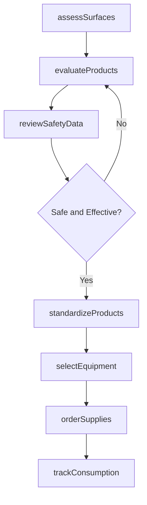
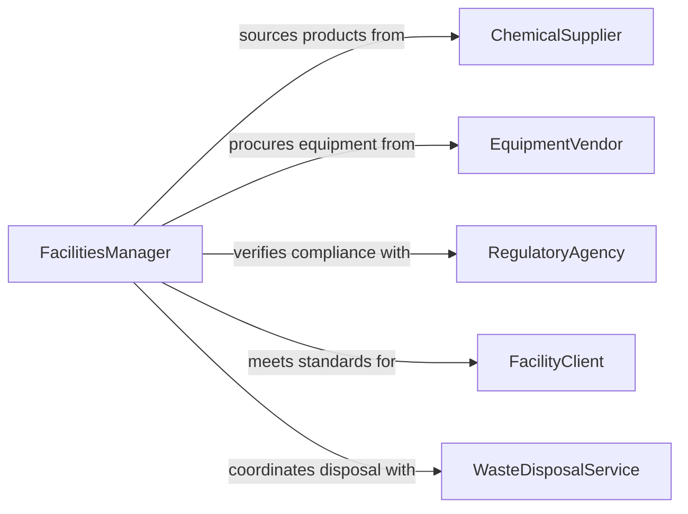

# Select Equipment Materials Supplies Cleaning

> Business-as-Code definition for selecting equipment, materials, and supplies for cleaning or maintenance activities. Models the evaluation of cleaning agents, tools, and machinery based on surface types, safety requirements, and facility standards.

## Overview

Selecting equipment, materials, and supplies for cleaning or maintenance involves assessing facility surfaces, contamination types, regulatory requirements, and operational schedules to determine the appropriate cleaning chemicals, tools, and machinery. This definition exposes actions for supply evaluation and standardization, events for procurement automation, and searches for product safety and inventory data.

## Actors

| Actor | Description |
|-------|-------------|
| ChemicalSupplier | Provides cleaning agents, solvents, and sanitizers |
| EquipmentVendor | Supplies floor machines, pressure washers, and maintenance tools |
| RegulatoryAgency | Sets standards for chemical safety and environmental compliance |
| FacilityClient | Specifies cleanliness standards and restricted-product lists |
| WasteDisposalService | Handles chemical waste and used material disposal |

## Roles

| Role | Description |
|------|-------------|
| FacilitiesManager | Oversees maintenance operations and supply standards |
| MaintenanceSupervisor | Directs cleaning crews and determines equipment needs |
| SafetyCoordinator | Ensures selected products meet health and safety regulations |
| ProcurementBuyer | Sources and purchases approved cleaning supplies |

## Entities

| Entity | Description |
|--------|-------------|
| CleaningProduct | A chemical agent, solution, or cleaning compound |
| MaintenanceEquipment | A machine or tool used for cleaning or facility upkeep |
| SafetyDataSheet | Chemical hazard and handling information for a product |
| SurfaceProfile | Characteristics of a surface that determine compatible products |
| SupplyInventory | Current stock levels of cleaning materials and equipment |
| ApprovedProductList | Standardized catalog of vetted cleaning products for a facility |

## Actions

| Action | Description |
|--------|-------------|
| assessSurfaces | Evaluate facility surfaces and contamination types to determine needs |
| evaluateProducts | Compare cleaning products on effectiveness, safety, and cost |
| reviewSafetyData | Analyze safety data sheets for chemical compatibility and hazards |
| standardizeProducts | Establish an approved product list for facility operations |
| selectEquipment | Choose cleaning machinery based on area size and surface type |
| orderSupplies | Place purchase orders for approved cleaning materials |
| trackConsumption | Monitor supply usage rates to optimize ordering frequency |

## Events

| Event | Description |
|-------|-------------|
| surfacesAssessed | Facility surfaces have been evaluated for cleaning needs |
| productsEvaluated | Candidate cleaning products have been compared and scored |
| safetyDataReviewed | Safety data sheets have been analyzed for compliance |
| productsStandardized | Approved product list has been established or updated |
| equipmentSelected | Cleaning machinery has been chosen for procurement |
| suppliesOrdered | Purchase order for cleaning supplies has been submitted |
| consumptionTracked | Supply usage metrics have been recorded |

## Searches

| Search | Description |
|--------|-------------|
| findProducts | List cleaning products by type, surface compatibility, or vendor |
| getApprovedList | Retrieve the current approved product list for a facility |
| getInventoryLevels | Check current stock of cleaning supplies and equipment |
| getSafetySheets | Look up safety data sheets for specific products |

## Workflow



## Actor Relationships



## Usage

### Calling Actions

```typescript
import { selectEquipmentMaterialsSuppliesCleaning } from '@headlessly/select-equipment-materials-supplies-cleaning'

const cleaning = selectEquipmentMaterialsSuppliesCleaning()

// Assess surface types in a healthcare facility
const surfaces = await cleaning.assessSurfaces({
  facilityId: 'FAC-MedCenter-West',
  areas: [
    { name: 'Operating Rooms', surfaceType: 'epoxy-floor', contaminationLevel: 'biohazard' },
    { name: 'Lobby', surfaceType: 'polished-stone', contaminationLevel: 'general' },
    { name: 'Kitchen', surfaceType: 'commercial-tile', contaminationLevel: 'food-grade' }
  ]
})

// Evaluate disinfectant products for operating rooms
const products = await cleaning.evaluateProducts({
  surfaceProfileId: surfaces.areas[0].profileId,
  category: 'hospital-grade-disinfectant',
  criteria: ['kill-rate', 'dwell-time', 'material-compatibility', 'cost']
})

// Review safety compliance
await cleaning.reviewSafetyData({
  productIds: products.map(p => p.id),
  requirements: ['OSHA-compliant', 'EPA-registered', 'low-VOC']
})
```

### Event-Driven Automation

```typescript
// Auto-reorder when supply inventory drops below threshold
cleaning.consumptionTracked(async ({ productId, currentStock, reorderPoint }) => {
  if (currentStock <= reorderPoint) {
    await cleaning.orderSupplies({
      productId,
      quantity: reorderPoint * 2,
      urgency: 'standard'
    })
  }
})

// Alert safety coordinator when new products are standardized
cleaning.productsStandardized(async ({ facilityId, addedProducts }) => {
  await notify({
    to: 'safety-coordinator',
    message: `${addedProducts.length} new products added to approved list for ${facilityId} - SDS review required`
  })
})
```
