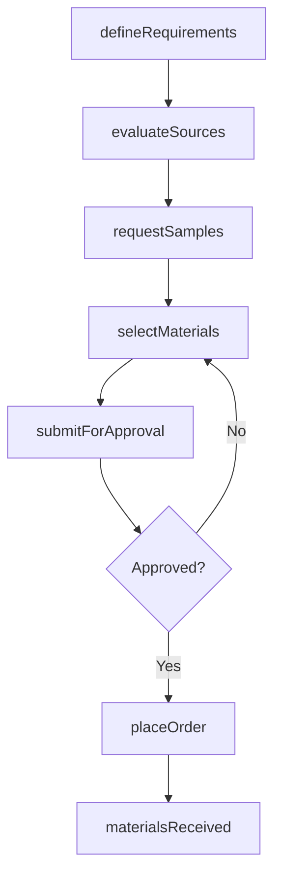
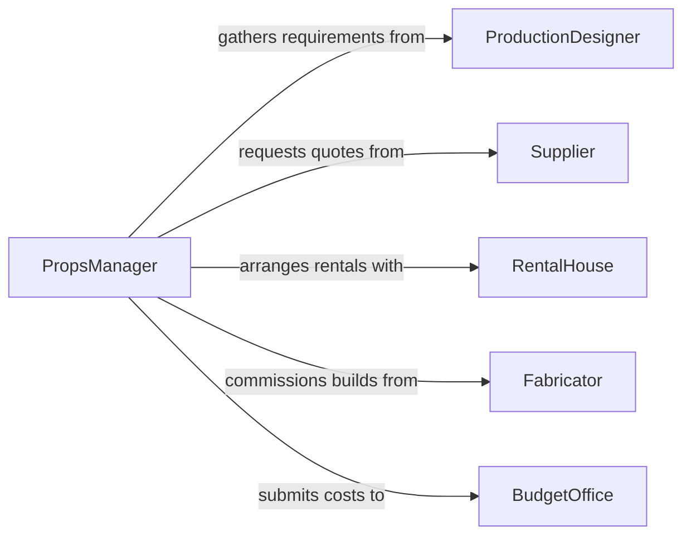

# Select Materials Props

> Business-as-Code definition for selecting materials and props. Models the evaluation, sourcing, and selection of physical materials and props used in productions, events, displays, and creative projects.

## Overview

Selecting materials and props involves identifying the specific physical items, fabrics, set pieces, and decorative elements needed for a production, exhibit, or event. This process requires evaluating creative requirements against budget constraints, material availability, and quality standards. The definition covers the full lifecycle from requirement gathering through procurement approval, ensuring that selected materials align with artistic direction and practical considerations.

## Actors

| Actor | Description |
|-------|-------------|
| ProductionDesigner | Defines the visual concept and material requirements for the project |
| Supplier | Provides materials, fabrics, and pre-made props for purchase or rental |
| RentalHouse | Offers props and set pieces available for temporary use |
| Fabricator | Custom-builds props and materials to specification |
| BudgetOffice | Approves expenditures and tracks material costs against project budget |

## Roles

| Role | Description |
|------|-------------|
| PropsManager | Coordinates the identification, sourcing, and management of all props |
| SetDecorator | Selects materials and furnishings that establish the visual environment |
| ProductionCoordinator | Manages scheduling, logistics, and procurement workflows |
| ArtDirector | Approves material and prop selections for creative consistency |

## Entities

| Entity | Description |
|--------|-------------|
| PropItem | A specific prop or material identified for use in the project |
| MaterialRequirement | A documented need for a particular material type, quantity, and specification |
| SourceOption | A vendor, rental house, or fabrication option for acquiring a prop or material |
| SelectionApproval | A formal sign-off authorizing the acquisition of selected materials |
| BudgetAllocation | Funds earmarked for materials and props within the project budget |

## Actions

| Action | Description |
|--------|-------------|
| defineRequirements | Document the materials and props needed based on creative briefs and scripts |
| evaluateSources | Compare vendors, rental houses, and fabricators for cost, quality, and availability |
| requestSamples | Obtain material swatches or prop photos for review before committing |
| selectMaterials | Choose the final materials and props that meet creative and budget criteria |
| submitForApproval | Send the selection list to the art director and budget office for sign-off |
| placeOrder | Initiate procurement or rental agreements for approved selections |

## Events

| Event | Description |
|-------|-------------|
| requirementsDefined | Material and prop requirements have been documented |
| sourcesEvaluated | Vendor and supplier options have been compared and ranked |
| samplesReceived | Physical samples or reference images have arrived for review |
| materialsSelected | Final material and prop choices have been made |
| selectionApproved | Art director and budget office have authorized the selections |
| orderPlaced | Procurement or rental orders have been submitted to suppliers |
| materialsReceived | Ordered materials and props have been delivered and inspected |

## Searches

| Search | Description |
|--------|-------------|
| findPropItems | Search props by type, project, scene, or availability status |
| getSourceOptions | Retrieve vendor and rental options filtered by material type and budget |
| getSelectionHistory | Look up past material selections for reference or reuse |

## Workflow



## Actor Relationships



## Usage

### Calling Actions

```typescript
import { selectMaterialsProps } from '@headlessly/select-materials-props'

const props = selectMaterialsProps()

// Define material requirements for a theater production
const requirements = await props.defineRequirements({
  projectId: 'prod-hamlet-2026',
  items: [
    { type: 'fabric', description: 'Velvet draping for throne room', quantity: 30, unit: 'yards' },
    { type: 'prop', description: 'Antique crown replica', quantity: 1 },
    { type: 'furniture', description: 'Wooden banquet table', quantity: 2 }
  ]
})

// Evaluate available sources
const sources = await props.evaluateSources({
  requirementId: requirements.id,
  maxBudget: 8000
})

// Select materials after sample review
await props.selectMaterials({
  requirementId: requirements.id,
  selections: [
    { itemId: 'fabric-01', sourceId: sources[0].id, cost: 450 },
    { itemId: 'crown-01', sourceId: sources[2].id, cost: 1200 }
  ]
})
```

### Event-Driven Automation

```typescript
// Notify art director when selections are ready for review
props.materialsSelected(async ({ projectId, selections }) => {
  await notify({
    to: 'art-director',
    message: `${selections.length} materials selected for project ${projectId} - awaiting approval`
  })
})

// Auto-generate purchase orders on approval
props.selectionApproved(async ({ requirementId, selections }) => {
  for (const selection of selections) {
    await props.placeOrder({
      requirementId,
      sourceId: selection.sourceId,
      itemId: selection.itemId,
      quantity: selection.quantity
    })
  }
})
```
