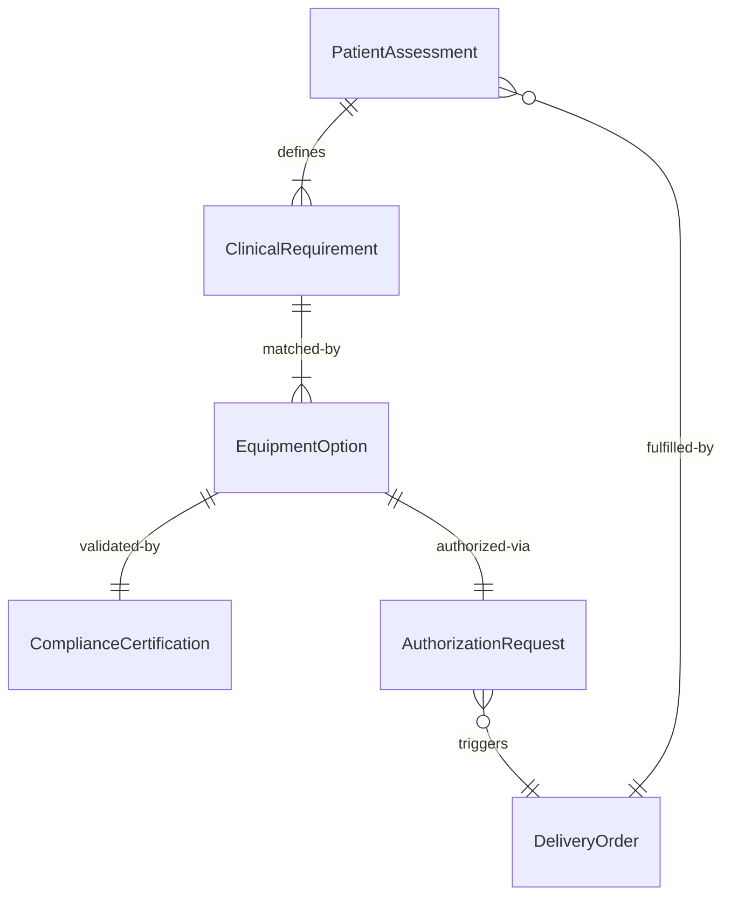
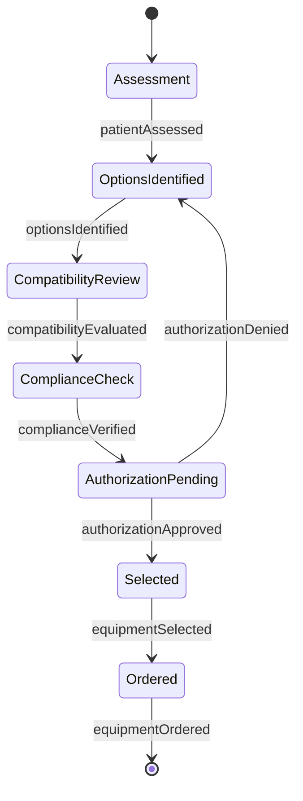
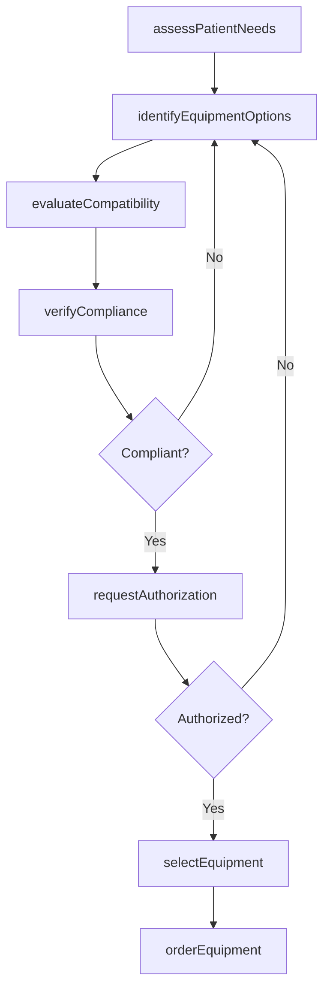
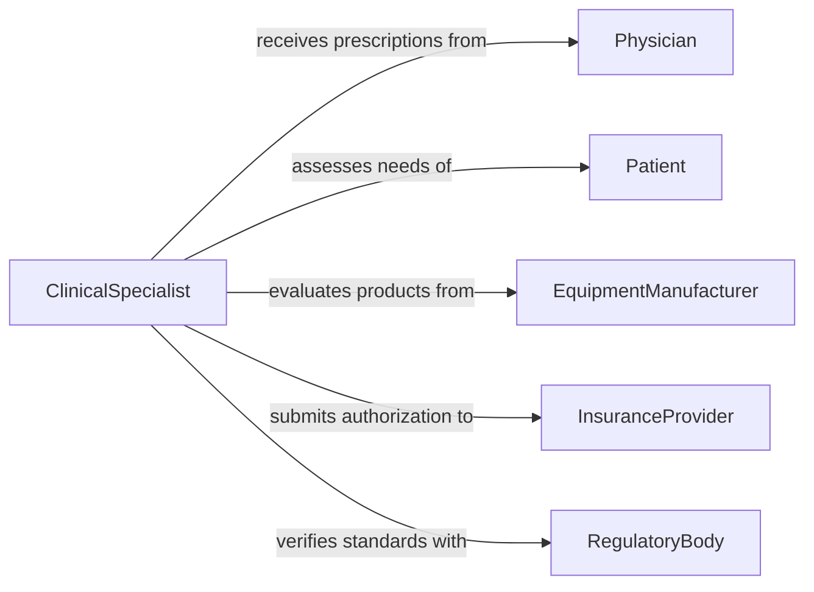

# Select Medical Equipment Addressing Patient

> Business-as-Code definition for selecting medical equipment to address patient needs. Models the clinical assessment, equipment evaluation, and procurement decision process for patient care devices and instruments.

## Overview

Selecting medical equipment for patient needs involves evaluating clinical requirements, patient conditions, and treatment plans to determine the appropriate devices, instruments, and durable medical equipment. This process balances clinical efficacy with patient safety, insurance coverage, and regulatory compliance. The definition covers the workflow from patient assessment through equipment selection, fitting, and delivery authorization.

## Actors

| Actor | Description |
|-------|-------------|
| Patient | The individual whose clinical needs drive equipment selection |
| Physician | Prescribes or orders medical equipment based on diagnosis and treatment plan |
| EquipmentManufacturer | Produces and supplies medical devices and instruments |
| InsuranceProvider | Authorizes coverage and reimbursement for prescribed equipment |
| RegulatoryBody | Sets standards for medical device safety, approval, and usage |

## Roles

| Role | Description |
|------|-------------|
| ClinicalSpecialist | Evaluates patient needs and recommends appropriate equipment |
| BiomedicalEngineer | Assesses equipment specifications, compatibility, and safety standards |
| ProcurementOfficer | Sources equipment from approved vendors and manages purchasing |
| CaseManager | Coordinates patient care workflow including equipment authorization |

## Entities

| Entity | Description |
|--------|-------------|
| PatientAssessment | A clinical evaluation documenting the patient's condition and equipment needs |
| EquipmentOption | A specific medical device or instrument under consideration |
| ClinicalRequirement | A documented specification derived from the patient's diagnosis and care plan |
| AuthorizationRequest | A formal request for insurance or institutional approval of equipment |
| ComplianceCertification | Documentation confirming equipment meets regulatory and safety standards |
| DeliveryOrder | An order to procure and deliver the selected equipment to the care setting |

## Actions

| Action | Description |
|--------|-------------|
| assessPatientNeeds | Evaluate the patient's condition and document equipment requirements |
| identifyEquipmentOptions | Research available devices that match clinical requirements |
| evaluateCompatibility | Assess equipment against patient-specific factors such as size, mobility, and condition |
| verifyCompliance | Confirm the equipment meets FDA, ISO, or institutional safety standards |
| requestAuthorization | Submit equipment selection for insurance or institutional approval |
| selectEquipment | Finalize the equipment choice based on clinical, financial, and regulatory factors |
| orderEquipment | Initiate procurement and delivery of the selected medical device |

## Events

| Event | Description |
|-------|-------------|
| patientAssessed | Patient clinical assessment has been completed and documented |
| optionsIdentified | Available equipment options have been researched and listed |
| compatibilityEvaluated | Equipment has been assessed for patient-specific suitability |
| complianceVerified | Equipment regulatory and safety compliance has been confirmed |
| authorizationRequested | Insurance or institutional approval request has been submitted |
| equipmentSelected | Final equipment choice has been made and documented |
| equipmentOrdered | Procurement and delivery order has been placed |

## Searches

| Search | Description |
|--------|-------------|
| findEquipmentOptions | Search available medical devices by type, specification, and clinical indication |
| getPatientAssessments | Retrieve assessments by patient, diagnosis, or date range |
| getAuthorizationStatus | Check the approval status of submitted equipment requests |
| getComplianceRecords | Look up regulatory certifications for specific equipment models |

## Entity Relationships



## State Diagram



## Workflow



## Actor Relationships



## Usage

### Calling Actions

```typescript
import { selectMedicalEquipmentAddressingPatient } from '@headlessly/select-medical-equipment-addressing-patient'

const medEquip = selectMedicalEquipmentAddressingPatient()

// Assess patient needs for mobility equipment
const assessment = await medEquip.assessPatientNeeds({
  patientId: 'pt-44821',
  diagnosis: 'Post-surgical knee replacement',
  requirements: ['mobility assistance', 'home use', 'adjustable height']
})

// Identify matching equipment options
const options = await medEquip.identifyEquipmentOptions({
  assessmentId: assessment.id,
  category: 'mobility-aids',
  setting: 'home'
})

// Select and order the best-fit equipment
await medEquip.selectEquipment({
  assessmentId: assessment.id,
  equipmentId: options[0].id,
  rationale: 'Best match for patient weight, height, and recovery timeline'
})
```

### Event-Driven Automation

```typescript
// Auto-submit authorization when equipment is selected
medEquip.equipmentSelected(async ({ assessmentId, equipmentId, patientId }) => {
  await medEquip.requestAuthorization({
    assessmentId,
    equipmentId,
    patientId,
    insurerId: 'ins-bluecross'
  })
})

// Notify care team when authorization is approved
medEquip.authorizationRequested(async ({ assessmentId, status }) => {
  if (status === 'approved') {
    await notify({
      to: 'care-team',
      message: `Equipment authorization approved for assessment ${assessmentId}`
    })
  }
})
```
