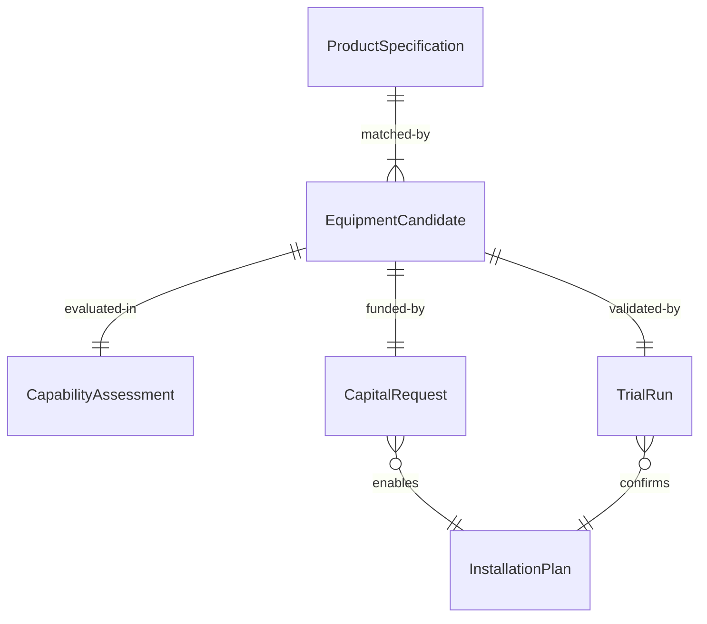
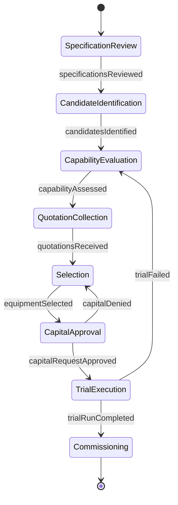
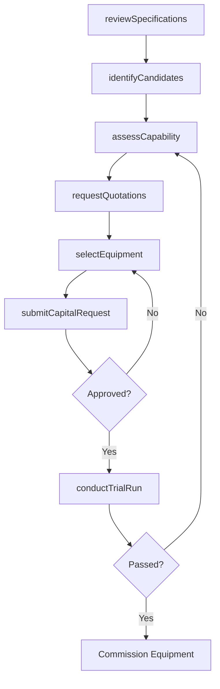
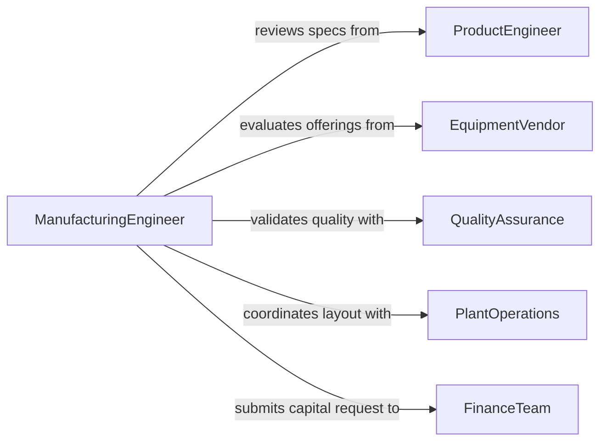

# Select Production Equipment According Product

> Business-as-Code definition for selecting production equipment according to product specifications. Models the process of matching manufacturing and production equipment to product design requirements, throughput targets, and quality standards.

## Overview

Selecting production equipment according to product specifications involves analyzing product designs, tolerances, material requirements, and production volumes to determine the appropriate machinery, tooling, and processing equipment. This activity ensures that selected equipment can consistently produce goods that meet quality standards while optimizing cost and throughput. The definition covers equipment evaluation from specification review through procurement and commissioning approval.

## Actors

| Actor | Description |
|-------|-------------|
| ProductEngineer | Defines product specifications, tolerances, and material requirements |
| EquipmentVendor | Supplies production machinery, tooling, and processing systems |
| QualityAssurance | Validates that equipment can produce output meeting quality standards |
| PlantOperations | Manages the production floor, utilities, and equipment layout |
| FinanceTeam | Evaluates capital expenditure requests and ROI projections |

## Roles

| Role | Description |
|------|-------------|
| ManufacturingEngineer | Matches equipment capabilities to product specifications and process needs |
| ProcessPlanner | Designs the production workflow and determines equipment sequencing |
| ProcurementManager | Sources equipment from qualified vendors and negotiates terms |
| PlantManager | Approves equipment installation within facility capacity constraints |

## Entities

| Entity | Description |
|--------|-------------|
| ProductSpecification | Documented design requirements including dimensions, tolerances, and materials |
| EquipmentCandidate | A specific machine or system being evaluated for production use |
| CapabilityAssessment | An analysis of equipment performance against product requirements |
| CapitalRequest | A formal request for funding to acquire production equipment |
| InstallationPlan | A schedule and layout for integrating equipment into the production line |
| TrialRun | A test production batch to validate equipment performance |

## Actions

| Action | Description |
|--------|-------------|
| reviewSpecifications | Analyze product design documents to extract equipment requirements |
| identifyCandidates | Research and shortlist equipment options that match production needs |
| assessCapability | Evaluate each candidate against tolerances, throughput, and material handling |
| requestQuotations | Solicit pricing, lead times, and terms from equipment vendors |
| selectEquipment | Choose the optimal equipment based on capability, cost, and delivery |
| submitCapitalRequest | Prepare and submit the capital expenditure request for approval |
| conductTrialRun | Execute test production to validate equipment meets specifications |

## Events

| Event | Description |
|-------|-------------|
| specificationsReviewed | Product specifications have been analyzed and equipment needs documented |
| candidatesIdentified | Shortlist of potential equipment has been compiled |
| capabilityAssessed | Equipment candidates have been evaluated against requirements |
| quotationsReceived | Vendor pricing and terms have been collected |
| equipmentSelected | Final equipment choice has been determined |
| capitalRequestApproved | Funding for equipment acquisition has been authorized |
| trialRunCompleted | Test production has validated equipment performance |

## Searches

| Search | Description |
|--------|-------------|
| findEquipmentCandidates | Search available equipment by capability, manufacturer, and price range |
| getCapabilityAssessments | Retrieve equipment evaluations by product line or specification |
| getCapitalRequests | Look up capital expenditure requests by status, amount, or equipment type |

## Entity Relationships



## State Diagram



## Workflow



## Actor Relationships



## Usage

### Calling Actions

```typescript
import { selectProductionEquipmentAccordingProduct } from '@headlessly/select-production-equipment-according-product'

const prodEquip = selectProductionEquipmentAccordingProduct()

// Review product specifications for a new injection-molded part
const specs = await prodEquip.reviewSpecifications({
  productId: 'prd-housing-7200',
  tolerances: { dimensional: 0.05, surface: 'Ra 1.6' },
  material: 'ABS thermoplastic',
  annualVolume: 500000
})

// Identify and assess equipment candidates
const candidates = await prodEquip.identifyCandidates({
  specificationId: specs.id,
  equipmentType: 'injection-molding-machine',
  clampForceMin: 200
})

// Select the best option after capability assessment
await prodEquip.selectEquipment({
  specificationId: specs.id,
  equipmentId: candidates[0].id,
  rationale: 'Meets tonnage requirements with fastest cycle time at competitive cost'
})
```

### Event-Driven Automation

```typescript
// Auto-generate capital request when equipment is selected
prodEquip.equipmentSelected(async ({ specificationId, equipmentId, totalCost }) => {
  await prodEquip.submitCapitalRequest({
    specificationId,
    equipmentId,
    amount: totalCost,
    justification: 'New production line for product housing series 7200'
  })
})

// Schedule trial run when capital request is approved
prodEquip.capitalRequestApproved(async ({ equipmentId, specificationId }) => {
  await prodEquip.conductTrialRun({
    equipmentId,
    specificationId,
    batchSize: 100
  })
})
```
