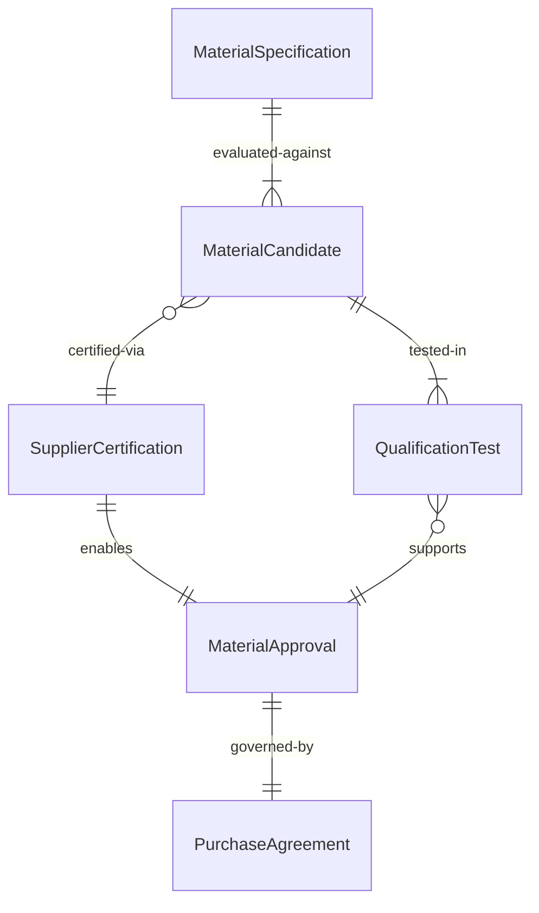
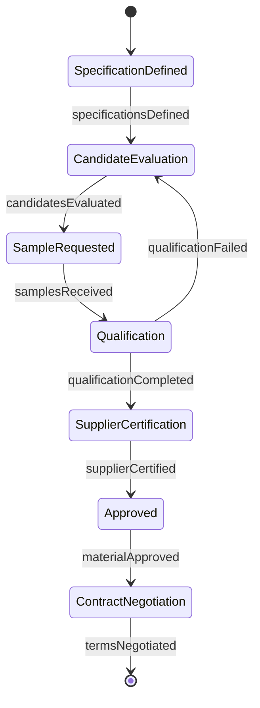
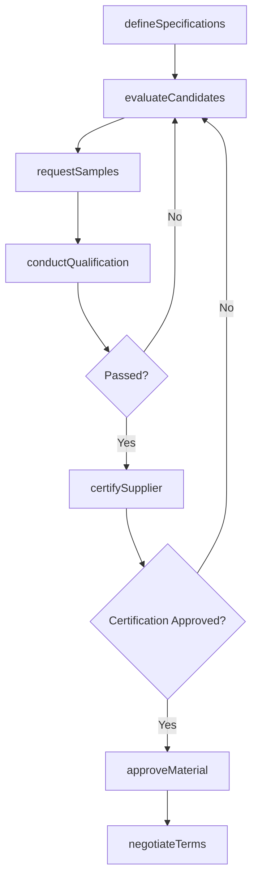
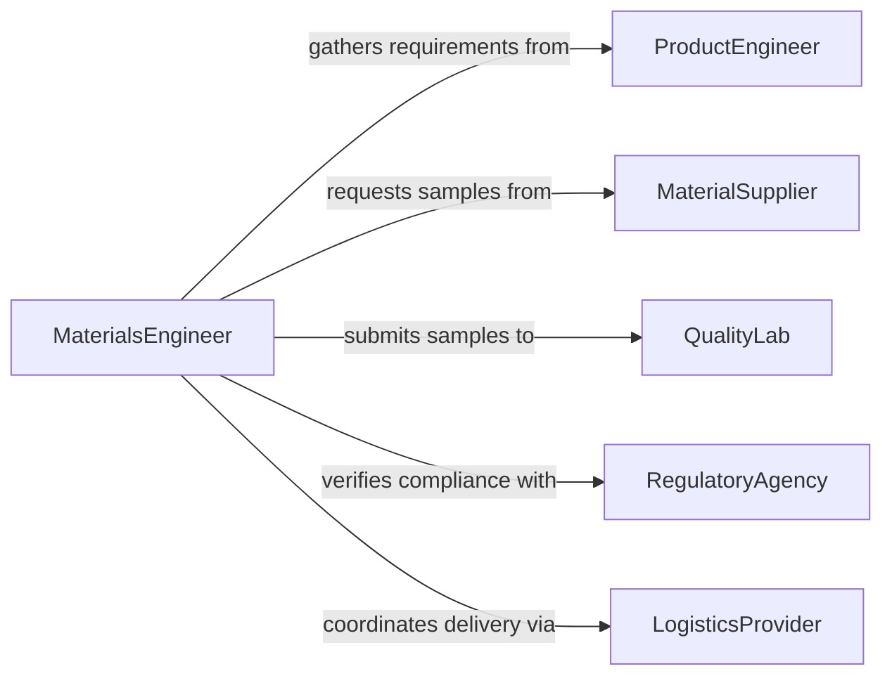

# Select Production Input Materials

> Business-as-Code definition for selecting production input materials. Models the evaluation, specification, and sourcing of raw materials and components used as inputs to manufacturing and production processes.

## Overview

Selecting production input materials involves evaluating raw materials, components, and consumables against product specifications, quality standards, and cost targets to determine the best inputs for manufacturing processes. This activity requires balancing material properties, supplier reliability, lead times, and regulatory compliance. The definition covers the workflow from material requirement analysis through qualification testing and supplier approval.

## Actors

| Actor | Description |
|-------|-------------|
| MaterialSupplier | Provides raw materials, chemicals, or components for production |
| QualityLab | Tests incoming materials against specifications and acceptance criteria |
| ProductEngineer | Defines material requirements based on product design and performance needs |
| RegulatoryAgency | Sets standards for material safety, composition, and traceability |
| LogisticsProvider | Handles material transportation, storage, and delivery scheduling |

## Roles

| Role | Description |
|------|-------------|
| MaterialsEngineer | Evaluates material properties and selects inputs that meet specifications |
| QualityManager | Establishes acceptance criteria and approves qualified materials |
| ProcurementSpecialist | Negotiates pricing, contracts, and delivery terms with suppliers |
| ProductionPlanner | Forecasts material demand and coordinates supply with production schedules |

## Entities

| Entity | Description |
|--------|-------------|
| MaterialSpecification | Documented requirements for a production input including composition, grade, and tolerances |
| MaterialCandidate | A specific raw material or component under evaluation for use |
| QualificationTest | A laboratory or process test validating material suitability |
| SupplierCertification | Documentation confirming a supplier meets quality and regulatory standards |
| MaterialApproval | Formal authorization to use a specific material from a specific supplier |
| PurchaseAgreement | A contract governing pricing, volume, and delivery terms for approved materials |

## Actions

| Action | Description |
|--------|-------------|
| defineSpecifications | Document material requirements based on product design and process needs |
| evaluateCandidates | Compare candidate materials on properties, cost, and availability |
| requestSamples | Obtain test quantities from suppliers for qualification testing |
| conductQualification | Run laboratory and process tests to validate material performance |
| certifySupplier | Verify that the supplier meets quality, regulatory, and delivery standards |
| approveMaterial | Formally authorize a material and supplier combination for production use |
| negotiateTerms | Establish pricing, volume commitments, and delivery schedules with the supplier |

## Events

| Event | Description |
|-------|-------------|
| specificationsDefined | Material requirements have been documented and reviewed |
| candidatesEvaluated | Candidate materials have been compared and ranked |
| samplesReceived | Test material samples have arrived from suppliers |
| qualificationCompleted | Laboratory and process testing has been finished |
| supplierCertified | Supplier has passed quality and compliance audits |
| materialApproved | Material and supplier have been formally authorized for production |
| termsNegotiated | Purchase agreement terms have been finalized |

## Searches

| Search | Description |
|--------|-------------|
| findMaterialCandidates | Search materials by composition, grade, specification, or supplier |
| getQualificationResults | Retrieve test results for material samples by specification or supplier |
| getApprovedMaterials | List materials authorized for production filtered by product line or category |

## Entity Relationships



## State Diagram



## Workflow



## Actor Relationships



## Usage

### Calling Actions

```typescript
import { selectProductionInputMaterials } from '@headlessly/select-production-input-materials'

const materials = selectProductionInputMaterials()

// Define specifications for steel alloy used in automotive parts
const spec = await materials.defineSpecifications({
  productLine: 'brake-rotors',
  material: 'cast-iron',
  grade: 'G3500',
  requirements: {
    tensileStrength: { min: 250, unit: 'MPa' },
    hardness: { min: 187, max: 241, unit: 'HBW' },
    composition: { carbon: { min: 3.2, max: 3.5 }, silicon: { min: 1.8, max: 2.2 } }
  }
})

// Evaluate candidates from multiple suppliers
const candidates = await materials.evaluateCandidates({
  specificationId: spec.id,
  suppliers: ['sup-arcelormittal', 'sup-nucor', 'sup-posco']
})

// Approve the top candidate after qualification
await materials.approveMaterial({
  specificationId: spec.id,
  candidateId: candidates[0].id,
  supplierId: candidates[0].supplierId,
  validUntil: '2027-01-01'
})
```

### Event-Driven Automation

```typescript
// Auto-initiate supplier certification when qualification passes
materials.qualificationCompleted(async ({ candidateId, supplierId, passed }) => {
  if (passed) {
    await materials.certifySupplier({ supplierId, candidateId })
  }
})

// Notify procurement to negotiate terms when material is approved
materials.materialApproved(async ({ specificationId, supplierId }) => {
  await notify({
    to: 'procurement-team',
    message: `Material approved for ${specificationId} - begin contract negotiations with supplier ${supplierId}`
  })
})
```
