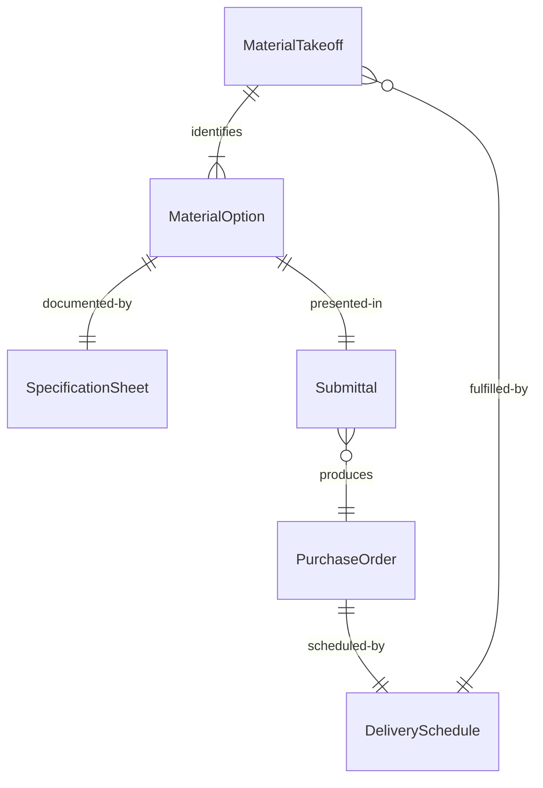
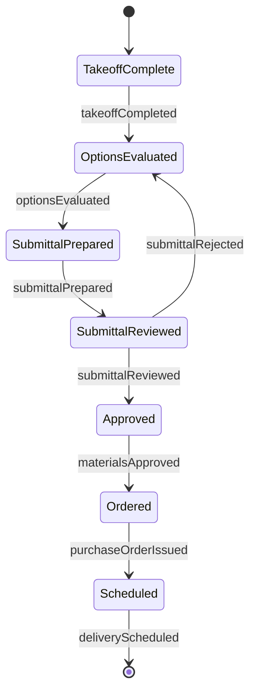
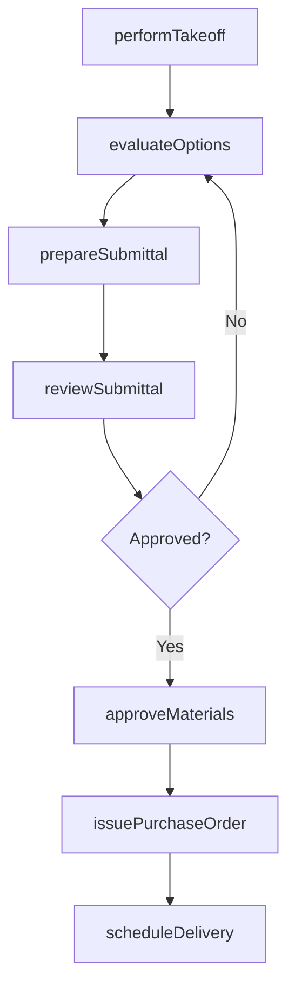
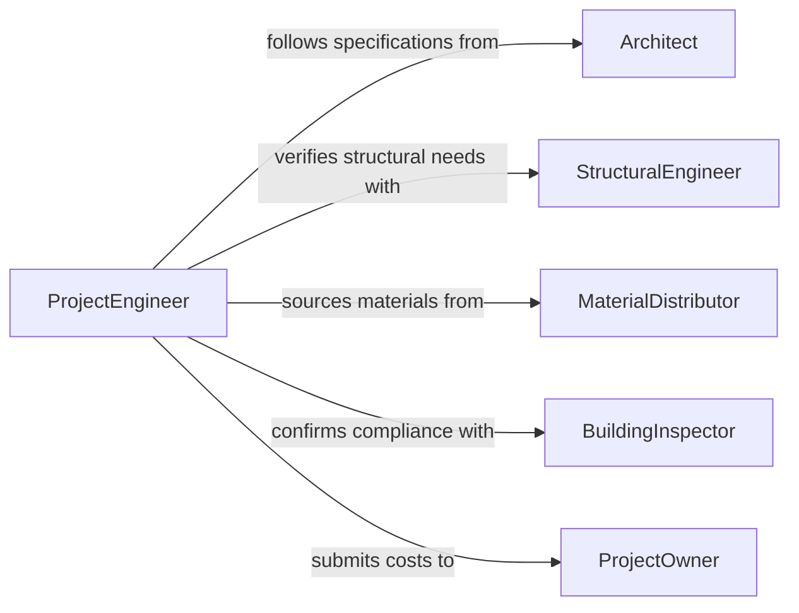

# Select Project Materials

> Business-as-Code definition for selecting project materials. Models the evaluation and procurement decision process for construction, engineering, and project-based materials.

## Overview

Selecting project materials involves identifying, evaluating, and choosing the building materials, structural components, and supplies required for construction, engineering, or infrastructure projects. This process considers design specifications, code compliance, environmental conditions, budget constraints, and delivery schedules. The definition covers material selection from initial takeoff through specification approval and purchase order issuance.

## Actors

| Actor | Description |
|-------|-------------|
| Architect | Specifies materials based on design intent, aesthetics, and performance |
| StructuralEngineer | Defines load-bearing and structural material requirements |
| MaterialDistributor | Supplies construction materials from manufacturers to the project site |
| BuildingInspector | Verifies that selected materials comply with building codes and standards |
| ProjectOwner | Approves material selections that affect project budget and timeline |

## Roles

| Role | Description |
|------|-------------|
| ProjectEngineer | Evaluates material options against technical specifications and site conditions |
| Estimator | Calculates material quantities and costs from project drawings |
| ConstructionManager | Coordinates material delivery with the construction schedule |
| SpecificationWriter | Documents approved materials and acceptable substitutions |

## Entities

| Entity | Description |
|--------|-------------|
| MaterialTakeoff | A quantified list of materials derived from project drawings and specifications |
| MaterialOption | A specific product or grade being evaluated for project use |
| SpecificationSheet | Documented performance, composition, and compliance data for a material |
| Submittal | A formal package presenting material selection for architect and engineer review |
| PurchaseOrder | An authorized order for materials from an approved distributor |
| DeliverySchedule | A timeline for material arrival coordinated with construction phases |

## Actions

| Action | Description |
|--------|-------------|
| performTakeoff | Extract material quantities and types from project drawings and models |
| evaluateOptions | Compare materials on performance, code compliance, cost, and lead time |
| prepareSubmittal | Assemble specification sheets and samples for architect and engineer review |
| reviewSubmittal | Evaluate submitted materials for conformance with design intent |
| approveMaterials | Formally authorize material selections for procurement |
| issuePurchaseOrder | Place orders with distributors for approved materials |
| scheduleDelivery | Coordinate material arrival with the construction phase timeline |

## Events

| Event | Description |
|-------|-------------|
| takeoffCompleted | Material quantities have been extracted from project documents |
| optionsEvaluated | Material candidates have been compared and ranked |
| submittalPrepared | Material submittal package has been assembled for review |
| submittalReviewed | Architect or engineer has evaluated the submitted materials |
| materialsApproved | Selected materials have been formally authorized |
| purchaseOrderIssued | Orders have been placed with material distributors |
| deliveryScheduled | Material arrival has been coordinated with construction phases |

## Searches

| Search | Description |
|--------|-------------|
| findMaterialOptions | Search materials by type, specification, code compliance, or price range |
| getSubmittals | Retrieve submittal packages by project, phase, or approval status |
| getDeliveryStatus | Check delivery schedules and shipment tracking for ordered materials |

## Entity Relationships



## State Diagram



## Workflow



## Actor Relationships



## Usage

### Calling Actions

```typescript
import { selectProjectMaterials } from '@headlessly/select-project-materials'

const materials = selectProjectMaterials()

// Perform takeoff for a commercial building project
const takeoff = await materials.performTakeoff({
  projectId: 'prj-westside-tower',
  phase: 'structural',
  drawings: ['S-101', 'S-102', 'S-201']
})

// Evaluate concrete options for foundation work
const options = await materials.evaluateOptions({
  takeoffId: takeoff.id,
  materialType: 'concrete',
  requirements: { compressiveStrength: 4000, unit: 'psi', exposureClass: 'F2' }
})

// Prepare and submit materials for approval
await materials.prepareSubmittal({
  projectId: 'prj-westside-tower',
  selections: [
    { materialId: options[0].id, quantity: 850, unit: 'cubic-yards' }
  ]
})
```

### Event-Driven Automation

```typescript
// Auto-issue purchase orders when materials are approved
materials.materialsApproved(async ({ projectId, selections }) => {
  for (const selection of selections) {
    await materials.issuePurchaseOrder({
      projectId,
      materialId: selection.materialId,
      quantity: selection.quantity,
      distributorId: selection.distributorId
    })
  }
})

// Alert construction manager when delivery is scheduled
materials.deliveryScheduled(async ({ projectId, materialType, arrivalDate }) => {
  await notify({
    to: 'construction-manager',
    message: `${materialType} delivery for ${projectId} scheduled for ${arrivalDate}`
  })
})
```
