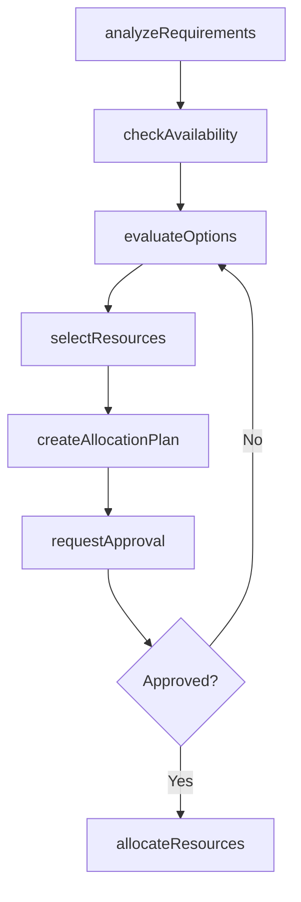
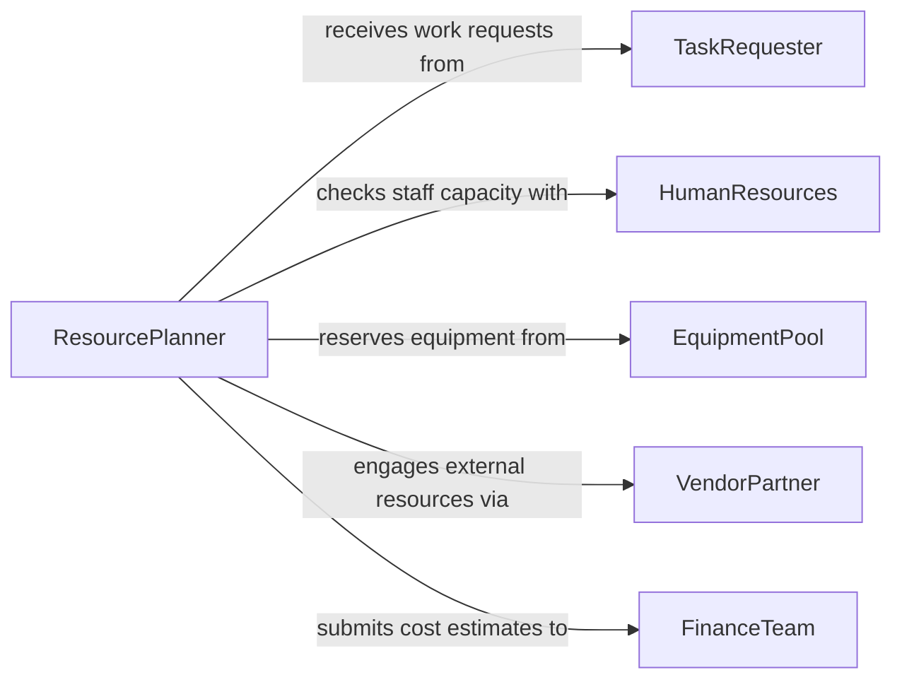

# Select Resources Needed Accomplish Tasks

> Business-as-Code definition for selecting resources needed to accomplish tasks. Models the identification, evaluation, and allocation of personnel, equipment, materials, and budget required to complete work assignments.

## Overview

Selecting resources needed to accomplish tasks involves analyzing work requirements and matching them with the appropriate combination of people, equipment, materials, and funding. This process ensures that each task has the necessary inputs for successful completion while avoiding resource conflicts and over-allocation. The definition covers resource planning from task analysis through allocation approval, supporting both project-based and operational work contexts.

## Actors

| Actor | Description |
|-------|-------------|
| TaskRequester | Submits the work assignment or project request that drives resource needs |
| HumanResources | Provides information on staff availability, skills, and capacity |
| EquipmentPool | Manages shared tools, vehicles, and machinery available for allocation |
| VendorPartner | Supplies external resources such as contractors, rentals, or specialized services |
| FinanceTeam | Approves budget allocations and monitors resource expenditures |

## Roles

| Role | Description |
|------|-------------|
| ResourcePlanner | Analyzes task requirements and determines the optimal resource mix |
| TeamLead | Validates resource needs and coordinates personnel assignments |
| ProjectManager | Oversees resource allocation across multiple tasks within a project |
| BudgetApprover | Reviews and authorizes spending for required resources |

## Entities

| Entity | Description |
|--------|-------------|
| TaskRequirement | A documented need specifying the type, quantity, and timing of resources for a task |
| ResourceOption | A specific person, piece of equipment, or material available for allocation |
| AllocationPlan | A plan mapping selected resources to tasks with schedules and dependencies |
| AvailabilityRecord | The current capacity and schedule of a resource |
| ResourceRequest | A formal ask for resources that require approval or external sourcing |
| CostEstimate | A projected cost for the resources selected to accomplish a task |

## Actions

| Action | Description |
|--------|-------------|
| analyzeRequirements | Break down task deliverables to identify resource types and quantities needed |
| checkAvailability | Verify that candidate resources are available during the required timeframe |
| evaluateOptions | Compare resource options on capability, cost, and availability |
| selectResources | Choose the final set of resources for each task |
| createAllocationPlan | Document the resource-to-task mapping with schedules and dependencies |
| requestApproval | Submit the allocation plan and cost estimate for budget authorization |
| allocateResources | Formally assign selected resources to the tasks |

## Events

| Event | Description |
|-------|-------------|
| requirementsAnalyzed | Task resource requirements have been identified and documented |
| availabilityChecked | Resource availability has been confirmed for the required timeframe |
| optionsEvaluated | Candidate resources have been compared and ranked |
| resourcesSelected | Final resource selections have been determined |
| allocationPlanCreated | Resource-to-task mapping has been documented |
| approvalGranted | Budget and resource allocation have been authorized |
| resourcesAllocated | Selected resources have been formally assigned to tasks |

## Searches

| Search | Description |
|--------|-------------|
| findAvailableResources | Search resources by type, skill, availability window, and location |
| getAllocationPlans | Retrieve allocation plans by project, task, or date range |
| getCostEstimates | Look up projected resource costs by task, project, or department |
| getResourceUtilization | View current utilization rates for personnel and equipment |

## Workflow



## Actor Relationships



## Usage

### Calling Actions

```typescript
import { selectResourcesNeededAccomplishTasks } from '@headlessly/select-resources-needed-accomplish-tasks'

const resources = selectResourcesNeededAccomplishTasks()

// Analyze requirements for a facility maintenance task
const requirements = await resources.analyzeRequirements({
  taskId: 'task-hvac-overhaul-b3',
  deliverables: ['Replace rooftop units', 'Update ductwork', 'Commission system'],
  timeline: { start: '2026-03-01', end: '2026-03-15' }
})

// Check availability of HVAC technicians and equipment
const available = await resources.checkAvailability({
  requirementId: requirements.id,
  resourceTypes: ['hvac-technician', 'crane', 'refrigerant-recovery-unit'],
  window: { start: '2026-03-01', end: '2026-03-15' }
})

// Select and allocate the best resources
await resources.selectResources({
  requirementId: requirements.id,
  selections: [
    { resourceId: 'tech-martinez', role: 'lead-technician' },
    { resourceId: 'tech-chen', role: 'support-technician' },
    { resourceId: 'equip-crane-04', type: 'equipment' }
  ]
})
```

### Event-Driven Automation

```typescript
// Auto-create allocation plan when resources are selected
resources.resourcesSelected(async ({ requirementId, selections }) => {
  await resources.createAllocationPlan({
    requirementId,
    assignments: selections,
    generateCostEstimate: true
  })
})

// Notify team lead when resources are formally allocated
resources.resourcesAllocated(async ({ taskId, assignments }) => {
  await notify({
    to: 'team-lead',
    message: `${assignments.length} resources allocated to task ${taskId} - ready to begin work`
  })
})
```
