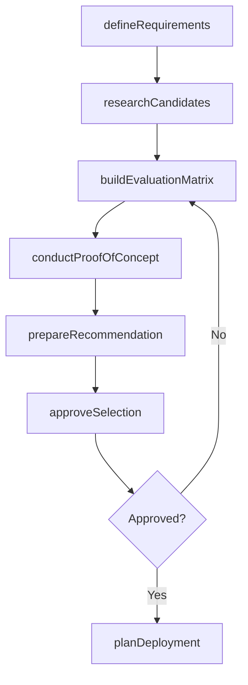
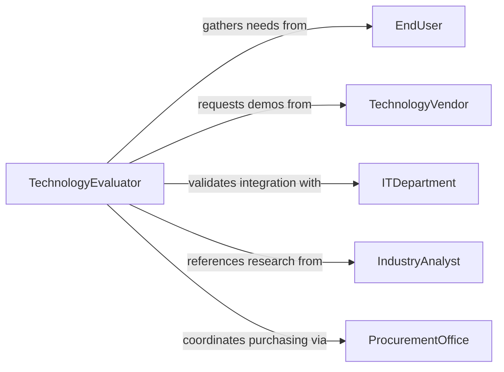

# Select Tools Equipment Technologies Use

> Business-as-Code definition for selecting tools, equipment, or technologies for use in operations or projects. Models the evaluation, comparison, and procurement decision process for operational tooling and technology solutions.

## Overview

Selecting tools, equipment, or technologies involves assessing operational or project requirements and matching them with the best available solutions across hardware, software, and specialized instruments. This process evaluates functionality, compatibility, total cost of ownership, vendor support, and scalability. The definition covers the full selection lifecycle from needs assessment through proof of concept, approval, and deployment planning.

## Actors

| Actor | Description |
|-------|-------------|
| TechnologyVendor | Provides tools, equipment, or software platforms for evaluation and purchase |
| EndUser | The personnel who will operate the selected tools or technologies daily |
| ITDepartment | Assesses technology compatibility, security, and integration requirements |
| IndustryAnalyst | Publishes evaluations and comparisons of tools and technologies |
| ProcurementOffice | Manages vendor relationships, contracts, and purchasing |

## Roles

| Role | Description |
|------|-------------|
| TechnologyEvaluator | Researches, tests, and compares tools and technologies against requirements |
| OperationsManager | Defines operational needs and validates that selections meet workflow demands |
| SolutionArchitect | Ensures technology selections integrate with existing systems and infrastructure |
| SteeringCommittee | Reviews and approves significant technology investments |

## Entities

| Entity | Description |
|--------|-------------|
| RequirementProfile | A documented set of functional, technical, and budget criteria for the selection |
| ToolCandidate | A specific tool, equipment model, or technology platform being evaluated |
| EvaluationMatrix | A weighted comparison of candidates across defined criteria |
| ProofOfConcept | A limited-scope trial to validate a candidate in the actual operating environment |
| SelectionRecommendation | A formal proposal documenting the recommended choice with supporting analysis |
| DeploymentPlan | A rollout schedule for implementing the selected tool or technology |

## Actions

| Action | Description |
|--------|-------------|
| defineRequirements | Document the operational needs, constraints, and evaluation criteria |
| researchCandidates | Identify tools and technologies that potentially meet the requirements |
| buildEvaluationMatrix | Score and rank candidates against weighted criteria |
| conductProofOfConcept | Run a limited trial of top candidates in the target environment |
| prepareRecommendation | Document findings and recommend the optimal selection |
| approveSelection | Obtain formal authorization from the steering committee |
| planDeployment | Create the rollout timeline, training plan, and integration steps |

## Events

| Event | Description |
|-------|-------------|
| requirementsDefined | Operational needs and evaluation criteria have been documented |
| candidatesResearched | Potential tools and technologies have been identified and cataloged |
| evaluationMatrixCompleted | Candidates have been scored and ranked |
| proofOfConceptCompleted | Limited trial results are available for review |
| recommendationPrepared | Formal selection recommendation has been documented |
| selectionApproved | Steering committee has authorized the technology choice |
| deploymentPlanned | Rollout schedule and integration steps have been finalized |

## Searches

| Search | Description |
|--------|-------------|
| findToolCandidates | Search tools and technologies by category, capability, and price range |
| getEvaluationMatrices | Retrieve scored comparisons by project, category, or evaluation date |
| getProofOfConceptResults | Look up trial outcomes by candidate or project |
| getDeploymentPlans | Retrieve deployment schedules filtered by status or technology type |

## Workflow



## Actor Relationships



## Usage

### Calling Actions

```typescript
import { selectToolsEquipmentTechnologiesUse } from '@headlessly/select-tools-equipment-technologies-use'

const techSelection = selectToolsEquipmentTechnologiesUse()

// Define requirements for a new project management platform
const requirements = await techSelection.defineRequirements({
  projectId: 'initiative-pm-modernization',
  category: 'project-management-software',
  criteria: [
    { name: 'Gantt charting', weight: 0.2, required: true },
    { name: 'Resource management', weight: 0.25, required: true },
    { name: 'Integration with Jira', weight: 0.15, required: false },
    { name: 'Cost tracking', weight: 0.2, required: true },
    { name: 'Mobile access', weight: 0.1, required: false },
    { name: 'SSO support', weight: 0.1, required: true }
  ],
  budget: 50000
})

// Build evaluation matrix after researching candidates
const matrix = await techSelection.buildEvaluationMatrix({
  requirementId: requirements.id,
  candidates: ['cand-monday', 'cand-asana', 'cand-smartsheet']
})

// Run proof of concept with the top-ranked candidate
await techSelection.conductProofOfConcept({
  requirementId: requirements.id,
  candidateId: matrix.rankings[0].candidateId,
  duration: 30,
  userGroup: 'engineering-leads'
})
```

### Event-Driven Automation

```typescript
// Auto-prepare recommendation when proof of concept finishes
techSelection.proofOfConceptCompleted(async ({ requirementId, candidateId, results }) => {
  if (results.satisfactionScore >= 4.0) {
    await techSelection.prepareRecommendation({
      requirementId,
      recommendedCandidate: candidateId,
      rationale: `POC satisfaction score: ${results.satisfactionScore}/5.0`
    })
  }
})

// Notify stakeholders when selection is approved
techSelection.selectionApproved(async ({ projectId, candidateId }) => {
  await notify({
    to: 'operations-team',
    message: `Technology selection approved for ${projectId} - deployment planning begins`
  })
})
```
