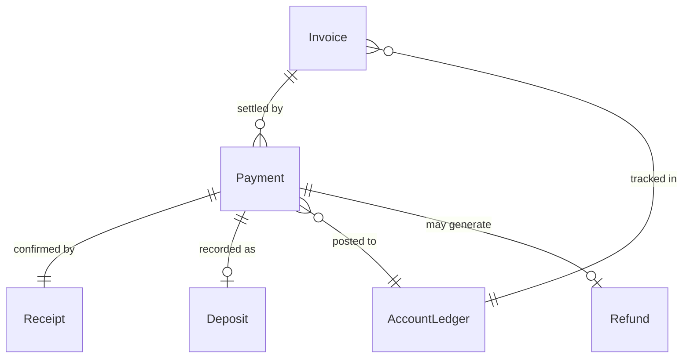
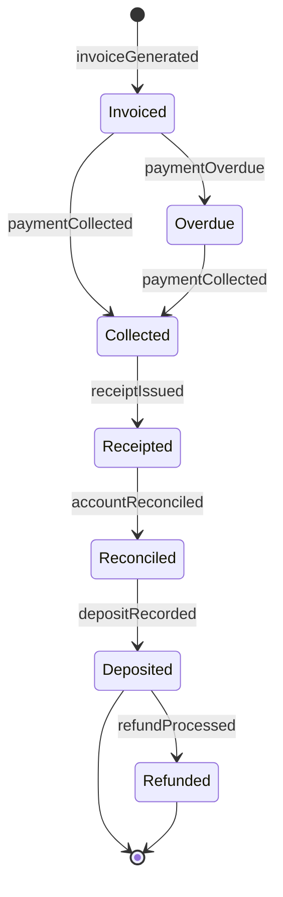
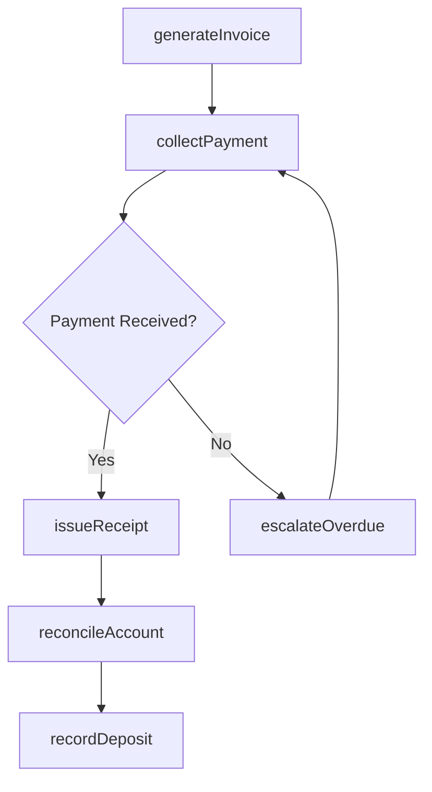
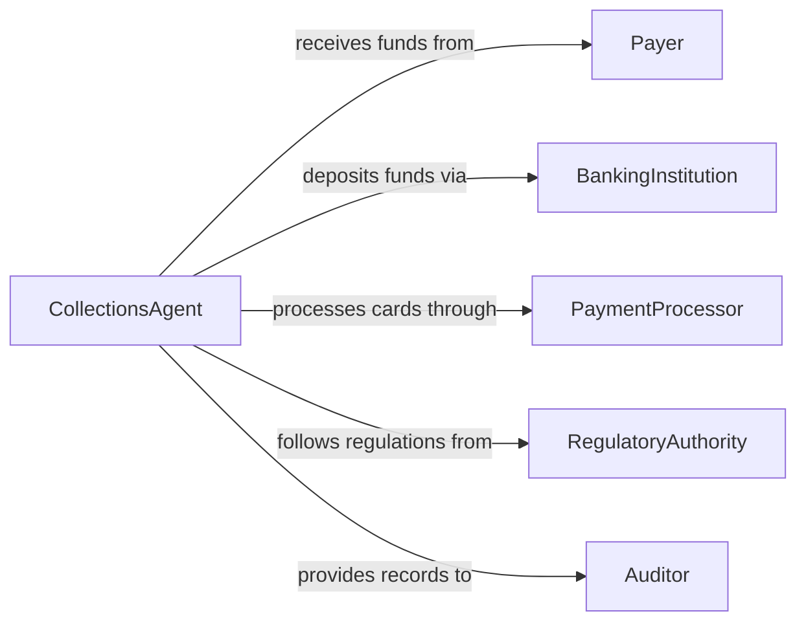

# Collect Deposits Payments Fees

> Business-as-Code definition for collecting deposits, payments, and fees. Models the intake, processing, reconciliation, and recording of monetary transactions including security deposits, installment payments, and service fees.

## Overview

Collecting deposits, payments, and fees involves receiving monetary amounts from clients, tenants, customers, or members in exchange for services, reservations, or contractual obligations. This process encompasses multiple payment types including security deposits, down payments, recurring fees, and one-time charges. The definition covers the full collection lifecycle from invoice generation through payment receipt, reconciliation, and deposit into organizational accounts.

## Actors

| Actor | Description |
|-------|-------------|
| Payer | The individual or organization submitting a deposit, payment, or fee |
| BankingInstitution | Processes payment transactions, wire transfers, and check clearances |
| PaymentProcessor | Handles credit card, debit card, and electronic payment transactions |
| RegulatoryAuthority | Sets rules governing deposit handling, escrow requirements, and fee disclosures |
| Auditor | Reviews payment records for accuracy and compliance |

## Roles

| Role | Description |
|------|-------------|
| CollectionsAgent | Receives payments, issues receipts, and manages the collection workflow |
| AccountsReceivableClerk | Records payments, reconciles accounts, and tracks outstanding balances |
| FinanceManager | Oversees collection policies, deposit handling, and revenue reporting |
| Cashier | Processes in-person payments and operates point-of-sale systems |

## Entities

| Entity | Description |
|--------|-------------|
| Invoice | A billing document specifying amounts due for deposits, payments, or fees |
| Payment | A monetary transaction received from a payer |
| Deposit | A refundable or non-refundable sum held as security or advance payment |
| Receipt | A confirmation document issued to the payer upon successful collection |
| AccountLedger | A record tracking all payments received against amounts owed |
| Refund | A return of funds when a deposit is released or overpayment occurs |

## Actions

| Action | Description |
|--------|-------------|
| generateInvoice | Create a billing document for the deposit, payment, or fee due |
| collectPayment | Receive and process a payment from the payer |
| issueReceipt | Generate and deliver a confirmation document to the payer |
| reconcileAccount | Match received payments against outstanding invoices and balances |
| recordDeposit | Log a security deposit or advance payment into the accounting system |
| processRefund | Return funds to the payer when a deposit is released or adjusted |
| escalateOverdue | Flag and follow up on payments that are past their due date |

## Events

| Event | Description |
|-------|-------------|
| invoiceGenerated | A billing document has been created and sent to the payer |
| paymentCollected | A payment has been successfully received and processed |
| receiptIssued | A confirmation document has been delivered to the payer |
| accountReconciled | Payments have been matched against invoices and balances updated |
| depositRecorded | A deposit has been logged in the accounting system |
| refundProcessed | Funds have been returned to the payer |
| paymentOverdue | A payment has passed its due date without receipt |

## Searches

| Search | Description |
|--------|-------------|
| findPayments | Search payments by payer, date range, amount, or payment method |
| getOutstandingInvoices | Retrieve unpaid invoices filtered by payer, due date, or amount |
| getDepositRecords | Look up deposit transactions by payer, account, or status |
| getOverdueAccounts | List accounts with payments past their due date |

## Entity Relationships



## State Diagram



## Workflow



## Actor Relationships



## Usage

### Calling Actions

```typescript
import { collectDepositsPaymentsFees } from '@headlessly/collect-deposits-payments-fees'

const collections = collectDepositsPaymentsFees()

// Generate invoice for a security deposit
const invoice = await collections.generateInvoice({
  payerId: 'tenant-johnson-204',
  type: 'security-deposit',
  amount: 2400,
  currency: 'USD',
  dueDate: '2026-03-01',
  description: 'Security deposit for Unit 204 lease'
})

// Collect the payment
const payment = await collections.collectPayment({
  invoiceId: invoice.id,
  method: 'bank-transfer',
  amount: 2400,
  referenceNumber: 'ACH-8834201'
})

// Issue receipt and record the deposit
await collections.issueReceipt({ paymentId: payment.id })
await collections.recordDeposit({
  paymentId: payment.id,
  depositType: 'security',
  escrowAccount: 'acct-escrow-001'
})
```

### Event-Driven Automation

```typescript
// Auto-issue receipt when payment is collected
collections.paymentCollected(async ({ paymentId, payerId }) => {
  await collections.issueReceipt({ paymentId })
})

// Send reminder when payment is overdue
collections.paymentOverdue(async ({ invoiceId, payerId, daysPastDue }) => {
  await notify({
    to: payerId,
    message: `Payment for invoice ${invoiceId} is ${daysPastDue} days overdue. Please remit at your earliest convenience.`
  })
})
```
